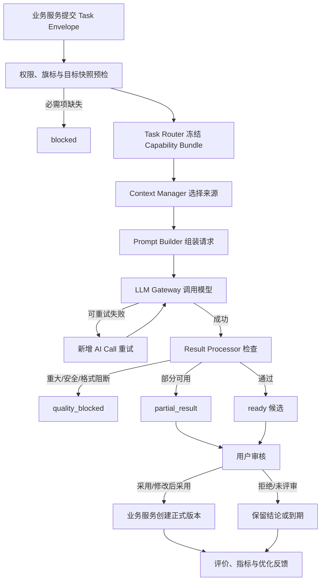
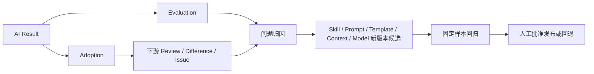

# AI 能力设计文档

> 文档状态：当前有效
> 设计版本：V1.0
> 日期：2026-07-29
> 窗口切换节点：8
> 主责范围：AI 任务分类、Task Router、调用记录、输出评价与反馈闭环
> 关联文档：`Agent架构设计.md`、`Skill体系设计.md`、`模板管理设计.md`、`Prompt管理设计.md`、`Context管理设计.md`

## 1. 设计结论

平台 AI 能力是受业务服务约束的候选生成与分析能力，不拥有 Project、Project Version、产物版本或流程节点的状态所有权。一次 AI 任务必须从明确的业务意图和目标快照开始，经任务分类、能力版本选择、上下文组合、模型调用、结果检查和用户结论后结束，并保存完整追溯链。

统一主链为：

`业务任务 → Task Router → Skill Version → Prompt Version / Template Version → Context Strategy Version → Context 检索与组合 → LLM Gateway → Result Processor → 候选审核 → 正式化或拒绝 → 评价与优化反馈`

硬性规则：

- AI 输出默认是候选，`ready` 不等于正式产物。
- 只有业务服务执行“采用”或“修改后采用”命令，才能生成正式领域版本。
- 正式结果必须 100% 可追溯至 Skill、Prompt、Template（如使用）、Context Strategy、Model、Provider Profile 和实际上下文来源版本。
- AI 失败、取消、过期、质量阻断或目标变旧均不得改变业务对象状态。
- MVP 采用后台预置能力；完整管理、知识审核、混合检索和第二 Provider 在 Sprint 6 开放。

## 2. 范围与非目标

本设计覆盖：

1. AI 任务分类及统一任务描述。
2. Task Router 的规则、语义和用户选择三级路由。
3. Agent 执行流程及能力版本组合。
4. Skill、Prompt、Template、Context、Experience、Checklist 的调用关系。
5. AI Task、Call、Context、Result、Evaluation、Adoption 的记录边界。
6. 自动检查、人工评价、采用反馈和版本优化闭环。

本设计不包含：

- 不修改已确认的业务流程、页面状态机、数据库表结构、Sprint 或技术栈。
- 不定义字段级 OpenAPI、JSON Schema、Celery 代码、LangGraph 代码或模型供应商 SDK。
- 不把知识中心、AI 能力管理或分析后台提升为 MVP 一级入口。
- 不允许 Agent 绕过业务 API 直接写正式产物或项目状态。

## 3. AI 任务分类

### 3.1 分类维度

每个任务同时按六个维度描述，避免只用一个模糊的 `task_type` 决定全部行为。

| 维度 | 取值示例 | 路由作用 |
|---|---|---|
| 业务阶段 | requirement、prd、flow、review、implementation、validation、knowledge | 限定可用 Skill 与上下文域 |
| 任务动作 | analyze、generate、review、compare、extract、classify、suggest | 选择执行方法和输出结构 |
| 目标对象 | Requirement Version、PRD Version、Flow Version、Plan Version、Issue | 确定目标快照与权限 |
| 风险级别 | low、medium、high | 决定人工确认、检查和重试上限 |
| 输出形态 | analysis、structured_document、feedback_list、diagram_source、candidate | 选择 Template 与结果 Schema |
| 执行模式 | synchronous_precheck、async_generation、batch_evaluation | 决定队列、进度和超时策略 |

### 3.2 标准任务目录

| 任务族 | 标准任务类型 | 主要输入 | 输出 | 阶段 |
|---|---|---|---|---|
| 需求 | `requirement.analyze` | 原始需求、项目上下文、来源资料 | 需求分析候选 | MVP |
| 需求 | `requirement.structure` | 已确认需求输入 | 结构化 Requirement 候选 | MVP |
| PRD | `prd.generate` | 正式 Requirement Version | PRD 候选 | MVP |
| PRD | `prd.review` | 指定 PRD Version、审查范围 | Feedback 候选 | MVP |
| Flow | `flow.extract_text` | PRD/需求版本、范围 | 文本流程候选 | 条件启用 |
| Flow | `flow.generate_mermaid` | 已通过文本 Review 的快照 | Mermaid 候选 | 条件启用 |
| Flow | `flow.validate_logic` | Mermaid/Flow 候选 | 逻辑校验结果 | 条件启用 |
| 实现 | `implementation_plan.generate` | 已确认设计范围 | Plan 候选 | MVP |
| 实现 | `implementation.compare` | 设计版本、实现证据 | Difference Record 候选 | 增强/按规划开放 |
| 验证 | `issue.analyze` | Test/Issue/证据 | 分类与影响分析候选 | MVP 可按任务开放 |
| 迭代 | `optimization.suggest` | Issue、指标、版本差异 | Optimization 候选 | 增强 |
| 知识 | `experience.extract_candidate` | Issue/AI Call/评审反馈 | Experience Candidate | Sprint 6 |
| 知识 | `checklist.derive_candidate` | 已审核 Experience Version | Checklist 候选 | Sprint 6 |
| 评测 | `ai_result.evaluate` | 结果、量表、来源快照 | Evaluation | MVP 自动检查；增强抽样 |

任务目录是受控枚举。新增任务类型必须说明目标对象、允许的 Skill、必需上下文、输出 Schema、风险级别、降级方式和评价量表，不允许由前端提交任意字符串动态创建生产任务。

## 4. 统一任务描述

Task Router 接收的逻辑输入称为 `Task Envelope`，至少包含：

| 分组 | 必需内容 |
|---|---|
| 身份与权限 | user、project、project_version、role、trace |
| 任务意图 | task_type 候选、用户目标、业务阶段、模块 |
| 目标快照 | object type/id/version、snapshot hash |
| 输入 | 用户本次输入、选择范围、上传资料引用 |
| 约束 | 输出语言、格式、风险确认、功能旗标、时间/成本限制 |
| 用户选择 | 指定 Skill/版本、Template、模型偏好；无选择时为空 |
| 幂等与恢复 | idempotency key、retry_of_task_id、来源页面/动作 |

正文和文件内容通过受权引用获取，不在路由消息中无差别复制。

## 5. Task Router

### 5.1 路由顺序

1. 校验身份、项目版本、目标对象和功能旗标。
2. 解析显式任务类型；无显式类型时按业务动作和目标对象产生候选类型。
3. 使用确定性规则筛选允许的 Skill Version。
4. 在规则候选内做语义匹配，语义分数不能突破权限、阶段和兼容性限制。
5. 若用户显式选择合法 Skill，则优先使用；不合法时返回原因，不静默替换。
6. 选择与 Skill Version 兼容的 Prompt、Template 和 Context Strategy 版本。
7. 形成可冻结的 `Capability Bundle`，通过预检后创建 AI Task。

### 5.2 匹配优先级

`合法的用户显式选择 > 精确规则命中 > 规则候选内的语义排序 > 任务类型默认版本`

任一层都必须满足：状态为 active、阶段允许、输入/输出兼容、权限通过、功能旗标开启、未命中阻断风险。

### 5.3 冲突与不确定性

| 情况 | 处理 |
|---|---|
| 无可用 Skill | 进入 `blocked`，返回缺失能力，不调用通用模型兜底冒充专用能力 |
| 多个同优先级 Skill | 根据任务专用度、版本兼容和回归状态排序；仍无法区分则让用户选择 |
| 用户指定已停用版本 | 历史查看可复现，新的生产调用禁止；提示选择当前允许版本 |
| 输入信息不足 | 必需项缺失则 blocked；可选项缺失需用户接受风险后继续 |
| 目标快照变化 | 标记 `stale_target`，原结果不得正式化；基于新快照创建新任务 |
| 路由置信不足 | 不伪造高置信度；返回澄清或限定候选 |

### 5.4 Capability Bundle

每次模型调用冻结以下组合：

- `skill_version_id`
- `prompt_version_id`
- `template_version_id`（可空）
- `context_strategy_version_id`
- `model_catalog_id`
- `provider_profile_id` 与运行配置版本
- 任务类型、结果 Schema/量表版本和目标快照哈希

组合中任一影响执行或输出的版本发生变化，都视为新的 AI Capability Version 组合，不在运行中热替换。

### 5.5 AI Capability 指纹与路由审计

AI Capability Version 在执行侧表现为上述版本组合的规范化指纹，而不是另一个可以覆盖修改的内容容器。MVP 可根据 Skill、Prompt、Template、Context Strategy、Model、Provider 运行配置和评价/结果规则版本生成稳定 `capability_fingerprint`；原始组件 ID 仍是权威追溯字段。这样既能按能力组合做前后比较，也避免只保存一个无法拆解的含糊版本号。

Task Router 另记录任务目录版本、路由策略版本、命中层级、候选和排除原因。路由策略影响“为何选中”，Capability Bundle 影响“实际用什么执行”，两类审计不得混为一项。现有调用记录已经保存实际组件版本；任务目录/路由策略的持久化映射在 Sprint 0 字段级契约中复核，若需要改变已确认数据结构，必须另行回到数据设计评审，不在本文直接增表或加字段。

## 6. Agent 标准流程

详细组件和异常策略见《Agent架构设计》。

## 7. 能力分层

| 能力 | MVP（Sprint 0～5） | Sprint 6 | 未来 |
|---|---|---|---|
| Task Router | 受控任务目录、规则路由、预置默认版本 | 语义匹配、管理配置和回归视图 | 受控实验与自动推荐 |
| Skill | 后台预置、版本绑定、调用追溯 | 导入/审核/测试/启停管理 | 受控市场与组织共享 |
| Prompt/Template | 预置版本、固定回归、追溯 | 可视化管理、发布与回退 | 自动优化候选 |
| Context | 结构化/关键词、来源与指纹追溯 | Experience/Checklist、Qdrant 混合检索 | 跨项目受控检索 |
| Provider | DeepSeek + OpenAI-compatible Gateway | 第二 Provider 契约 | 智能分流与实验 |
| Evaluation | 结构/必填/追溯/安全检查，采用反馈 | 抽样运营与版本比较 | 校准后的自动评测 |
| Knowledge | 仅预置来源追溯 | 候选审核、版本、引用与采用 | 生态与跨组织共享 |

## 8. AI 调用记录

### 8.1 记录模型

沿用已确认数据基线：

| 记录 | 含义 | 不得混入 |
|---|---|---|
| `ai_task` | 一次用户意图和任务状态 | 供应商重试明细 |
| `ai_call` | 一次实际供应商调用和能力版本组合 | 覆盖前次失败记录 |
| `ai_context_usage` | 每个候选来源的检索、注入与排除事实 | 完整敏感正文 |
| `ai_result` | 候选结果、指纹、检查和目标快照 | 正式业务状态 |
| `ai_evaluation` | 自动、用户或专家评价 | 覆盖其他评价类型 |
| `ai_adoption` | 采用、修改后采用、拒绝或未评审 | 直接修改 AI Result |

### 8.2 最小追溯要求

每个正式化结果必须能回答：谁在什么项目版本、对哪个目标快照、以什么任务类型，使用哪组 Skill/Prompt/Template/Context Strategy/Model/Provider 版本，注入了哪些来源，产生哪个候选，经过哪些检查，最终由谁以何种结论正式化。

### 8.3 内容保存边界

- 采用结果的正式全文归属业务领域版本；AI Result 保存引用、指纹和必要摘要。
- 未采用结果不复制进分析明细，只保留满足审计和质量分析的摘要/引用。
- Context Usage 保存来源 ID、版本、指纹、摘要、Token 和排除原因，不保存完整敏感上下文。
- 密钥、Token、密码、Secret 原文不得进入 Task、Call、Context、日志或评价说明。

## 9. 输出评价与反馈

### 9.1 四层证据

1. 运行可用：调用成功、结果可解析。
2. 输出合格：结构、完整、追溯、安全等检查通过。
3. 用户可用：直接采用、修改后采用或拒绝。
4. 下游有效：是否引发可归因的评审退回、差异或 Issue。

自动格式通过不能替代内容正确性，用户评分不能替代真实采用。

### 9.2 结果门禁

| 检查 | MVP 处理 |
|---|---|
| 结构/格式 | 全量自动；失败可修复重试或阻断 |
| 必填项 | 全量自动；缺关键项不得 ready |
| 来源追溯 | 拟正式化结果全量检查；不完整不得正式化 |
| 安全与越权 | 全量检查；命中即阻断并审计 |
| 正确性/一致性 | 规则 + 抽样人工；重大错误全量复核 |
| 可执行性/清晰性 | 按任务类型抽样人工评价 |

人工维度沿用《AI质量评价指标》的 0～4 与 N/A 量表；重大错误优先于综合分。

### 9.3 反馈闭环

问题归因顺序：输入完整性 → 上下文来源 → Skill → Prompt → Template → 模型 → Result Processor → 用户任务变化。一次同时改变多个组件时标记为组合变更，不把效果归因给单项。

### 9.4 必采反馈

- adopted、adopted_after_edit、rejected、not_reviewed。
- 修改强度 `none/minor/major`；大改或拒绝需原因。
- `rubric_version`、维度分数和重大错误标签。
- 结果与正式对象版本、下游反馈/差异/Issue 的关联。
- 实际能力版本组合及生效时间。

## 10. 权限、安全与降级

- 路由和检索在项目权限过滤后执行，禁止先跨项目检索再隐藏结果。
- System Prompt、Skill 和 Template 不得接收能覆盖系统安全规则的用户变量。
- 外部内容按不可信输入处理，防止提示注入改变工具、权限和来源优先级。
- Provider 不可用时进入可恢复失败并转人工；不得用未审核 Provider 静默替换。
- Qdrant 不可用时降级结构化/关键词检索；Sprint 6 失败不影响 MVP。
- 任何降级都记录实际路径，不得把降级结果标记为完整能力成功。

## 11. 验收清单

- [ ] 标准任务目录覆盖已确认 AI 使用场景，并区分 MVP、Sprint 6 和未来。
- [ ] Router 的规则、语义和用户选择三级匹配顺序唯一明确。
- [ ] Capability Bundle 在调用开始前冻结，运行中不热替换版本。
- [ ] AI Task、Call、Context、Result、Evaluation、Adoption 责任不混用。
- [ ] `ready` 候选不能绕过业务服务成为正式产物。
- [ ] 正式结果追溯完整率门禁为 100%。
- [ ] 失败、取消、过期、质量阻断和目标变旧均有恢复路径。
- [ ] 评价与反馈能定位具体能力版本，不用单一总分掩盖重大错误。
- [ ] MVP 与 Sprint 6 边界和现有开发规划一致。

## 12. 确认与生效

本文与同目录其余五份文档已于 2026-07-29 通过用户确认，共同构成当前有效 V1.0 AI 能力体系设计基线，并作为 Development / Sprint 0 中 AI 服务契约、任务目录、能力版本与追溯实现的直接设计输入。若与正式产品设计、已确认交互/页面状态、开发规划或数据设计冲突，按领域主责和既定权威层级修订本文，不得反向静默覆盖上游基线。
