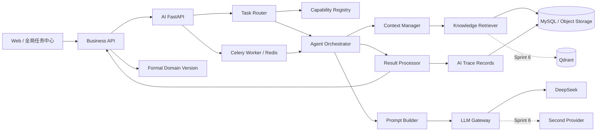
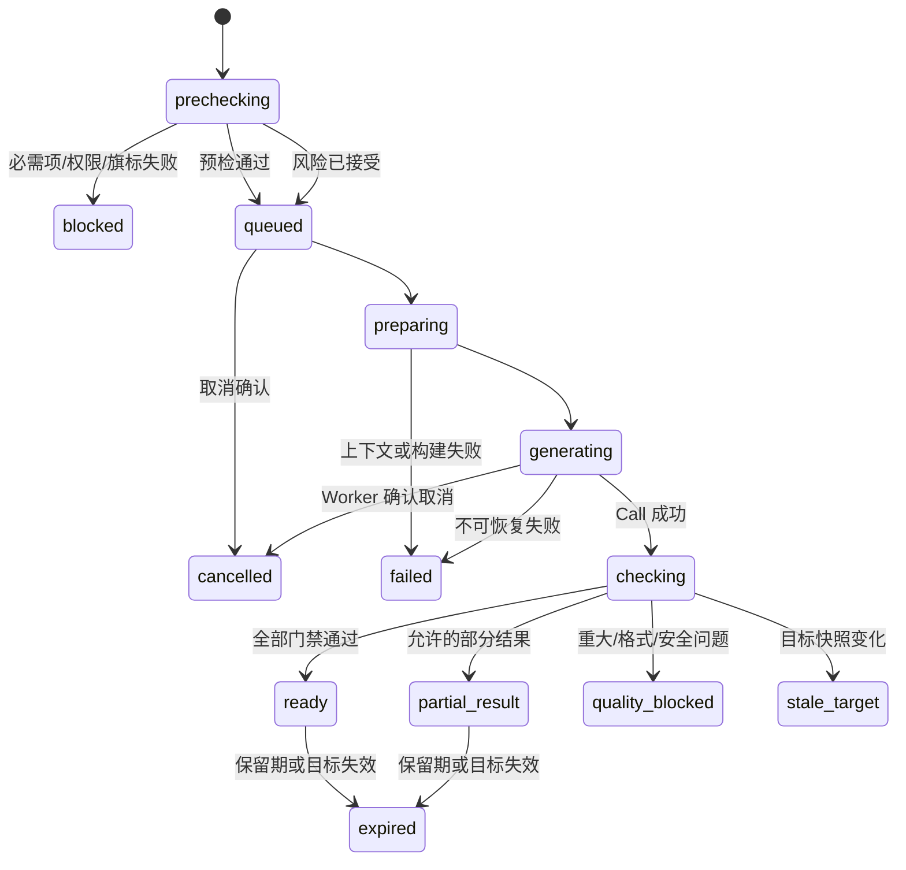

# Agent 架构设计

> 文档状态：当前有效
> 设计版本：V1.0
> 日期：2026-07-29
> 主责范围：Agent 逻辑架构、执行状态、组件职责、异常恢复与降级

## 1. 架构结论

Agent 是独立 AI 服务中的受控执行编排器。业务后端拥有身份、权限、Project Version、业务对象和正式化命令；Agent 只负责把已授权的业务任务转换为可追溯的候选结果。

已确认技术承载保持不变：FastAPI 独立 AI API、Celery Worker、Redis 队列、OpenAI-compatible Gateway、DeepSeek；Qdrant 和第二 Provider 仅在 Sprint 6 启用。本文定义逻辑职责，不新增代码或可执行契约。

## 2. 架构原则

- 业务状态与 AI 执行状态分离。
- Task 与 Call 分离：Task 表示一次意图，Call 表示一次实际模型请求。
- 编排与能力内容分离：Agent 不把具体方法硬编码为不可版本化逻辑。
- 所有执行输入都冻结目标快照和 Capability Bundle。
- 重试新增事实，不覆盖失败历史。
- 权限、目标新鲜度、追溯和安全检查是正式化前硬门禁。
- 可降级、可取消、可恢复，但不静默改变执行路径。

## 3. 逻辑架构

## 4. 组件职责

| 组件 | 负责 | 不负责 |
|---|---|---|
| Business API | 权限、目标对象、幂等、业务命令、候选正式化 | 模型编排和 Prompt 内容 |
| AI API | 接收受控任务、预检、创建/查询/取消任务 | 直接写正式业务产物 |
| Task Router | 任务分类、候选能力过滤、Capability Bundle 冻结 | 绕过兼容性选任意 Skill |
| Capability Registry | 提供 active Skill/Prompt/Template/Context/Model 版本与兼容信息 | 修改历史调用快照 |
| Agent Orchestrator | 按 Skill 流程组织检索、构建、调用和检查 | 拥有 Project Version 状态 |
| Context Manager | 必需/可选来源、预算、压缩、指纹和排除 | 将全部历史无差别注入 |
| Knowledge Retriever | 权限内结构化、关键词、规则与向量检索 | 把 Qdrant 当事实源 |
| Prompt Builder | 确定性组合 Prompt、Skill 规则、Context 和 Template | 运行时改写已发布版本 |
| LLM Gateway | Provider 适配、请求、流式/非流式、Token/错误映射 | 决定业务采用结论 |
| Result Processor | 解析、Schema、必填、追溯、安全和质量检查 | 把候选直接设为正式 |
| Trace Recorder | 保存 Task/Call/Context/Result/Evaluation 事实 | 保存明文密钥和无关敏感正文 |

## 5. 执行阶段

### 5.1 Precheck

检查身份、项目与目标权限、功能旗标、任务类型、必需输入、目标版本和快照哈希。缺失分两类：

- 阻断缺失：无法安全执行，进入 `blocked`。
- 可接受风险：展示缺失项和影响，用户提交理由后记录 `risk_accepted`。

### 5.2 Route

Router 选择并冻结 Capability Bundle。冻结后若组件版本被管理员切换，当前 Task 继续使用原版本；新 Task 使用新版本。

### 5.3 Prepare

Context Manager 生成候选来源，权限过滤、去重、排序、压缩和预算分配，并逐项记录 retrieved/injected/excluded。Prompt Builder 只消费已经批准注入的来源。

### 5.4 Generate

Gateway 发起 Call，记录 Provider、Model、配置版本、开始时间、Token、成本和错误映射。流式片段只用于进度展示，未完成片段不作为正式 Result。

### 5.5 Check

Result Processor 解析输出，执行结构、必填、来源、目标快照、安全和任务专用规则。结果分为 ready、partial_result、quality_blocked 或 failed。

### 5.6 Review and Formalize

Agent 返回候选和追溯摘要。用户在业务页面采用、修改后采用或拒绝；业务服务再次校验权限、目标快照和并发版本，再创建正式领域版本。

## 6. AI Task 状态模型

页面状态名称和事件事实沿用当前页面状态机及埋点设计；实现时不得另造一套同义状态。

## 7. Call、重试与恢复

### 7.1 重试层级

| 层级 | 适用 | 记录方式 |
|---|---|---|
| Provider Call 重试 | 限流、瞬时网络、可恢复 5xx | 同一 Task 新增 `ai_call.sequence_no` |
| 结果修复重试 | 可解析修复、格式不合格且无安全风险 | 新增 Call，标记 retry reason |
| Task 重跑 | 输入、目标快照或能力版本发生变化 | 新建 Task，使用 `retry_of_task_id` |

权限失败、安全阻断、确定性输入缺失、目标已变旧不可通过原 Call 自动重试解决。

### 7.2 退避与上限

重试次数、退避、超时和熔断由 Provider Profile/任务策略配置，不写死在 Skill 或 Prompt 中。达到上限后返回可解释失败和人工替代路径。

### 7.3 幂等

- 创建 Task 使用业务动作的 idempotency key，重复提交不创建并行意图。
- Provider 请求能使用供应商幂等键时，键与 Call 绑定。
- 正式化命令单独幂等，不能因为 Task 成功自动触发。

## 8. 取消、离页与过期

- 用户离开页面不取消 Task；全局任务中心继续展示状态。
- `cancel_requested` 只表示命令已受理，Worker 确认后才进入 `cancelled`。
- Provider 已完成但取消先到时，结果可保留审计，但不得作为可采用候选展示。
- 目标版本变化时进入 `stale_target`；用户可查看差异并基于新快照新建 Task。
- 候选保留期到期进入 `expired`；历史追溯记录按数据保留策略处理。

## 9. 编排模式

### 9.1 单次生成

适用于 Requirement、PRD 章节或 Plan 的一次 Context → Prompt → Call → Check。

### 9.2 分阶段生成

适用于 Flow：文本候选通过 Review 后才能进入 Mermaid，再经 Review、`.drawio` 和逻辑校验。每层有独立目标快照和候选，不用一个长调用绕过门禁。

### 9.3 分析与比较

适用于 Review、Difference 和 Issue 分析。输入侧必须区分正式来源、实现证据、用户说明和 AI 推论；输出逐项保留定位和证据。

### 9.4 知识候选

适用于 Sprint 6。Agent 只创建 Experience/Checklist 候选，人工审核后业务服务才创建正式知识版本。

## 10. 事件与可观测性

### 10.1 关键事件

沿用已确认事件：`ai.task.precheck_started/blocked/risk_accepted/queued/preparing/generating/checking/ready/partial_result/quality_blocked/failed/cancelled/expired/stale_target/retry_created`，以及 `ai.call.started/succeeded/failed`、`ai.context.selected`、`ai.result.generated/evaluated`。

### 10.2 日志关联

业务请求、Task、Call、Outbox、行为事件和操作审计统一使用 trace ID。日志只记录结构化状态、耗时、错误分类和去敏标识，不记录完整 Prompt、密钥或敏感 Context。

### 10.3 运行护栏

- 任务/调用成功率、首次成功率、重试率。
- P50/P95 时延、Token 和估算成本。
- 正式结果追溯完整率 100%。
- 重大错误率、质量阻断率和 stale target 数量。
- Provider、任务类型和能力版本分层错误分布。

## 11. 安全边界

- Business API 生成内部授权声明，AI API 不信任前端直接传入的权限范围。
- Context 读取使用最小权限，并在检索前过滤 project/user scope。
- 外部文件和知识内容不得覆盖 System Prompt、安全策略或工具权限。
- Provider Profile 只暴露 Secret 引用，Worker 在运行时按权限取用。
- Prompt、Context 摘要、错误和日志进入持久化前做敏感信息过滤。
- 管理操作、版本启停、风险接受和正式化均写操作审计。

## 12. 故障降级

| 故障 | 降级 | 禁止行为 |
|---|---|---|
| AI Service 不可用 | 保留人工录入/上传/确认 | 阻断项目 CRUD |
| Redis/队列不可用 | 拒绝新异步任务，已提交状态可查 | 假装已入队 |
| DeepSeek 不可用 | 返回可恢复失败、转人工 | 未审核切换 Provider |
| Qdrant 不可用 | 结构化/关键词检索 | 影响 MVP 主链或宣称向量成功 |
| Context 来源不可读 | 必需源 blocked；可选源记录排除 | 静默伪造摘要 |
| Result 校验器故障 | 阻止 ready/正式化 | 跳过质量门禁 |
| 追溯写入失败 | 关键命令回滚或任务失败 | 产生不可追溯正式结果 |

## 13. 验收清单

- [ ] 业务服务与 Agent 的状态所有权边界明确。
- [ ] Task、Call、Result 和正式领域版本不混用。
- [ ] 组件均有单一职责和失败边界。
- [ ] 状态与已确认页面状态机/埋点事件一致。
- [ ] 重试新增 Call 或 Task，不覆盖历史。
- [ ] 取消、离页、目标变旧和过期均有确定语义。
- [ ] Flow 不绕过分层 Review。
- [ ] 所有故障存在不破坏 MVP 主链的降级路径。
- [ ] 本文未新增技术栈、数据库或可执行接口实现。
