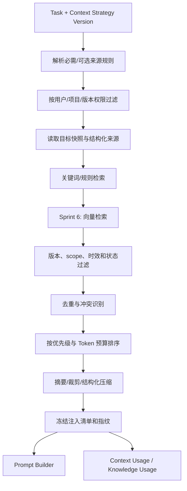

# Context 管理设计

> 文档状态：当前有效
> 设计版本：V1.0
> 日期：2026-07-29
> 主责范围：Context Strategy、动态组合、Experience/Checklist 检索、权限、预算、压缩与追溯

## 1. 设计结论

Context 是一次 AI Call 实际可用的事实与参考集合，不是把项目全部历史发送给模型。Context Manager 按已发布的 Context Strategy Version，在权限过滤后选择必需与可选来源，执行检索、冲突识别、去重、排序、预算和压缩，并逐项记录是否实际注入。

权威性与注入优先级是两个维度：来源更相关不代表更权威，权威来源更高也不代表本次必须全文注入。系统必须保留来源类型、对象、版本、指纹、摘要、检索方法、排序和排除原因。

## 2. Context 对象边界

| 对象 | 含义 |
|---|---|
| Project Context | 项目长期背景和已确认稳定信息 |
| Task Context | 本次用户目标、约束、选择和输入 |
| Target Snapshot | 本次操作的明确业务对象版本及哈希 |
| Context Strategy | 按任务定义来源、必需性、预算和压缩规则 |
| Context Candidate | 检索到但尚未决定注入的来源 |
| Context Usage | 某 Call 对单个来源的 retrieved/injected/excluded 事实 |
| Knowledge Usage | Sprint 6 对 Experience/Checklist/Skill 等资产的检索、注入、引用和采用事实 |

Context 不拥有业务事实；MySQL/对象存储中的正式对象版本是事实源，Qdrant 只是可重建的派生索引。

## 3. 来源分类

### 3.1 来源层级

| 层级 | 来源 | 典型内容 |
|---|---|---|
| C0 | 当前 Task/用户输入 | 目标、范围、补充要求、明确选择 |
| C1 | Target Snapshot | 当前 Requirement/PRD/Flow/Plan/Issue 版本 |
| C2 | 当前 Project Version 正式事实 | 当前有效产物、决策、评审结论、版本关系 |
| C3 | Project Context | 项目定位、术语、长期约束和稳定偏好 |
| C4 | Checklist | 与场景/阶段匹配的检查提醒 |
| C5 | Experience | 经审核的可复用分析参考 |
| C6 | 历史版本 | 只读历史、差异和来源谱系 |
| C7 | 全局/跨项目知识 | 经权限、scope 和脱敏允许的知识 |

MVP 使用 C0～C3 及后台预置的最小 C4/C5 来源追溯；完整知识管理与 Qdrant 混合检索在 Sprint 6 启用，C7 默认属于未来受控能力。

### 3.2 事实角色

每个来源还标记：

- authoritative：当前正式业务事实或有效策略。
- user_asserted：用户本次说明，可能形成变更请求但未自动替代正式事实。
- advisory：Experience、Checklist、Skill 说明等参考。
- historical：历史版本，只读且不代表当前有效。
- candidate：AI 或人工尚未确认的候选。

Prompt Builder 必须保留角色标签，不能把 advisory/candidate 写成 authoritative。

## 4. Context Strategy

### 4.1 定义

Context Strategy 以 `task_type` 为稳定身份，Context Strategy Version 必须绑定 Skill Version。沿用现有数据基线：

- `required_context_json`
- `optional_context_json`
- `limit_config_json`
- `compression_policy_json`
- 内容哈希和当前版本

### 4.2 必需规则

每个来源规则至少定义：来源类型、scope、查询条件、是否必需、允许角色、最大数量、最大 Token、时效/版本规则、冲突处理、压缩方式和缺失处理。

### 4.3 示例策略

| 任务 | 必需来源 | 可选来源 | 缺失处理 |
|---|---|---|---|
| Requirement 分析 | Task 输入、Project Version、Project Context | 来源文件、Checklist、Experience | 原始输入缺失 blocked |
| PRD 生成 | 正式 Requirement Version、Project Context | 当前相关决策、Checklist、Experience | Requirement 非正式或缺失 blocked |
| PRD Review | 指定 PRD Version、Review scope | Requirement、Checklist、历史反馈 | 目标版本缺失 blocked |
| Flow 文本生成 | 指定 PRD/需求版本、生成范围 | 相关术语与 Flow Checklist | 来源/范围缺失 blocked |
| Implementation Plan | 已确认设计版本与范围 | Review 结论、Checklist、Experience | 阻断反馈未处理则 blocked |
| Issue 分析 | Test/Issue/证据、Project Version | 相关正式设计、历史同类 Experience | 证据不足时输出待补充，不猜测 |

具体 JSON 结构在 Sprint 0 的 Schema 设计中冻结，本文不生成可执行 Schema。

## 5. 动态组合流程

向量检索未启用或不可用时直接走结构化/关键词路径，不创建伪向量结果。

## 6. 权限与 Scope

- 权限过滤必须在语义/向量排序前完成。
- 用户、项目、Project Version、对象权限和历史只读状态分别校验。
- 跨项目 Experience 只有在资产 scope 明确允许且内容已脱敏时可用。
- 项目私有正文不得进入全局索引或其他项目候选集。
- 被归档/停用知识默认不进入新调用，但历史 Call 仍可按版本追溯。
- 无权限来源不返回标题、摘要、分数或存在性信息，只记录安全的排除分类。

## 7. 检索策略

### 7.1 结构化检索

按对象 ID、版本关系、阶段、模块、Scenario、Stage、标签和状态查询，是 MVP 首选。确定性关系不交给向量相似度猜测。

### 7.2 关键词检索

用于标题、术语、标签和正文索引。关键词命中仍需版本、scope、时效和权限过滤。

### 7.3 向量检索

Sprint 6 启用 Qdrant，仅索引已审核且允许检索的知识版本。索引记录绑定资产版本、来源哈希和索引版本；MySQL/对象存储变化后可重建。Qdrant 不返回或持有业务真相。

### 7.4 混合排序

排序信号包括：确定性关系、任务/阶段匹配、版本有效性、Scenario/标签、关键词相关、向量相关、时效和证据强度。具体权重属于 Context Strategy Version；权限、状态和排除范围是硬过滤，不参与加权抵消。

## 8. Experience 检索

### 8.1 可检索前提

- Experience Candidate 已人工审核并形成 active Experience Version。
- 包含问题、分析、方案、适用范围、排除范围、证据强度和来源。
- 当前任务符合适用范围且未命中排除范围。
- 项目/全局 scope 和权限允许。

### 8.2 选择规则

1. 先按任务阶段、模块、对象类型和问题分类过滤。
2. 再按适用/排除范围、项目关系、证据强度和版本状态过滤。
3. 最后进行关键词/向量排序。
4. 注入时标记为 advisory，展示适用与排除条件，不把经验写成硬规则。

### 8.3 去重与冲突

同一 Experience 多版本只选择策略允许的有效版本；多个 Experience 内容相近时保留证据更强、范围更精确者。与当前正式项目事实冲突时不静默合并：排除或以“参考冲突”呈现，由用户判断。

## 9. Checklist 检索

### 9.1 可检索前提

- Checklist Version 为 active，绑定 Scenario、Stage、来源和适用范围。
- 当前任务的阶段、模块、对象和 scope 匹配。
- 来源 Experience 如已废弃，不自动删除 Checklist，但应按审核规则标记复核。

### 9.2 使用方式

Checklist 是提醒与覆盖检查，不是事实来源或简单对错判断。它用于：

- 生成前确定适用要求项。
- Result Processor 计算要求项完整度。
- Review 时提示可能遗漏项。
- 人工评价时提供一致量表入口。

### 9.3 排序与合并

按 Stage 精确匹配、Scenario、模块、对象、强制级别/来源和版本排序。内容相同且来源不同的项合并展示但保留全部来源；冲突项分别呈现，不由模型私自裁决。

## 10. Token 预算

### 10.1 预算组成

总输入预算扣除：System Policy、Skill/Prompt 固定部分、Template/输出预留和安全余量后，剩余才分配给 Context。预算由模型能力、任务类型和 Context Strategy Version 决定。

### 10.2 分配原则

1. 保证 C0 当前任务和 C1 目标快照的最小完整内容。
2. 按任务需要注入 C2 当前正式事实和 C3 Project Context。
3. C4 Checklist 优先注入适用条目，不注入无关全文。
4. C5 Experience 只选少量高相关、有证据且范围匹配的版本。
5. C6 历史只在比较/追溯任务中使用；普通生成默认不注入。
6. C7 仅在明确允许时使用。

不在设计阶段虚设统一百分比；每类任务通过固定回归确定 `limit_config`，并以 Token、完整度、重大错误和采用反馈验证。

### 10.3 超限处理

- 先删除未注入的低相关可选候选。
- 再按策略压缩 advisory/history 来源。
- 正式目标内容优先结构化抽取，不能为保留 Experience 而截断关键业务规则。
- 必需来源压缩后仍超限时 blocked 或拆分任务，不静默丢弃。

## 11. 压缩与摘要

压缩方式包括字段选择、章节抽取、去重、规则摘要和受控 AI 摘要。AI 摘要只能作为派生 Context，必须保留原来源版本、摘要生成方式、内容指纹和时间；不得替代事实源。

对于权限、安全、验收、业务规则和重大错误证据，优先保留原文片段/结构化字段，禁止只保留无引用概括。

## 12. 冲突与时效

### 12.1 冲突优先级

当前正式版本 > 已确认项目决策/Project Context > 当前用户补充（作为变更意图） > Checklist > Experience > 历史版本 > 全局参考。

用户明确要求修改正式规则时，应把冲突标记为变更意图并生成候选，不能假装旧规则已失效。

### 12.2 时效

- 所有业务来源引用明确版本，不用“最新”文本代替版本 ID。
- 调用开始后目标哈希变化，结果标记 `stale_target`。
- active 知识版本变化不改变运行中 Call。
- 过期/归档知识不用于新调用，除非任务显式要求历史分析。

## 13. 追溯记录

每个 Context Candidate/Usage 至少记录：

- `source_type/source_id/source_version_id`
- retrieval method、candidate rank、relevance score（如适用）
- was injected、exclusion reason
- content fingerprint、去敏摘要、Token count
- Context Strategy Version 和 Call

Sprint 6 的知识资产另外通过 `knowledge_usage` 记录 retrieved、injected、cited、adopted，支持检索命中、注入、引用和采用分阶段分析。

## 14. Context 质量与反馈

| 现象 | 可能归因 |
|---|---|
| 追溯失败 | 来源版本或 Usage 记录缺失 |
| 事实错误 | 权威来源漏选、历史/候选误当正式 |
| 内容遗漏 | 必需来源规则或 Token 分配不合理 |
| 无关冗长 | 检索过滤、去重或压缩不足 |
| 错误引用 | scope、版本、排序或引用生成问题 |
| 时延/Token 过高 | 候选集、摘要、向量或预算策略问题 |

优化必须新建 Context Strategy Version，固定其他能力版本做回归；若 Skill/Prompt/Model 同时变化，标记组合变更。

## 15. 降级与失败

| 情况 | 处理 |
|---|---|
| 必需来源无权限/不存在 | blocked，不猜测 |
| 可选来源不可用 | 记录排除和风险；按策略继续 |
| Qdrant 不可用 | 降级结构化/关键词检索 |
| 摘要失败 | 使用受控裁剪或阻断，不伪造摘要 |
| Token 超限 | 压缩、拆分或 blocked |
| 来源冲突 | 显式标记冲突，不静默合并 |
| 目标变旧 | stale_target，新建 Task |

## 16. 验收清单

- [ ] Context 来源、角色、scope、版本和权威性均可识别。
- [ ] Context Strategy Version 绑定 Skill Version，并冻结必需/可选/预算/压缩规则。
- [ ] 权限过滤发生在关键词/向量排序之前。
- [ ] 动态组合不无差别发送全部历史。
- [ ] Experience 作为 advisory，Checklist 作为提醒/覆盖检查。
- [ ] Qdrant 仅是可重建派生索引，故障可降级。
- [ ] 必需来源不能因 Token 超限被静默丢弃。
- [ ] 每个候选来源的注入或排除都有追溯记录。
- [ ] Context 变更能按 Strategy Version 回归、归因和回退。
