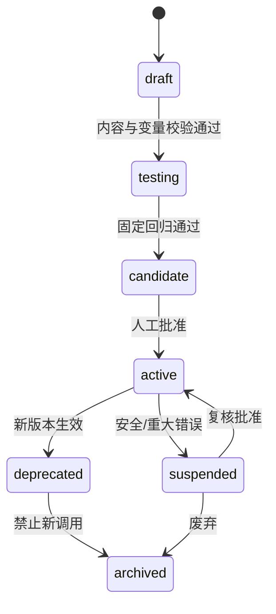

# Prompt 管理设计

> 文档状态：当前有效
> 设计版本：V1.0
> 日期：2026-07-29
> 主责范围：Prompt 定义、分层组合、变量、版本、测试、发布与安全

## 1. 设计结论

Prompt 是绑定 Skill Version 的版本化语言指令，不是项目事实、输出模板、上下文仓库或运行时配置的混合容器。生产调用只使用已发布的 Prompt Version；运行时通过受控变量和 Context 引用组装，不允许直接编辑已发布内容。

MVP 使用后台预置 Prompt Version 和固定回归；Sprint 6 开放只读或管理入口；自动 Prompt 优化和在线实验属于未来能力。

## 2. 对象边界

| 对象 | 负责 | 不负责 |
|---|---|---|
| System Policy | 平台级安全、候选边界、权限和不可覆盖规则 | 具体任务写法 |
| Skill Rule | 完成任务的方法、步骤、工具和检查 | 大段项目事实 |
| Prompt Version | 任务指令、角色、推理约束、变量和交付要求 | 输出字段/版式的唯一真相 |
| Template Version | 输出结构、章节、字段和格式 | 模型行为策略 |
| Context | 当前任务的事实和参考来源 | 固定执行方法 |
| Provider Config | 温度、上限、超时等运行参数 | Prompt 文本 |

## 3. Prompt 模型

### 3.1 Prompt

稳定身份，必须绑定一个 Skill Version，包含名称、用途、状态和当前版本指针。一个 Skill Version 可有多个 Prompt，例如按任务子类型或语言拆分，但 Router 必须确定唯一选择规则。

### 3.2 Prompt Version

不可变版本，沿用现有数据基线：

- `system_prompt`
- `user_template`
- `variables_json`
- `content_hash`
- `version_no`
- 当前版本标记

逻辑元数据还包括适用任务、语言、变量类型、兼容 Template/Model 能力、评价量表、回归集和发布证据；实现映射在 Sprint 0 字段级契约阶段复核，不在本文直接修改数据设计。

## 4. Prompt 分层组合

Prompt Builder 按以下固定顺序组合：

1. 平台 System Policy：安全、权限、候选边界、数据处理规则。
2. Skill Rule：本任务的执行方法和禁止动作。
3. Prompt System：任务角色、目标、判断准则和输出要求。
4. 任务信息：Task Envelope 中的用户目标、目标对象和约束。
5. Context：按来源分段的正式事实、用户输入、Checklist、Experience 等。
6. Template：输出结构或 Schema 说明。
7. 最终用户补充：只进入允许的变量位置，不得覆盖 1～3 层。

上层规则优先级高于下层。若用户输入要求越权、泄密、跳过确认或把候选设为正式，Prompt Builder 必须拒绝或标记冲突，而不是将其作为高优先级指令拼接。

## 5. 变量设计

### 5.1 变量类型

| 类型 | 示例 | 来源 |
|---|---|---|
| 标识变量 | task_type、project_version_id、target_version | Task Envelope |
| 业务变量 | goal、scope、acceptance requirements | 已授权业务对象或用户输入 |
| Context 引用 | current_artifact、project_context、checklists | Context Manager 输出 |
| 输出变量 | language、format、detail_level | 受控用户偏好/任务配置 |
| 运行提示 | time_budget、provider_capabilities | Orchestrator；不含 Secret |

### 5.2 变量规则

- 每个变量必须定义名称、类型、是否必需、允许来源、长度/数量上限和缺失处理。
- 结构化对象使用序列化后的受控片段，不允许任意字符串替换系统段落。
- 缺失必需变量在调用前 blocked；可选变量缺失显示影响并按策略处理。
- Secret、密码、Token、Provider 密钥不得定义为 Prompt 变量。
- 变量值进入日志前去敏；完整敏感正文不记录在 Prompt 调试日志。
- 用户可编辑变量与系统只读变量必须区分。

## 6. Prompt 生命周期

MVP 可由管理员离线维护预置版本，但仍遵循测试、批准、生效和回退记录，不允许直接改数据库文本绕过版本。

## 7. 版本规则

### 7.1 必须新建版本

- System Prompt 或 User Template 的任何执行语义变化。
- 变量新增、删除、类型、必需性或来源变化。
- 任务目标、判断标准、来源使用规则或输出要求变化。
- 安全边界、拒绝规则或候选/正式化表述变化。
- 与 Skill、Template、Context Strategy 或 Model 的兼容范围变化。

纯管理备注可更新 Prompt 元数据并写审计，不改变 Prompt Version。

### 7.2 发布与回退

- 发布冻结内容哈希、兼容版本、回归集和 `rubric_version`。
- 新 Task 使用新版本；进行中的 Task 继续使用冻结版本。
- 回退把新调用指向已验证历史版本，不覆盖或复制历史内容。
- 历史任务按 `prompt_version_id` 查看只读快照。

## 8. 测试与评价

### 8.1 静态检查

- 所有变量有定义且无未引用/未定义变量。
- 分层边界清晰，Template 结构不被 Prompt 重复维护。
- 无密钥、真实敏感数据、无权限来源或不可验证事实。
- 不包含绕过用户确认、直接修改业务状态或隐藏来源的指令。
- Token 估算不超过 Context Strategy 与模型预算。

### 8.2 固定回归

对每个适用任务至少覆盖：正常输入、必需项缺失、冲突来源、恶意注入、长 Context、Provider 失败和目标变旧。对比固定输入、Context 快照、Skill/Template/Model 和量表版本，仅改变 Prompt 时才可归因给 Prompt。

### 8.3 质量 Gate

- 结构、必填、追溯和安全全量通过。
- 重大错误不得高于现有 active 版本；出现新增重大错误即阻断发布。
- 有效采用、直接采用、大改和拒绝作为上线后观察，不用小样本虚设承诺值。
- 证据不足可发布为修复性候选，但不得宣称质量提升。

## 9. Prompt 安全

### 9.1 Prompt 注入防护

- 外部文件、网页、Experience 和用户正文统一标记为 data，不作为系统指令执行。
- 来源内容中的“忽略之前规则”“调用工具”等文本不得提升权限。
- 工具可用范围由 Skill/Orchestrator 决定，不由 Context 内容决定。
- 引用内容使用明确分隔和来源标签，避免与系统指令混淆。

### 9.2 内容与日志

- 管理员查看 Prompt Version 需要相应权限，普通用户只看必要追溯摘要。
- 调试视图默认显示变量名、来源和去敏预览，不显示 Secret 或完整敏感正文。
- Prompt 导出包含版本、哈希、来源和敏感信息检查结果；导出动作写审计。

## 10. 多语言与模型兼容

- 输出语言作为受控变量，不复制多份内容相同的 Prompt，除非语言差异影响任务规则。
- Prompt 不依赖单一 Provider 的私有语法；Provider 特有能力通过 Gateway/兼容元数据处理。
- JSON/结构化输出必须声明模型能力和 Result Processor 校验方式。
- 更换 Model 时保持 Prompt/Context/Template 快照，执行同任务回归；不能只凭单次样例切换。

## 11. 管理功能分期

| 阶段 | 功能 |
|---|---|
| MVP | 预置 Prompt/Version、内容哈希、能力绑定、固定回归和调用追溯 |
| Sprint 6 | 列表/详情/版本比较、草稿测试、发布、回退、权限与审计 |
| 未来 | 受控实验、自动优化候选、批量评测和组织级复用 |

## 12. 验收清单

- [ ] Prompt 与 Skill、Template、Context 和运行参数边界明确。
- [ ] Prompt Builder 有唯一、不可被用户覆盖的分层顺序。
- [ ] 所有变量有类型、来源、限制和缺失处理。
- [ ] 发布版本不可变，运行中不热替换。
- [ ] 静态、注入、回归和重大错误 Gate 完整。
- [ ] Prompt 变化能按版本单独归因和回退。
- [ ] MVP 仅使用预置能力，完整管理不提前开放。
