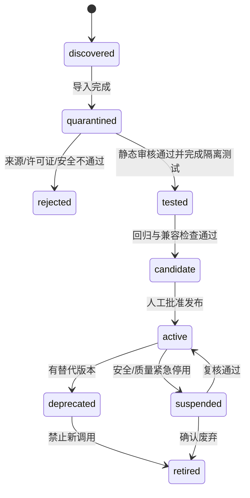
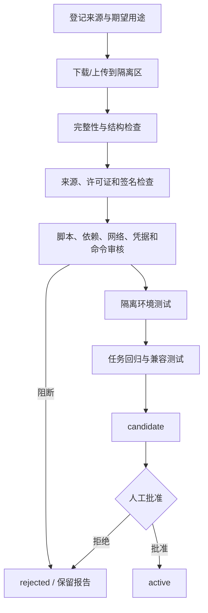

# Skill 体系设计

> 文档状态：当前有效
> 设计版本：V1.0
> 日期：2026-07-29
> 主责范围：平台运行时 Skill 的定义、查询匹配、安装审核、版本、发布与停用

## 1. 术语与边界

本文设计的是产品平台内部的运行时 Skill，不等同于开发本项目时 Codex 使用的本地 `SKILL.md`。两者可以共享“来源、审核、版本、最小权限”等原则，但存储、执行环境和发布流程不得混用。

平台 Skill 定义“如何完成某类 AI 任务”，包括适用任务、输入/输出约束、执行步骤、工具需求、风险和评价要求。Skill 不承载大量项目事实或案例：项目事实进入 Context，经验进入 Experience，检查提醒进入 Checklist，输出结构进入 Template，语言指令进入 Prompt。

## 2. Skill 类型

| 类型 | 来源 | 使用范围 | 阶段 |
|---|---|---|---|
| built_in | 平台随版本发布 | 全局、只读或受控更新 | MVP |
| admin_managed | 平台管理员导入/维护 | 全局或指定任务域 | Sprint 6 |
| user_imported | 用户受控导入 | 用户/项目范围 | 未来 |
| marketplace | 受信市场安装 | 按许可证与策略 | 未来 |

MVP 只启用经过发布验证的 built_in Skill Version，不提供任意上传、脚本安装或市场入口。

## 3. Skill 逻辑模型

### 3.1 Skill

稳定身份，包含名称、类型、来源、状态和当前版本指针。归档 Skill 不影响历史调用回放。

### 3.2 Skill Version

不可变执行版本，至少描述：

- 版本号和内容哈希。
- 支持的标准任务类型、业务阶段和目标对象。
- 输入 Schema、输出 Schema 与必需变量。
- 执行步骤、允许的工具/检索方式和禁止动作。
- 依赖的 Prompt/Context Strategy 兼容范围。
- 风险级别、权限需求、超时/重试约束。
- 评价量表版本和固定回归集引用。
- 来源、许可证、审核与发布证据引用。

现有数据基线以 `skill`、`skill_version`、`source_ref`、`rule_text`、Schema 引用、内容哈希和操作审计承载；更细的审核证据可作为受控文件引用。本文不直接新增物理表或字段。

## 4. Skill 状态与生命周期

历史调用始终保留当时版本引用。`retired` 只禁止新生产调用，不删除版本。

## 5. Skill 查询

### 5.1 查询入口

- Task Router 按任务类型查询可执行版本。
- 管理员按名称、来源、状态、任务域、风险和版本查询。
- 用户在允许手动选择的任务中查看经过权限过滤的候选。
- 历史任务按实际 `skill_version_id` 查看只读快照。

### 5.2 过滤顺序

1. scope 与权限。
2. active 状态和功能旗标。
3. 标准任务类型、阶段、目标对象。
4. 输入/输出 Schema 兼容。
5. Prompt、Template、Context Strategy、Model 能力兼容。
6. 风险、工具和 Provider 可用性。
7. 回归状态与版本策略。

语义匹配只在通过这些确定性过滤的候选内执行。

## 6. Skill 匹配与评分

### 6.1 三级匹配

1. 规则匹配：任务目录到 Skill 的允许关系，是硬边界。
2. 语义匹配：在合法候选内比较目标和能力描述，是排序信号。
3. 用户选择：用户可选择合法版本，是明确偏好。

### 6.2 排序因子

排序考虑任务专用度、输入覆盖、输出兼容、当前发布状态、回归通过、近期重大错误护栏和用户合法选择。具体权重配置属于 Router 版本，不写死在 Skill 内容中。

### 6.3 匹配解释

每次路由至少能返回：命中规则、候选数量、选中 Skill Version、用户选择是否生效、被排除候选及原因。解释信息用于审计，不向无权限用户暴露其他项目或管理员配置。

## 7. 安装与导入流程

“安装”指把外部包转换为隔离候选，不等于启用。

### 7.1 安装前必备信息

- 名称、来源 URL/标识、作者、版本或 Commit、许可证。
- 适用任务、期望 scope、是否替代已有 Skill。
- 文件清单、内容哈希、脚本和二进制清单。
- 外部依赖、网络域名、凭据类型、系统命令、文件读写范围。
- 输入/输出 Schema、工具权限和数据敏感级别。
- 已知风险、测试计划、回退版本和责任人。

### 7.2 阻断条件

- 来源不可验证或许可证不允许目标用途。
- 请求未声明的网络、凭据、系统命令或越权文件访问。
- 包含密钥、Token、密码、恶意载荷或混淆执行内容。
- 试图覆盖 active 历史版本、绕过版本机制或删除审计证据。
- 与现有 Skill 同名但无法证明兼容/升级关系。
- 回归失败、重大错误或输出越过业务正式化边界。

### 7.3 安装安全策略

- 默认不执行安装包中的脚本；需要执行时必须单独列出、隔离运行并人工批准。
- 外部网络默认禁止，只放行审核过的域名和只读下载动作。
- 凭据按 Secret 引用注入，Skill 包内不得包含凭据值。
- 导入包先进入 quarantine，不能被生产 Router 查询。
- 安装与启用是两个独立授权动作。

## 8. 审核模型

### 8.1 静态审核

检查清单：结构、元数据、来源、许可证、哈希、脚本、依赖、网络、凭据、命令、文件访问、工具权限、Prompt 注入风险、敏感信息和同名重复。

### 8.2 动态测试

- 在隔离数据和最小权限环境运行。
- 成功、输入缺失、无权限、Provider 失败、超时、取消和恶意输入用例。
- 验证不直接修改正式业务对象。
- 验证输出 Schema、来源追溯和敏感信息过滤。

### 8.3 任务回归

每个 Skill Version 绑定固定代表性任务集，记录输入快照、Context 快照、能力组合、期望门禁和结果。对比必须沿用相同量表版本；证据不足时不得宣称优于当前版本。

### 8.4 人工批准

批准人确认审核报告、适用范围、风险、默认路由、回退版本和功能旗标。批准结论写操作审计，不由导入者自动批准自己的高风险 Skill。

## 9. 版本机制

### 9.1 新版本触发

以下任一变化必须创建新 Skill Version：

- 执行步骤、规则或安全边界变化。
- 输入/输出 Schema、工具权限或支持任务变化。
- 依赖、网络、凭据或命令需求变化。
- 默认 Prompt/Context 策略兼容范围变化。
- 会影响输出或执行的修复，即使对用户称为“小改”。

仅描述、标签或管理备注变化可修改 Skill 元数据，但仍写审计。

### 9.2 不可变与当前版本

- Skill Version 发布后不可原地编辑。
- 同一 Skill 只能有一个当前 active 生产版本；灰度实验属于未来实验平台，不在本阶段默认设计。
- 历史任务固定引用原版本，当前指针变化不改历史。
- 回退是把允许的新调用指向已验证历史版本，不复制或覆盖版本内容。

### 9.3 兼容性

兼容检查至少覆盖：Task Envelope、输入/输出 Schema、Prompt 变量、Template 格式、Context Strategy 需求、模型能力和 Result Processor 规则。破坏性变更需要同步的新版本组合和回归证据。

## 10. 发布、停用与紧急处置

### 10.1 发布 Gate

- 来源/许可证/安全审核通过。
- 输入输出和权限契约完整。
- 固定回归集通过，重大错误为零或有明确阻断结论。
- 追溯记录完整，降级和回退已验证。
- Prompt/Template/Context 兼容版本已冻结。
- 人工批准和生效时间已记录。

### 10.2 正常停用

先 deprecated 并指定替代版本，再 retired。新任务禁止使用，运行中任务按冻结版本完成，历史记录继续可查。

### 10.3 紧急停用

安全泄露、越权、重大错误或供应链问题可立即 suspended：阻止新 Task，取消尚未生成有效 Result 的任务，保留证据并启动影响范围查询。恢复必须创建或重新批准版本，不静默解除。

## 11. 与其他能力的关系

| 对象 | 与 Skill 的关系 |
|---|---|
| Prompt | 绑定 Skill Version，负责语言指令和变量 |
| Template | 控制输出结构，可由多个兼容 Skill 使用 |
| Context Strategy | 绑定 Skill Version，决定来源、预算和压缩 |
| Experience | 可复用分析参考，不改变 Skill 执行规则 |
| Checklist | 场景化提醒/审查项，不等同于输入 Schema |
| Model | 由 Gateway 选择兼容模型，Skill 不保存密钥 |
| Evaluation | 按 Skill 任务类型和量表评价结果 |

## 12. MVP、Sprint 6 与未来边界

| 阶段 | 能力 |
|---|---|
| MVP | 预置 Skill/Version、规则路由、内容哈希、追溯、固定回归、管理员受控发布 |
| Sprint 6 | Skill 只读或管理入口、导入候选、审核、启停、与知识/RAG 联动 |
| 未来 | 用户级安装、市场、组织共享、在线实验和自动优化候选 |

## 13. 验收清单

- [ ] 平台 Skill 与开发环境 Codex Skill 明确分离。
- [ ] Skill、Context、Experience、Checklist、Prompt、Template 的职责不重叠。
- [ ] 查询先做权限和确定性兼容过滤，再做语义排序。
- [ ] 安装、审核、测试、批准和启用是可审计的独立步骤。
- [ ] 默认不运行外部脚本、不开放未声明网络和凭据。
- [ ] Skill Version 不可变，历史调用可复现。
- [ ] 停用不删除历史，紧急处置能定位影响范围。
- [ ] MVP 不开放任意外部安装，完整管理保持 Sprint 6/未来边界。
