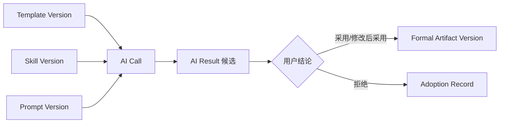
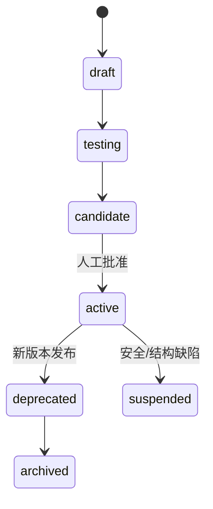

# 模板管理设计

> 文档状态：当前有效
> 设计版本：V1.0
> 日期：2026-07-29
> 主责范围：AI 输出 Template 的分类、版本、校验、选择、发布和复用

## 1. 设计结论

Template 控制候选或正式产物的输出结构，保证结果可检查、可编辑、可比较和可保存。Template 不定义任务方法，不保存项目事实，也不承担 System Prompt 的安全规则。

每次实际使用必须冻结 Template Version；无模板任务也要由 Skill/Result Schema 明确允许。正式领域产物继续使用各自不可变业务版本，Template Version 只是生成来源之一，不能替代产物版本。

## 2. Template 分类

### 2.1 按用途

| 类型 | 例子 | 主要校验 |
|---|---|---|
| structured_document | Requirement、PRD、Implementation Plan | 章节、必填项、来源引用 |
| review_output | Feedback、Difference、Issue 分析 | 条目结构、定位、严重性、处理建议 |
| data_schema | 结构化 JSON 候选 | Schema、类型、枚举、必填字段 |
| diagram_source | 文本 Flow、Mermaid | 节点/边、语法、来源关系 |
| knowledge_asset | Experience/Checklist 候选 | 适用/排除范围、证据、来源 |
| evaluation_form | 人工评价表 | 维度、量表、N/A、重大错误 |

### 2.2 按来源

- system：平台内置并随发布管理。
- admin：管理员在受控范围创建/导入。
- user：未来用户级自定义，必须限制 scope 和权限。

MVP 只开放 system 预置版本；Sprint 6 可开放 system/admin 管理；user 模板属于未来。

## 3. 数据模型

沿用现有 `template` 和 `template_version`：

- Template：名称、类型、来源、状态、当前版本指针。
- Template Version：版本号、内容格式、内容、变量定义、内容哈希和当前标记。

逻辑上每个版本还应具备适用任务、目标对象、输出 MIME/格式、校验器/Schema 引用、兼容 Skill/Prompt、示例与发布证据。实现时优先通过现有字段和受控引用映射，任何物理结构调整必须回到已确认数据设计另行评审。

## 4. Template 与正式产物的关系

- Template 更新不会修改已有正式产物。
- 编辑正式产物形成新的 Artifact Version，不回写 Template。
- 从高价值编辑中提炼 Template 改进必须先形成候选，再单独审核和发布。

## 5. 模板内容规范

### 5.1 Markdown 文档模板

定义章节 ID、标题、是否必需、重复规则、字段语义、来源要求和空值表达。显示标题可以本地化，但稳定章节 ID 不随文案变化。

### 5.2 JSON/结构化模板

使用受控 Schema 引用，明确类型、必填、枚举、长度、嵌套上限和未知字段策略。模型返回必须经解析与 Schema 校验，不能以“看起来像 JSON”通过。

### 5.3 Mermaid/图形源模板

Template 只定义允许的图类型、节点/边字段、ID 和注释结构。业务逻辑正确性由 Flow Review 和逻辑校验负责，语法通过不等于业务通过。

### 5.4 评价模板

量表版本、维度、评分定义、N/A 和重大错误标签必须固定；不能在同一观察窗中静默修改。

## 6. 变量与占位符

- 变量必须有名称、类型、必需性、允许来源、默认值策略和转义规则。
- Template 变量表达输出结构所需元数据，不复制 Prompt 的完整任务指令。
- 未定义变量、循环引用和未转义内容阻断发布。
- 空值必须使用显式规则：省略、`N/A`、空数组或待补充，不允许模型自行猜测。
- 用户输入进入正文槽位时按内容处理，不能改变模板控制指令。

## 7. 选择与兼容

### 7.1 选择顺序

1. Task Router 确定任务类型和输出形态。
2. Skill Version 声明允许的 Template 类型/兼容版本。
3. 用户若有合法显式选择则采用。
4. 否则选择任务类型的当前默认 active 版本。
5. 无合法模板且任务要求结构化输出时进入 blocked。

### 7.2 兼容检查

- 任务类型与目标对象。
- Skill 输出 Schema 与 Template 结构。
- Prompt 变量与 Template 占位符。
- Result Processor 是否具备对应解析/校验器。
- 模型是否支持所需输出能力。
- 语言和内容格式。

## 8. 生命周期与版本

以下变化必须新建 Template Version：章节/字段、必填性、Schema、变量、格式、来源要求、校验规则或任何影响输出内容的变更。发布后内容不可变；回退只切换新调用的当前版本指针。

## 9. 校验与测试

### 9.1 静态校验

- 语法、Schema、章节 ID 和变量完整。
- 必填/可选、空值和重复规则无冲突。
- 无 Secret、真实敏感样例或项目绝对路径。
- 不包含绕过用户确认、权限或正式化规则的文本。

### 9.2 渲染校验

使用最小、典型、长文本、缺失可选项、多语言和恶意输入样例渲染，检查结构稳定、转义、可读性和 Token 规模。

### 9.3 任务回归

与兼容 Skill/Prompt/Context/Model 的固定版本组合运行。结构检查、必填、追溯和安全必须通过；只改变 Template 的对比才能归因给 Template。

## 10. 发布与回退

发布 Gate：

- 类型、scope、变量和兼容关系完整。
- 静态、渲染和任务回归通过。
- Result Processor 校验器存在并通过反例测试。
- 重大错误和安全检查通过。
- 人工批准、生效时间、回退版本和内容哈希已记录。

紧急结构缺陷可 suspended，阻止新 Task 使用；历史调用和正式产物不删除。

## 11. 模板库组织

管理视图按任务域 → 模板类型 → Template → Version 组织。支持名称、类型、来源、状态、任务、版本、发布时间和使用情况过滤；不以文件夹路径作为业务唯一标识。

同名规则：同一 `template_type` 下名称唯一；跨类型可同名但 UI 必须显示类型。复制模板创建新 Template 身份并保留来源关系，不伪装成原模板新版本。

## 12. 反馈与优化

Template 评价重点：结构通过率、要求项完整度、可编辑性、大改原因、缺失章节和下游返工。用户删除某章节不自动证明模板错误，需结合任务适用性和原因标签。

优化流程：问题证据 → Template 改进候选 → 新版本 → 固定回归 → 人工批准 → 分版本观察。不得用线上正式内容反向自动覆盖模板。

## 13. 验收清单

- [ ] Template 只负责输出结构，与 Prompt/Skill/Context 边界明确。
- [ ] Template Version 与正式 Artifact Version 不混用。
- [ ] 分类覆盖文档、Review、结构化数据、图形、知识和评价。
- [ ] 变量、空值、转义和 Schema 规则可验证。
- [ ] 选择和兼容关系由 Router/Skill 约束，不任意套用。
- [ ] 发布后不可变，回退不覆盖历史。
- [ ] MVP 只使用预置模板，完整管理保持 Sprint 6/未来边界。
