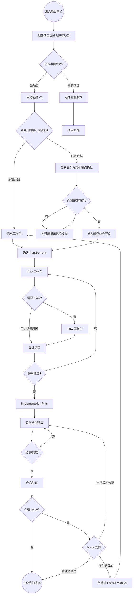

# 交互设计方案

> 文档状态：当前有效
> 阶段：Interaction Design
> 上游基线：`产品设计体系整理/` 九份 V1.0 正式产品设计
> 边界：定义用户任务、可感知流程和交互规则；不冻结页面状态机、视觉 UI、API 或技术实现

## 1. 设计目标

本方案把已确认的产品对象和业务门禁转化为用户可完成的操作路径。阶段成功标准是：产品负责人能够在同一项目版本中完成需求确认、PRD、评审、实现确认、验证和 Issue 去向，并能在重大变化时派生新版本；所有 AI 结果、评审、修改、确认和保存行为均可理解、可撤回、可追溯且不覆盖历史。

设计遵循以下原则：

1. **项目版本始终可见**：任何业务页面都显示当前项目、当前查看版本和当前工作版本，避免在错误版本操作。
2. **任务先于模块**：页面首先回答“下一步做什么、为什么、缺少什么”，模块导航只帮助定位。
3. **候选与正式分离**：AI 结果、解析结果、差异和知识均先作为候选，只有用户采用或修改并保存后成为正式内容。
4. **门禁透明但不僵化**：非门禁资料缺失可继续，门禁缺失必须补齐或由有权用户记录风险接受。
5. **历史不被覆盖**：已评审或已确认内容的修改创建新产物版本、新确认轮次或新项目版本。
6. **长任务可离开**：AI 生成、文件解析和导出不锁死页面；用户可离开并从任务中心恢复。
7. **错误可恢复**：失败必须保留输入和任务上下文，提供重试、修改输入、转人工或返回安全页面。

## 2. 用户与参与身份

| 身份 | 主要目标 | 可执行的核心动作 | 限制 |
|---|---|---|---|
| 产品负责人 | 推动项目版本闭环并作最终确认 | 创建项目/版本、确认需求、采用产物、处理评审、确认差异、决定 Issue 去向 | MVP 内拥有项目最终确认权 |
| 评审者 | 对明确版本的产物提交结构化反馈 | 查看冻结快照、提交反馈、补充说明 | 不能直接改写正式产物或确认评审通过 |
| 实现确认人 | 提交实现证据并说明差异 | 上传/关联资料、补充差异、提交确认轮次 | 最终“是否具备验证条件”由有权用户确认 |
| 测试人员 | 记录验证事实和问题 | 创建 Test Record、上传证据、创建 Issue | 不能擅自派生项目版本或关闭需决策 Issue |
| 平台管理者 | 保证基础能力可用 | 配置模型连接、基础模板和模块开关 | 不自动获得项目内容最终确认权 |

同一用户可以兼任多个参与身份。MVP 不建设独立角色门户，页面通过动作权限和责任人标签区分身份。

## 3. 用户任务清单

### T01 从零完成一个项目版本

- 入口：项目中心“新建项目”。
- 成功条件：形成至少一个已确认 Requirement、一个当前有效 PRD、通过的评审、Implementation Plan、当前有效确认轮次、Test Record，以及 Issue 的明确去向或无问题结论。
- 主路径：创建项目与 V1 → 需求确认 → PRD → 是否需要 Flow → 设计评审 → 实现方案 → 实现确认 → 验证 → Issue 去向 → 完成或派生新版本。
- 高风险点：用户不清楚当前版本、AI 候选被误当正式、评审反馈遗漏、确认轮次被覆盖。

### T02 携带已有资料接续项目

- 入口：新建项目时选择“已有资料开始”，或项目概览“导入资料并接续”。
- 成功条件：资料被保留并关联，用户确认起始节点，系统形成节点完整性清单，缺失项具有补齐、跳过或风险接受结论。
- 主路径：上传资料 → 解析与类型建议 → 人工确认类型 → 选择起始节点 → 检查门禁 → 进入目标工作台。
- 异常路径：解析失败时保留原文件；用户可手动指定类型和关联对象。

### T03 生成、审核并保存正式产物

- 适用：PRD、Flow 文本、Mermaid、Implementation Plan、差异候选等。
- 成功条件：用户能检查 AI 使用的范围和来源，审阅候选、修改或拒绝，并把采用结果保存为明确版本。
- 主路径：配置任务 → 预检 → 发起生成 → 查看进度 → 审核候选 → 采用/修改/拒绝 → 保存版本 → 查看追溯信息。

### T04 完成设计评审循环

- 入口：PRD、Flow 或 Implementation Plan 的“发起评审”。
- 成功条件：评审范围冻结到具体产物版本；所有阻断反馈处理完毕；有权用户明确通过评审。
- 主路径：选择版本与范围 → 提交评审 → 收集反馈 → 逐条接受/拒绝/暂缓/澄清 → 接受项产生新产物版本 → 必要时再次评审 → 通过。

### T05 完成实现确认

- 入口：已评审通过的 Implementation Plan。
- 成功条件：创建不可变确认轮次，实际证据和差异均可追溯，并明确是否具备验证条件。
- 主路径：关联实现资料 → 创建确认轮次 → 生成/填写差异 → 逐项确认 → 就绪检查 → 确认通过或退回处理。

### T06 验证、处理 Issue 并推动迭代

- 入口：当前有效确认轮次“进入验证”。
- 成功条件：Test Record 关联具体确认轮次；Issue 归类正确并有当前版本修正、派生新版本、暂缓或拒绝结论。
- 主路径：创建验证记录 → 填写结果和证据 → 创建/归类 Issue → 评估影响 → 决定去向 → 回到实现确认或新版本需求确认。

### T07 查看历史并安全派生

- 入口：项目版本管理、产物版本历史、确认轮次历史。
- 成功条件：查看历史不改变当前工作版本；恢复业务只能通过显式派生新版本。
- 主路径：查看版本谱系 → 打开只读历史 → 比较差异 → 选择“基于此版本派生” → 填写原因 → 创建新版本。

## 4. 端到端主流程

该图只表达用户可感知页面与决策，不代表后台服务调用或正式状态机。

## 5. 关键交互模式

### 5.1 项目与版本上下文条

所有项目内页面固定提供：项目名称、当前查看版本、当前工作版本标记、版本生命周期摘要、当前业务节点和“返回项目概览”。查看历史版本时使用持续可见的“只读历史”提示，并只提供“返回当前工作版本”与“基于此版本派生”。

### 5.2 阶段导航与下一步卡片

项目概览和各业务页展示同一条阶段导航：需求 → PRD → Flow（可选）→ 评审 → 实现方案 → 实现确认 → 验证 → Issue 去向。每个节点只显示用户可理解的完成情况：已完成、进行中、需处理、已跳过、不适用；这些是交互摘要，不替代后续正式状态机。

页面顶部的“下一步卡片”说明：推荐动作、前置条件、阻断项、可跳过项、责任身份和预计产出。用户可以进入推荐动作，也可通过阶段导航查看其他节点。

### 5.3 草稿、提交和版本保存

- 未提交内容可保存草稿并继续编辑。
- 发起评审时冻结所选产物版本；后续修改不能覆盖该快照。
- 对已评审内容执行修改时，先显示“将创建新版本”的影响确认。
- 保存正式版本必须填写或确认变更摘要；AI 可生成摘要候选，用户确认后保存。
- 页面离开时如有未保存修改，提供保存草稿、放弃修改、留在页面三种动作。

### 5.4 Review 反馈处理

反馈列表按“阻断/非阻断”和“待处理/已处理”组织。处理反馈时必须选择接受、拒绝、暂缓或需澄清，并填写必要理由。接受反馈进入编辑工作区形成新产物版本；拒绝和暂缓保留原反馈与处理理由；需澄清保持评审未完成。

### 5.5 权限反馈

权限控制优先采用“可见但不可执行”：用户可以理解流程和对象，但无权动作显示锁定原因、所需身份和可联系对象。涉及设置当前工作版本、评审通过、确认轮次生效、风险接受和派生新版本的动作需要产品负责人权限；参与者仍可提交其职责范围内的反馈或证据。

## 6. AI 生成前、中、后交互

### 6.1 生成前

生成面板必须展示并允许用户确认：

- 任务目标与产物类型。
- 所属项目版本和目标业务对象。
- 生成范围、来源版本和用户补充要求。
- 必需上下文是否齐全；缺失项与继续风险。
- 将使用的 Skill/模板摘要、模型选择或系统默认值。
- 结果保存位置，以及“生成不会自动覆盖正式内容”的说明。

主操作为“开始生成”；次要操作为“保存配置并稍后运行”和“取消”。若存在阻断缺失或无权限，主操作禁用并给出具体修复入口。

### 6.2 生成中

生成任务以可收起任务面板呈现，至少显示：任务名称、目标对象、开始时间、当前阶段摘要、已用时、取消入口和“可安全离开”提示。进度无法准确计算时使用阶段式反馈，不显示虚假百分比：准备上下文 → 生成候选 → 格式/质量检查 → 准备结果。

用户离开页面后，任务继续；全局任务中心显示运行中、已完成、失败或已取消。取消只停止尚未完成的候选生成，不删除已有正式产物。

### 6.3 生成后

结果页默认进入“候选审核”而不是自动保存：

1. 展示候选正文、质量检查结果、来源清单与追溯摘要。
2. 对已有正式内容提供差异视图；新增、修改、删除分别标识。
3. 用户可逐段修改，并执行采用、修改后采用、拒绝或重新生成。
4. 采用时选择保存为草稿或正式新版本；正式版本需要变更摘要。
5. 拒绝时保留最小审计理由，可选择修改输入后重试。

## 7. 数据反馈交互原则

MVP 不提供独立分析一级导航，但在业务页面返回与当前决策直接相关的最小反馈：AI 任务是否成功、结果采用/修改/拒绝、评审反馈处理情况、产物质量检查、当前版本关键完成事实和版本前后可比指标入口。所有比率和趋势只展示真实采集结果；数据不足时明确显示“样本不足”或“尚未形成基线”，不得用示例值代替。

## 8. 阶段边界与后续输入

本阶段会定义页面中可感知的加载、失败、空数据、权限和业务节点摘要，但不会冻结状态枚举、事件、守卫条件或转换表。需要进入页面状态机阶段继续处理的输入包括：AI 长任务、文件解析、产物草稿/评审/生效、确认轮次、验证记录、Issue 去向、权限变化和并发冲突。

## 9. 阶段验收映射

| 验收要求 | 设计覆盖 | 结果 |
|---|---|---|
| 用户可以完整完成一个项目 | T01、端到端主流程及《页面跳转关系》新建—设计—确认—验证—迭代路径 | 通过 |
| 每个核心页面状态明确 | 《页面结构设计》核心页面族 + 《异常与空状态设计》MVP 状态覆盖矩阵 | 已覆盖用户可感知状态，正式状态机后置 |
| AI 生成前、中、后交互明确 | 本文第 6 节及《页面结构设计》第 6 节 | 已覆盖 |
| Review、修改、确认和版本保存明确 | 本文第 5 节、页面结构第 7～11 节及异常设计第 6 节 | 已覆盖 |
| 加载、失败、空数据和权限状态 | 《异常与空状态设计》第 2～9 节 | 已覆盖 |
| 数据反馈不编造且可解释 | 本文第 7 节、页面结构第 12 节、异常设计第 9 节 | 已覆盖 |

> 验收结论：2026-07-27 用户确认 Interaction Design 阶段通过。
