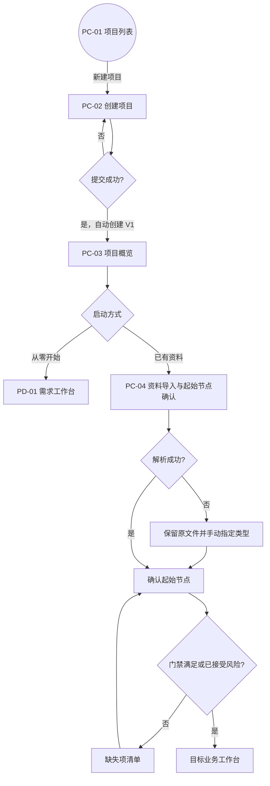
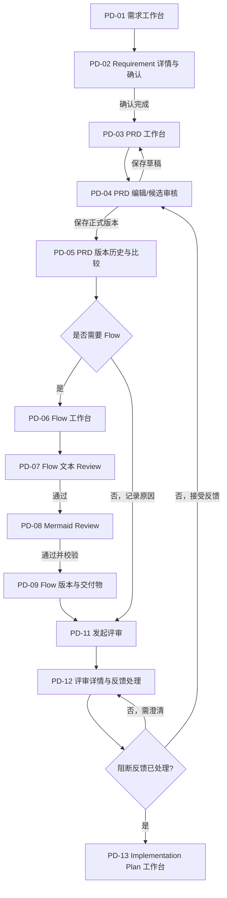
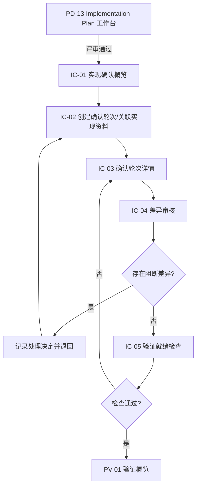
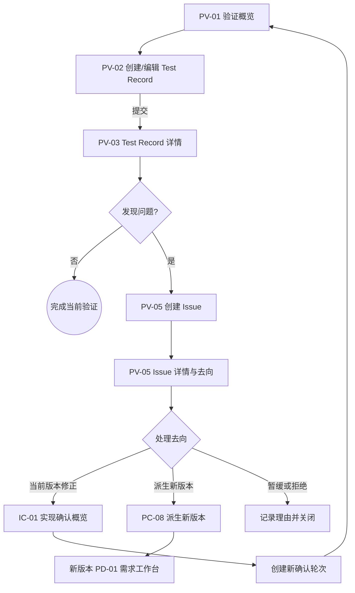
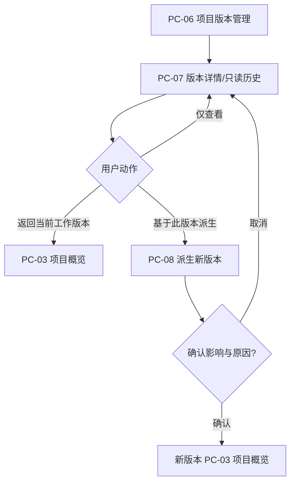

# 页面跳转关系

> 文档状态：当前有效
> 说明：本文件定义用户可感知的入口、出口、返回与异常恢复，不定义前端路由实现或页面状态机

## 1. 跳转通则

1. 项目内跳转必须携带项目与查看版本上下文；若目标动作只能在当前工作版本执行，历史查看上下文先进入只读提示。
2. 从列表进入详情后，返回操作恢复原筛选、排序、分页和滚动位置。
3. AI 任务、文件解析和导出允许跨页面运行；点击任务中心结果回到对应项目、版本、业务对象和审核页。
4. 未保存编辑离开时，必须选择保存草稿、放弃修改或留在页面。
5. 权限不足、对象不存在、版本已被替代或并发冲突时，不跳转到空白页；进入可解释的恢复页或返回安全来源页。

## 2. 全局入口与出口

| 来源 | 操作 | 目标 | 返回/恢复 |
|---|---|---|---|
| 登录后默认入口 | 进入平台 | PC-01 项目列表 | 无项目时显示创建/导入引导 |
| PC-01 | 新建项目 | PC-02 创建项目 | 取消返回 PC-01，保留筛选 |
| PC-01 | 打开项目 | PC-03 项目概览 | 返回 PC-01，保留列表上下文 |
| 全局项目切换 | 选择项目 | 目标项目 PC-03 | 有未保存编辑时先处理草稿 |
| 全局任务中心 | 打开完成任务 | 对应候选审核页 | 对象无权/已删除时显示原因和项目入口 |
| 通知/待处理 | 打开反馈或确认 | 对应评审、差异或 Issue 详情 | 返回原待处理列表 |

## 3. 新项目与已有资料路径

## 4. 产品设计与评审路径

返回规则：

- Flow 文本 Review 退回时回到同一 Flow 候选编辑，不丢失评审意见。
- Mermaid Review 退回时回到文本/结构修订，不允许直接在导出文件中静默修逻辑。
- 接受评审反馈后进入基于被评审版本创建的新草稿；原评审快照保持只读。
- 发起新一轮评审后，旧评审仍可从历史入口查看。

## 5. 实现确认路径

历史轮次只能从 IC-06 只读查看；若实际实现变化，必须从 IC-01 新建轮次，不能从历史详情直接覆盖编辑。

## 6. 验证、Issue 与迭代路径

Issue 也可从用户反馈或数据异常入口创建，此时允许没有 Test Record，但必须先选择项目版本。

## 7. 历史查看与派生路径

查看历史版本不会改变项目默认进入版本；设置当前工作版本是单独的受权限、审计和并发校验动作。

## 8. AI 任务跳转

| 任务结果 | 目标页面 | 可用动作 |
|---|---|---|
| 运行中 | 原业务页的任务面板或全局任务中心 | 收起、取消、离开页面 |
| 成功 | 对应候选审核页 | 采用、修改后采用、拒绝、重新生成 |
| 质量检查未通过 | 候选审核页的检查结果区 | 查看问题、修改输入、重试、转人工 |
| 失败/超时 | 原任务配置页 | 保留输入重试、切换模型（有权限时）、转人工 |
| 已取消 | 任务详情 | 复制原配置重新发起或返回业务对象 |
| 目标对象已更新 | 冲突说明页 | 对比最新版本、基于最新重试、保留为未采用结果 |

## 9. 无权限与失效链接恢复

- 未登录：保存安全返回地址，认证成功后回到原目标；敏感一次性动作不自动重放。
- 无项目访问权：显示项目名称（若可披露）、所需权限与返回项目列表，不显示业务内容。
- 有查看无编辑权：进入只读详情，隐藏危险操作但保留权限说明。
- 对象已归档：进入只读归档详情，有权限时提供恢复；否则返回所属列表。
- 对象不存在或链接失效：显示对象类型和可能原因，提供项目概览、所属列表和最近有效版本入口。
