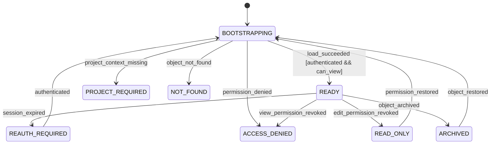
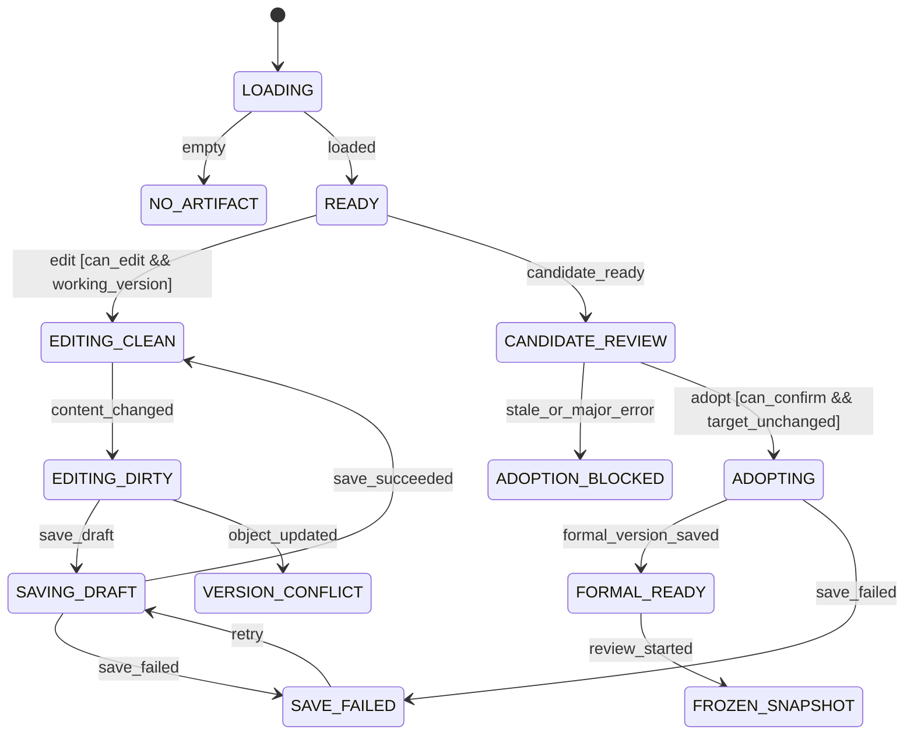
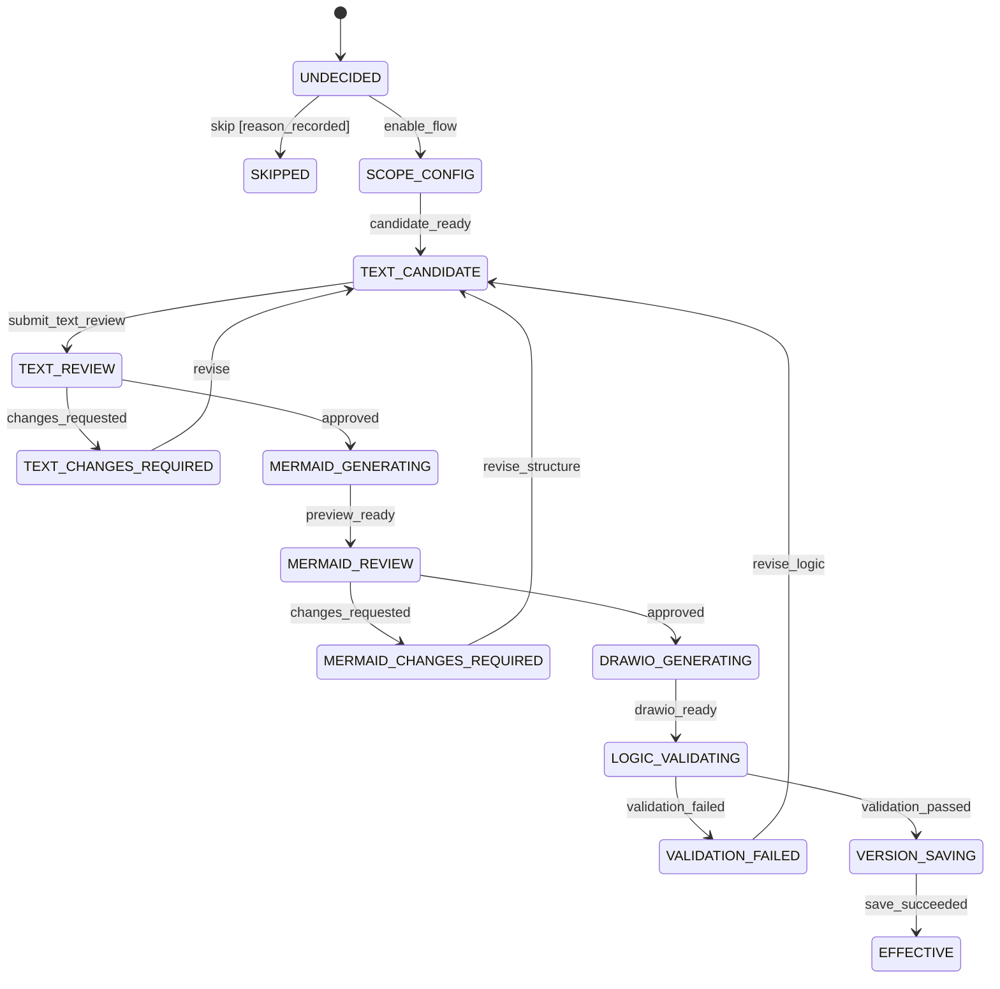
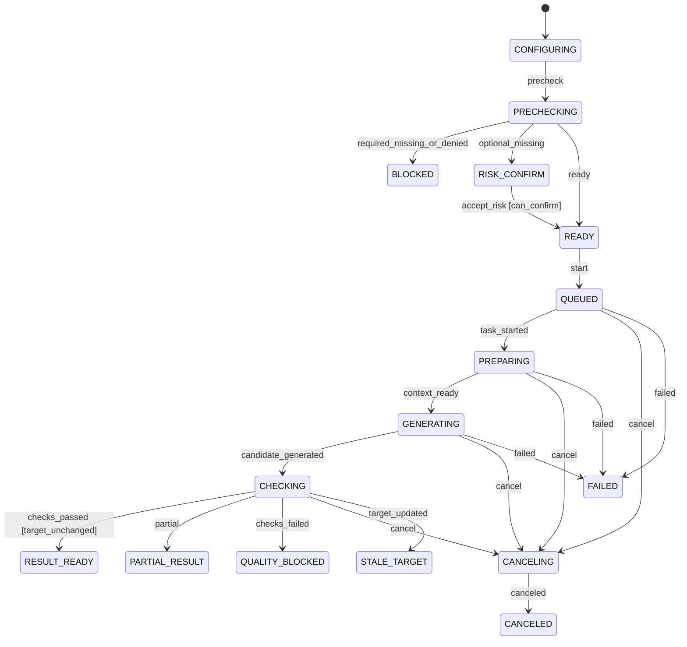
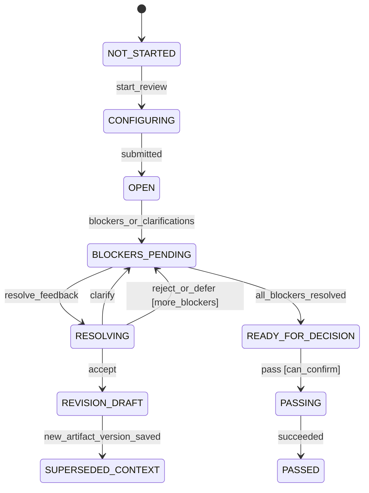
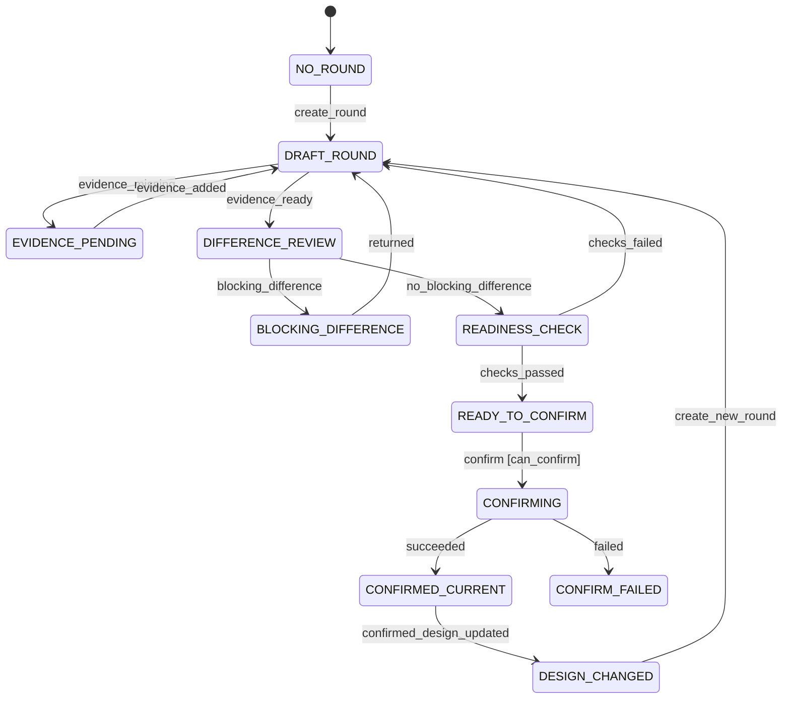
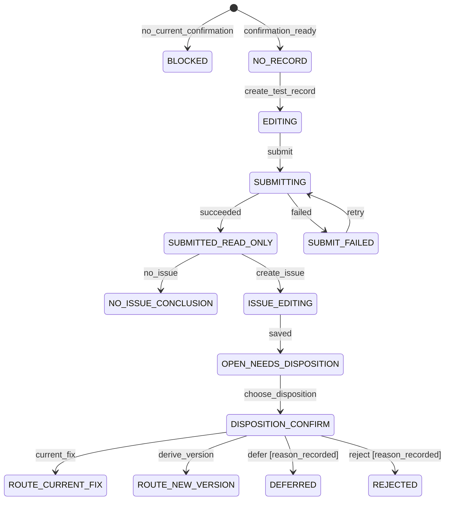

# 页面状态机

> 文档状态：当前有效（2026-07-27 已验收）  
> 阶段：Page State Machine  
> 建立日期：2026-07-27  
> 上游基线：`产品设计体系整理/` 当前有效 V1.0 文档、`交互设计与页面状态机/交互设计/` 已验收文档  
> 边界：定义用户可观察的页面状态、事件、守卫、转换和恢复；不定义数据库状态码、API、前端实现或视觉样式

## 1. 目标与验收范围

本文件把已确认的产品与交互规则冻结为页面级状态机，使后续 Wireframe、UI、原型和前端开发可以回答：页面当前处于什么状态、用户能做什么、什么条件允许转换、失败后如何恢复、刷新或跨页后保留什么。

本阶段覆盖以下页面族：

| 状态机 ID | 页面族 | 覆盖页面 |
|---|---|---|
| `SM-GLOBAL` | 全局壳层、认证、访问与恢复 | 全部页面、全局任务中心 |
| `SM-PC-LIST` | 项目列表与创建 | PC-01、PC-02 |
| `SM-PC-CONTEXT` | 项目概览、版本查看与派生 | PC-03、PC-06、PC-07、PC-08 |
| `SM-PC-IMPORT` | 资料导入、解析与接续 | PC-04、PC-05 |
| `SM-ARTIFACT` | 通用产物工作台 | PD-01、PD-02、PD-03、PD-04、PD-05、PD-13、PD-14、PD-15 |
| `SM-FLOW` | Flow 分层生成与 Review | PD-06、PD-07、PD-08、PD-09 |
| `SM-AI-TASK` | AI 生成前、中、后 | 所有支持 AI 的工作台、全局任务中心 |
| `SM-REVIEW` | 设计评审与反馈处理 | PD-10、PD-11、PD-12 |
| `SM-CONFIRM` | 实现确认轮次 | IC-01、IC-02、IC-03、IC-04、IC-05、IC-06 |
| `SM-VALIDATE` | Test Record 与 Issue 去向 | PV-01、PV-02、PV-03、PV-04、PV-05 |

系统设置 SS-02、SS-03 使用 `SM-GLOBAL` 的加载、权限、保存和失败模式；它们不是 MVP 端到端业务主链，不另行创造业务状态机。SS-01、SS-04、SS-05 不属于当前 MVP 必须页面；KC-01、KC-02、KC-03、KC-04 为增强范围，本阶段只允许“未开放”或受控只读状态，不把尚未确认的能力伪装成可操作状态。

验收标准：

1. T01～T07 均能从入口走到成功或安全退出，无死路。
2. 每个核心页面都有加载、可操作、空/前置不足、失败、权限/只读状态中的真实适用项。
3. AI 生成前、中、后与候选采用严格分离。
4. Review、修改、确认、正式保存和版本派生不覆盖历史。
5. 失败、取消、权限变化、会话失效和并发冲突均保留用户投入并提供恢复路径。

## 2. 权威输入与效力

状态与转换按以下优先级取值：

1. `产品设计体系整理/产品设计决策记录.md`
2. `产品设计体系整理/版本管理规则.md`
3. `产品设计体系整理/核心业务流程.md`
4. `产品设计体系整理/产品功能架构.md` 与 `产品设计总览.md`
5. 已验收的《交互设计方案》《信息架构》《页面结构设计》《页面跳转关系》《异常与空状态设计》
6. `PROJECT_MEMORY.md`、`PROJECT_STATUS.md` 与项目执行规则

若本文件与上游正式设计冲突，以上游正式设计为准；应记录冲突并修订本文件，不得反向静默修改产品基线。

## 3. 建模约定

### 3.1 状态域分离

| 状态域 | 本文件处理方式 | 示例 |
|---|---|---|
| 页面主状态 | 直接建模 | 首次空、编辑草稿、候选审核、只读历史 |
| 页面局部区域 | 仅在能独立失败/恢复时建模 | 项目概览单卡片加载失败 |
| 异步任务状态 | 使用 `SM-AI-TASK` 或导入任务子状态机 | 排队、运行、失败、取消 |
| 权限模式 | 作为全局正交状态；整页不可访问时覆盖页面主状态 | 可编辑、只读、拒绝访问 |
| 业务实体生命周期 | 作为页面守卫或上下文，不在此重新定义 | 当前有效产物版本、当前有效确认轮次 |
| 工作流节点 | 用于阶段导航摘要，不与页面状态合并 | 需求、PRD、评审、确认、验证 |
| 最近访问模块 | 仅用于返回定位，不具有状态机效力 | 最近访问产品验证 |

### 3.2 命名

- 页面状态：`<机器>.Sxx_<英文语义>`。
- 事件：`EV_<英文语义>`，使用已发生事实或明确用户命令。
- 守卫：`G_<英文语义>`，只判断已确认条件，不产生副作用。
- 动作：`A_<英文语义>`，描述用户可感知反馈或上下文变化。
- 转换：`TR-<机器缩写>-<序号>`。

### 3.3 全局转换优先级

同一时刻出现多个条件时按以下优先级解析：

1. 会话失效或需重新认证。
2. 无查看权限。
3. 对象不存在或链接失效。
4. 对象已归档。
5. 历史版本或冻结快照只读。
6. 并发冲突或来源版本过期。
7. 页面主状态。
8. 局部区域加载/失败状态。

高优先级状态不删除低优先级上下文；恢复后回到安全且可验证的最近状态。

## 4. 通用事件、守卫与动作词汇

### 4.1 通用事件

| ID | 含义 |
|---|---|
| `EV_OPEN` | 打开页面或深链 |
| `EV_LOAD_SUCCEEDED` | 页面主数据加载成功 |
| `EV_LOAD_FAILED` | 页面主数据加载失败 |
| `EV_RETRY` | 用户重试当前失败动作 |
| `EV_EDIT` | 用户开始编辑 |
| `EV_CONTENT_CHANGED` | 页面产生未保存修改 |
| `EV_SAVE_DRAFT` | 用户保存草稿 |
| `EV_SAVE_SUCCEEDED` | 草稿或正式保存成功 |
| `EV_SAVE_FAILED` | 保存失败 |
| `EV_LEAVE` | 用户尝试离开当前页面 |
| `EV_DISCARD` | 用户确认放弃未保存修改 |
| `EV_PERMISSION_CHANGED` | 当前动作权限发生变化 |
| `EV_SESSION_EXPIRED` | 会话失效 |
| `EV_OBJECT_UPDATED` | 目标对象出现更新版本或并发变化 |
| `EV_ARCHIVED` | 当前对象归档 |
| `EV_RESTORED` | 对象恢复 |

### 4.2 通用守卫

| ID | 条件 |
|---|---|
| `G_AUTHENTICATED` | 用户会话有效 |
| `G_CAN_VIEW` | 用户可查看目标对象 |
| `G_CAN_EDIT` | 用户可修改当前对象或保存草稿 |
| `G_CAN_CONFIRM` | 用户具有当前最终确认动作权限 |
| `G_IS_WORKING_VERSION` | 查看版本是当前工作版本 |
| `G_IS_HISTORY` | 查看版本是历史版本或冻结快照 |
| `G_HAS_UNSAVED_CHANGES` | 页面存在未保存修改 |
| `G_REQUIRED_INPUTS_READY` | 当前动作的必需上下文齐全 |
| `G_GATE_SATISFIED` | 下一阶段门禁满足 |
| `G_RISK_ACCEPTED` | 产品负责人已记录允许继续的风险及理由 |
| `G_NO_BLOCKERS` | 当前阻断项已处理完毕 |
| `G_TARGET_UNCHANGED` | 任务或候选仍基于目标对象的最新适用版本 |

### 4.3 通用动作

| ID | 用户可感知结果 |
|---|---|
| `A_KEEP_CONTEXT` | 保留项目、版本、对象、筛选和来源上下文 |
| `A_KEEP_USER_INPUT` | 保留表单、编辑或候选修改内容 |
| `A_SHOW_RECOVERY` | 说明发生什么、影响什么和下一步 |
| `A_MARK_READ_ONLY` | 持续显示只读原因与可用替代动作 |
| `A_CREATE_NEW_VERSION` | 明确创建新产物或项目版本，不覆盖历史 |
| `A_RECORD_REASON` | 保存跳过、拒绝、暂缓、风险接受或派生理由 |
| `A_RETURN_SAFE` | 返回所属列表、项目概览或当前工作版本 |
| `A_RESTORE_LOCATION` | 恢复原筛选、分页、排序和滚动位置 |

## 5. `SM-GLOBAL`：全局壳层、认证与访问

### 5.1 状态清单

| 状态 | 类型 | 可见反馈与允许动作 | 持久化/退出 |
|---|---|---|---|
| `GLOBAL.S01_BOOTSTRAPPING` | 初始瞬态 | 保留全局骨架，加载会话、导航与目标上下文 | 成功进入访问判断；失败进入恢复状态 |
| `GLOBAL.S02_READY` | 稳定 | 页面按自身状态机运行 | 路由、权限或会话事件触发退出 |
| `GLOBAL.S03_PROJECT_REQUIRED` | 稳定 | 保留一级入口，提示先选择项目 | 选择项目后进入目标页或 PC-03 |
| `GLOBAL.S04_REAUTH_REQUIRED` | 稳定覆盖 | 保存安全返回地址和未提交内容临时副本；允许重新认证 | 认证成功返回原目标，不重放敏感动作 |
| `GLOBAL.S05_ACCESS_DENIED` | 稳定覆盖 | 不渲染业务正文；显示所需权限与安全返回入口 | 权限恢复后重新加载；否则返回 PC-01 |
| `GLOBAL.S06_READ_ONLY` | 正交模式 | 页面正文可见，编辑/确认动作替换为原因和替代路径 | 返回工作版本、派生或权限恢复 |
| `GLOBAL.S07_NOT_FOUND` | 稳定覆盖 | 显示对象类型、可能原因、所属列表与项目概览 | 用户选择安全入口 |
| `GLOBAL.S08_ARCHIVED` | 稳定覆盖 | 归档详情只读；有权时允许恢复 | 恢复后重新加载；否则返回列表 |
| `GLOBAL.S09_PARTIAL_FAILURE` | 正交区域 | 主内容可用，失败卡片单独重试 | 局部恢复不重置主页面 |

### 5.2 核心转换

| ID | Source | Event | Guard | Action/feedback | Target |
|---|---|---|---|---|---|
| `TR-GL-01` | `S01` | `EV_LOAD_SUCCEEDED` | `G_AUTHENTICATED && G_CAN_VIEW` | 加载目标页面上下文 | `S02` |
| `TR-GL-02` | `S01/S02` | `EV_SESSION_EXPIRED` | — | `A_KEEP_USER_INPUT`，保存安全返回地址 | `S04` |
| `TR-GL-03` | `S01/S02` | `EV_PERMISSION_CHANGED` | `!G_CAN_VIEW` | 隐藏业务正文，`A_SHOW_RECOVERY` | `S05` |
| `TR-GL-04` | `S01/S02` | `EV_PERMISSION_CHANGED` | `G_CAN_VIEW && !G_CAN_EDIT` | `A_MARK_READ_ONLY` | `S06` |
| `TR-GL-05` | `S04` | 认证成功 | `G_AUTHENTICATED` | 返回原目标，不自动重放提交 | `S01` |
| `TR-GL-06` | `S05/S06` | 权限恢复 | `G_CAN_VIEW` | 重新读取目标对象 | `S01` |
| `TR-GL-07` | 任意可加载状态 | 对象不存在 | — | `A_SHOW_RECOVERY` | `S07` |
| `TR-GL-08` | 任意可加载状态 | `EV_ARCHIVED` | — | `A_MARK_READ_ONLY` | `S08` |
| `TR-GL-09` | `S08` | `EV_RESTORED` | 有恢复权限 | 重新加载对象 | `S01` |
| `TR-GL-10` | `S01` | 项目上下文缺失 | 目标页需要项目 | 保留目标地址并展示选择入口 | `S03` |
| `TR-GL-11` | `S03` | 选择项目 | `G_CAN_VIEW` | `A_KEEP_CONTEXT`，重新解析原目标 | `S01` |
| `TR-GL-12` | `S02` | 局部区域加载失败 | 主页面仍可用 | 隔离失败区域，`A_SHOW_RECOVERY` | `S09`（正交） |
| `TR-GL-13` | `S09` | 局部重试成功 | — | 仅替换失败区域 | `S02` |

## 6. `SM-PC-LIST`：项目列表与创建

### 6.1 状态清单

| 状态 | 页面表现 | 允许动作 | 退出条件 |
|---|---|---|---|
| `PCL.S01_LOADING` | 列表骨架，筛选区可见 | 等待、超时后重试 | 加载成功/失败 |
| `PCL.S02_READY` | 项目卡和表格 | 打开项目、筛选、搜索、新建 | 用户选择动作 |
| `PCL.S03_FIRST_EMPTY` | “还没有项目” | 新建项目 | 创建入口 |
| `PCL.S04_FILTERED_EMPTY` | 保留筛选并显示无匹配 | 清除筛选、修改关键词 | 结果出现或清除筛选 |
| `PCL.S05_LOAD_FAILED` | 页面骨架与失败说明 | 重试 | 加载成功 |
| `PCL.S06_CREATING` | PC-02 表单与启动方式 | 编辑、取消、提交 | 取消或提交 |
| `PCL.S07_SUBMITTING` | 表单保留，提交锁定 | 等待 | 成功/失败 |
| `PCL.S08_CREATE_FAILED` | 表单和输入保留 | 重试、修改 | 再次提交或取消 |
| `PCL.S09_CREATED` | 明确项目与 V1 已创建 | 进入 PC-03 | 跳转完成 |

### 6.2 转换

| ID | Source | Event | Guard | Action/feedback | Target |
|---|---|---|---|---|---|
| `TR-PCL-01` | `S01` | `EV_LOAD_SUCCEEDED` | 有可见项目 | 展示列表 | `S02` |
| `TR-PCL-02` | `S01` | `EV_LOAD_SUCCEEDED` | 无可见项目 | 展示首次创建引导 | `S03` |
| `TR-PCL-03` | `S02` | 筛选结果为空 | — | 保留筛选 | `S04` |
| `TR-PCL-04` | `S04` | 清除/修改筛选 | 有结果 | 恢复列表 | `S02` |
| `TR-PCL-05` | `S01` | `EV_LOAD_FAILED` | — | `A_SHOW_RECOVERY` | `S05` |
| `TR-PCL-06` | `S02/S03` | 新建项目 | 有创建权限 | 初始化空表单 | `S06` |
| `TR-PCL-07` | `S06/S08` | 提交 | 必填校验通过 | 保留表单，显示提交中 | `S07` |
| `TR-PCL-08` | `S07` | 创建成功 | — | 创建 V1 并设为工作版本 | `S09` |
| `TR-PCL-09` | `S07` | 创建失败 | — | `A_KEEP_USER_INPUT` | `S08` |
| `TR-PCL-10` | `S06/S08` | 取消 | — | `A_RESTORE_LOCATION` | `S02` 或 `S03` |
| `TR-PCL-11` | `S05` | `EV_RETRY` | — | 重新读取列表，保留筛选 | `S01` |
| `TR-PCL-12` | `S09` | 进入项目 | `G_CAN_VIEW` | 传递新项目与 V1 上下文 | `PCC.S01_LOADING` |

## 7. `SM-PC-CONTEXT`：项目概览、版本与历史

### 7.1 状态清单

| 状态 | 页面表现与可用动作 | 关键条件 |
|---|---|---|
| `PCC.S01_LOADING` | 保留项目壳层，卡片分区加载 | 已选择项目/查看版本 |
| `PCC.S02_NEW_PROJECT` | 启动方式选择、空产物摘要 | 新项目尚未选择从零/已有资料 |
| `PCC.S03_WORKING_READY` | 下一步、阶段事实、阻断与产物摘要 | 查看当前工作版本 |
| `PCC.S04_WORKING_BLOCKED` | 下一步卡片列出门禁缺失 | 存在未处理门禁 |
| `PCC.S05_HISTORY_READ_ONLY` | 持续显示查看版本与工作版本差异 | `G_IS_HISTORY` |
| `PCC.S06_SWITCHING_VIEW` | 仅改变查看上下文 | 用户选择另一个版本 |
| `PCC.S07_SETTING_WORKING` | 展示影响、权限和并发确认 | 用户显式设置工作版本 |
| `PCC.S08_VERSION_CONFLICT` | 显示最新工作版本与当前选择 | 并发校验失败 |
| `PCC.S09_COMPARING` | 两个明确版本的差异 | 已选择可比较版本 |
| `PCC.S10_DERIVE_CONFIG` | 来源、继承范围、不继承项、原因 | 有派生权限 |
| `PCC.S11_DERIVING` | 配置锁定并显示创建中 | 派生确认 |
| `PCC.S12_DERIVE_FAILED` | 配置与原因保留 | 创建失败 |
| `PCC.S13_NEW_VERSION_READY` | 新版本已创建，显示新上下文 | 创建成功 |
| `PCC.S14_LOAD_FAILED` | 返回版本列表/重试 | 主数据加载失败 |

### 7.2 核心转换

| ID | Source | Event | Guard | Action/feedback | Target |
|---|---|---|---|---|---|
| `TR-PCC-01` | `S01` | `EV_LOAD_SUCCEEDED` | 新项目未选启动方式 | 显示启动选择 | `S02` |
| `TR-PCC-02` | `S01/S06` | `EV_LOAD_SUCCEEDED` | `G_IS_WORKING_VERSION && G_GATE_SATISFIED` | 展示可推进下一步 | `S03` |
| `TR-PCC-03` | `S01/S06` | `EV_LOAD_SUCCEEDED` | `G_IS_WORKING_VERSION && !G_GATE_SATISFIED` | 展示阻断定位 | `S04` |
| `TR-PCC-04` | `S01/S06` | `EV_LOAD_SUCCEEDED` | `G_IS_HISTORY` | `A_MARK_READ_ONLY` | `S05` |
| `TR-PCC-05` | `S03/S04/S05` | 选择查看版本 | — | 只更新查看上下文 | `S06` |
| `TR-PCC-06` | `S05` | 返回工作版本 | — | 恢复工作版本上下文 | `S06` |
| `TR-PCC-07` | `S05` | 基于此版本派生 | 有派生权限 | 载入来源与继承规则 | `S10` |
| `TR-PCC-08` | `S10/S12` | 确认派生 | 原因完整且来源仍有效 | `A_RECORD_REASON` | `S11` |
| `TR-PCC-09` | `S11` | 派生成功 | — | `A_CREATE_NEW_VERSION` | `S13` |
| `TR-PCC-10` | `S11` | 派生失败 | — | 保留派生配置 | `S12` |
| `TR-PCC-11` | `S03/S05` | 设置工作版本 | `G_CAN_CONFIRM` | 展示独立影响确认 | `S07` |
| `TR-PCC-12` | `S07` | 设置成功 | 版本未变化 | 更新工作版本并审计 | `S03/S04` |
| `TR-PCC-13` | `S07` | `EV_OBJECT_UPDATED` | — | 展示并发差异 | `S08` |
| `TR-PCC-14` | `S03/S05` | 选择比较 | 已选择两个不同版本 | 保留当前查看版本 | `S09` |
| `TR-PCC-15` | `S09` | 关闭比较 | — | `A_RESTORE_LOCATION` | `S03` 或 `S05` |
| `TR-PCC-16` | `S01/S06` | `EV_LOAD_FAILED` | — | `A_SHOW_RECOVERY` | `S14` |
| `TR-PCC-17` | `S14` | `EV_RETRY` | — | 重新读取目标版本 | `S01` |
| `TR-PCC-18` | `S08` | 使用最新工作版本 | — | 丢弃过期设置动作，重新加载 | `S01` |
| `TR-PCC-19` | `S13` | 打开新版本 | — | 将新版本设为查看上下文；是否设为工作版本另行确认 | `S06` |
| `TR-PCC-20` | `S02` | 选择从零开始/导入资料 | — | 记录启动选择并进入相应入口 | `ART.S02_NO_ARTIFACT` 或 `PCI.S01_EMPTY` |

> 规则：查看切换、设置工作版本和基于历史派生始终是三个独立事件；任何一个都不能静默代替另一个。

## 8. `SM-PC-IMPORT`：资料导入与起始节点确认

### 8.1 状态清单

| 状态 | 页面表现 | 允许动作 |
|---|---|---|
| `PCI.S01_EMPTY` | 上传引导 | 上传、返回概览 |
| `PCI.S02_UPLOADING` | 单文件进度和已成功文件 | 取消单文件、继续其他文件 |
| `PCI.S03_UPLOAD_PARTIAL_FAILED` | 成功文件保留，失败文件单独标记 | 单文件重试、移除失败项 |
| `PCI.S04_PARSING` | 每个文件独立解析状态 | 离开页面、稍后查看 |
| `PCI.S05_TYPE_CONFIRMATION` | 解析建议、依据和人工确认 | 修改类型、确认关联 |
| `PCI.S06_MANUAL_REQUIRED` | 原文件保留，标记解析失败/不确定 | 手动指定类型和对象 |
| `PCI.S07_ENTRY_SELECTION` | 起始节点及各节点前置条件 | 选择节点 |
| `PCI.S08_COMPLETENESS_REVIEW` | 已具备/待补充/已跳过/不适用清单 | 补充、记录跳过、继续判断 |
| `PCI.S09_GATE_BLOCKED` | 门禁缺失与定位入口 | 补齐、返回选择 |
| `PCI.S10_RISK_PENDING` | 风险、影响、操作者与理由 | 产品负责人确认或取消 |
| `PCI.S11_READY_TO_ENTER` | 目标节点与保留资料摘要 | 确认进入 |
| `PCI.S12_READ_ONLY` | 资料与关联可查看 | 返回概览 |

### 8.2 转换

| ID | Source | Event | Guard | Action/feedback | Target |
|---|---|---|---|---|---|
| `TR-PCI-01` | `S01/S03` | 选择文件 | 有上传权限且文件预检通过 | 创建单文件任务 | `S02` |
| `TR-PCI-02` | `S02` | 全部上传成功 | — | 启动解析 | `S04` |
| `TR-PCI-03` | `S02` | 部分上传失败 | — | 保留成功文件 | `S03` |
| `TR-PCI-04` | `S04` | 解析成功/不确定 | — | 展示建议和依据 | `S05` |
| `TR-PCI-05` | `S04` | 解析失败 | — | 保留原文件 | `S06` |
| `TR-PCI-06` | `S05/S06` | 类型与关联确认 | — | 形成资料关联候选 | `S07` |
| `TR-PCI-07` | `S07` | 起始节点确认 | — | 计算完整性清单 | `S08` |
| `TR-PCI-08` | `S08` | 完整性确认 | `G_GATE_SATISFIED` | 显示目标入口 | `S11` |
| `TR-PCI-09` | `S08` | 完整性确认 | 门禁缺失 | 显示缺失项 | `S09` |
| `TR-PCI-10` | `S08` | 带风险继续 | 仅缺少可接受项且有确认权 | 展示风险确认 | `S10` |
| `TR-PCI-11` | `S10` | 风险接受 | 理由完整 | `A_RECORD_REASON` | `S11` |
| `TR-PCI-12` | `S11` | 确认进入 | `G_GATE_SATISFIED || G_RISK_ACCEPTED` | 携带项目版本与资料上下文跳转 | 目标工作台 |
| `TR-PCI-13` | `S03` | 重试失败文件 | 文件仍有效 | 仅重建失败文件任务 | `S02` |
| `TR-PCI-14` | `S09` | 缺失项已补齐 | — | 重新计算完整性 | `S08` |
| `TR-PCI-15` | `S10` | 取消风险接受 | — | 不记录风险结论 | `S08` |
| `TR-PCI-16` | 任意可操作状态 | 进入历史/无编辑权限 | `G_CAN_VIEW && !G_CAN_EDIT` | `A_MARK_READ_ONLY` | `S12` |

## 9. `SM-ARTIFACT`：Requirement、PRD、Plan 通用工作台

### 9.1 状态清单

| 状态 | 类型 | 页面反馈与动作 | 持久化 |
|---|---|---|---|
| `ART.S01_LOADING` | 初始 | 正文、来源、检查分区加载 | 无 |
| `ART.S02_NO_ARTIFACT` | 稳定空 | 生成、上传或新建；显示前置条件 | 页面上下文保留 |
| `ART.S03_READY` | 稳定 | 查看当前草稿/有效版本、历史和来源 | 当前查看位置保留 |
| `ART.S04_EDITING_CLEAN` | 稳定 | 可编辑，无未保存变化 | 草稿标识 |
| `ART.S05_EDITING_DIRTY` | 稳定 | 显示未保存标记 | 离开前必须决策 |
| `ART.S06_SAVING_DRAFT` | 瞬态 | 编辑区锁定最小范围，显示保存中 | 内容保留 |
| `ART.S07_SAVE_FAILED` | 稳定异常 | 正式内容未变化；重试/复制 | 用户输入保留 |
| `ART.S08_CANDIDATE_REVIEW` | 稳定 | 候选、正式内容、差异、质量与来源 | 候选修改保留 |
| `ART.S09_ADOPTION_BLOCKED` | 稳定 | 重大错误、来源过期或权限原因 | 候选保留 |
| `ART.S10_ADOPTING` | 瞬态 | 显示保存目标、版本与摘要 | 候选和选择保留 |
| `ART.S11_FORMAL_READY` | 稳定 | 当前有效版本和追溯信息 | 正式版本持久化 |
| `ART.S12_FROZEN_SNAPSHOT` | 稳定只读 | 评审引用快照，禁止覆盖 | 永久可追溯 |
| `ART.S13_HISTORY_READ_ONLY` | 稳定只读 | 历史版本、比较、基于来源新建 | 查看位置保留 |
| `ART.S14_VERSION_CONFLICT` | 稳定异常 | 当前编辑与最新版本差异 | 当前编辑副本保留 |
| `ART.S15_LOAD_FAILED` | 稳定异常 | 页面框架、来源上下文、重试 | 无 |

### 9.2 核心转换

| ID | Source | Event | Guard | Action/feedback | Target | 失败/取消 |
|---|---|---|---|---|---|---|
| `TR-ART-01` | `S01` | `EV_LOAD_SUCCEEDED` | 无产物 | 显示创建方式 | `S02` | — |
| `TR-ART-02` | `S01` | `EV_LOAD_SUCCEEDED` | 有可查看版本 | 展示版本与状态摘要 | `S03` | — |
| `TR-ART-03` | `S03` | `EV_EDIT` | `G_CAN_EDIT && G_IS_WORKING_VERSION` | 创建/载入可编辑草稿 | `S04` | 无权进入全局只读 |
| `TR-ART-04` | `S04` | `EV_CONTENT_CHANGED` | — | 标记未保存 | `S05` | — |
| `TR-ART-05` | `S05/S07` | `EV_SAVE_DRAFT` | `G_CAN_EDIT` | `A_KEEP_USER_INPUT` | `S06` | 取消返回 `S05` |
| `TR-ART-06` | `S06` | `EV_SAVE_SUCCEEDED` | — | 更新草稿时间 | `S04` | — |
| `TR-ART-07` | `S06/S10` | `EV_SAVE_FAILED` | — | `A_KEEP_USER_INPUT` | `S07` | — |
| `TR-ART-08` | `S05` | `EV_LEAVE` | `G_HAS_UNSAVED_CHANGES` | 显示保存/放弃/留在页面 | `S05` | 选择留在页面不转换 |
| `TR-ART-09` | `S05` | `EV_DISCARD` | 用户确认 | 放弃本次未保存变化 | `S03/S04` | — |
| `TR-ART-10` | 任意可操作状态 | AI 候选就绪 | — | 展示差异、质量和来源 | `S08` | — |
| `TR-ART-11` | `S08` | 采用/修改后采用 | `G_CAN_CONFIRM && G_TARGET_UNCHANGED && 无重大错误` | 展示草稿/正式新版本选项 | `S10` | 取消返回 `S08` |
| `TR-ART-12` | `S08` | 采用 | 目标过期/重大错误/无权限 | 定位原因和修复入口 | `S09` | — |
| `TR-ART-13` | `S10` | `EV_SAVE_SUCCEEDED` | 保存为正式版本 | `A_CREATE_NEW_VERSION`，记录采用结论 | `S11` | — |
| `TR-ART-14` | `S11` | 发起评审 | 版本可评审 | 冻结明确版本引用 | `S12` | 提交失败保持 `S11` |
| `TR-ART-15` | `S04/S05/S08` | `EV_OBJECT_UPDATED` | — | 展示最新版本与当前副本 | `S14` | — |
| `TR-ART-16` | `S14` | 基于最新合并 | 有编辑权 | 创建新草稿，不覆盖最新 | `S05` | 可保存当前副本后退出 |
| `TR-ART-17` | `S01` | `EV_LOAD_FAILED` | — | `A_SHOW_RECOVERY` | `S15` | — |
| `TR-ART-18` | `S15` | `EV_RETRY` | — | 重新读取当前查看版本 | `S01` | — |
| `TR-ART-19` | `S03/S11` | 选择历史版本 | — | 保留工作版本标识，加载历史 | `S13` | — |
| `TR-ART-20` | `S13` | 返回当前版本 | — | 恢复工作版本上下文 | `S01` | — |
| `TR-ART-21` | `S09` | 修复来源/质量问题 | 阻断已解除 | 重新校验原候选 | `S08` | 候选仍保留 |
| `TR-ART-22` | `S12/S13` | 基于此版本新建 | `G_CAN_EDIT` | 创建关联新草稿，不改变原版本 | `S04` | — |

### 9.3 Requirement 特化

- 原始输入始终只读，与确认结论并列。
- 待确认问题使用 `待确认/已确认/暂缓/不适用` 作为页面数据维度，不替代工作台主状态。
- “进入 PRD”只在阻断待确认项已处理或存在已记录的允许遗留结论时可用。

### 9.4 PRD/Plan 特化

- PRD 发起评审前必须显示冻结版本和未决项摘要。
- 已评审 PRD 或 Plan 的修改从 `S12_FROZEN_SNAPSHOT` 派生新草稿，原快照不变。
- Plan 只有在引用评审通过的输入且版本未更新时，才显示“进入实现确认”。

## 10. `SM-FLOW`：Flow 分层生成与双重 Review

### 10.1 状态清单

| 状态 | 页面反馈 | 可推进条件 |
|---|---|---|
| `FLW.S01_UNDECIDED` | 选择生成/上传或记录跳过原因 | 用户决定是否需要 Flow |
| `FLW.S02_SKIPPED` | 显示跳过原因和重新启用入口 | 原因已记录 |
| `FLW.S03_SCOPE_CONFIG` | 来源 PRD Version、主/子流程、范围与类型 | 必需来源齐全 |
| `FLW.S04_TEXT_CANDIDATE` | 文本流程候选可编辑 | AI/上传/人工输入完成 |
| `FLW.S05_TEXT_REVIEW` | Review 角色、节点、条件、分支和范围 | 用户提交 Review |
| `FLW.S06_TEXT_CHANGES_REQUIRED` | 反馈与原候选保留 | Review 退回 |
| `FLW.S07_MERMAID_GENERATING` | 生成拓扑预览 | 文本 Review 通过 |
| `FLW.S08_MERMAID_REVIEW` | Mermaid 结构与逻辑审核 | 预览生成成功 |
| `FLW.S09_MERMAID_CHANGES_REQUIRED` | 返回文本/结构修订 | Mermaid Review 退回 |
| `FLW.S10_DRAWIO_GENERATING` | `.drawio` 和布局候选生成 | Mermaid Review 通过 |
| `FLW.S11_LOGIC_VALIDATING` | 业务逻辑校验，布局与逻辑变更分开 | `.drawio` 候选可用 |
| `FLW.S12_VALIDATION_FAILED` | 问题定位，返回文本/结构层 | 逻辑校验失败 |
| `FLW.S13_VERSION_SAVING` | 明确 Flow Version 和交付物 | 校验通过且有确认权 |
| `FLW.S14_EFFECTIVE` | 当前有效 Flow Version、`.drawio`、PNG、SVG | 保存成功 |
| `FLW.S15_TASK_FAILED` | 当前层输入和上层通过结论保留 | 任一生成/导出失败 |

### 10.2 转换表

| ID | Source | Event | Guard | Action/feedback | Target |
|---|---|---|---|---|---|
| `TR-FLW-01` | `S01` | 记录跳过 | 理由完整 | `A_RECORD_REASON` | `S02` |
| `TR-FLW-02` | `S01/S02` | 启用 Flow | 来源 PRD 可用 | 载入范围与类型选项 | `S03` |
| `TR-FLW-03` | `S03` | 候选就绪 | 必需来源齐全 | 保存来源与范围 | `S04` |
| `TR-FLW-04` | `S04/S06` | 提交文本 Review | 文本结构完整 | 冻结本次文本候选 | `S05` |
| `TR-FLW-05` | `S05` | 文本 Review 退回 | — | 保留反馈和定位 | `S06` |
| `TR-FLW-06` | `S05` | 文本 Review 通过 | `G_CAN_CONFIRM && G_NO_BLOCKERS` | 冻结文本通过结论 | `S07` |
| `TR-FLW-07` | `S07` | Mermaid 生成成功 | — | 展示结构预览 | `S08` |
| `TR-FLW-08` | `S08` | Mermaid Review 退回 | — | 定位到文本/结构问题 | `S09` |
| `TR-FLW-09` | `S09` | 开始修订 | — | 保留 Mermaid 反馈 | `S04` |
| `TR-FLW-10` | `S08` | Mermaid Review 通过 | `G_CAN_CONFIRM && G_NO_BLOCKERS` | 冻结结构通过结论 | `S10` |
| `TR-FLW-11` | `S10` | drawio 生成成功 | — | 进入业务逻辑校验 | `S11` |
| `TR-FLW-12` | `S11` | 逻辑校验失败 | — | 输出可定位问题，不只修改布局 | `S12` |
| `TR-FLW-13` | `S12` | 返回修订 | — | 保留校验问题与上层输入 | `S04` |
| `TR-FLW-14` | `S11` | 逻辑校验通过 | `G_CAN_CONFIRM` | 展示版本与交付物摘要 | `S13` |
| `TR-FLW-15` | `S13` | 保存成功 | 来源仍有效 | 创建 Flow Version 与导出物 | `S14` |
| `TR-FLW-16` | `S07/S10/S11/S13` | 生成/导出/保存失败 | — | 保留当前层输入和上层通过结论 | `S15` |
| `TR-FLW-17` | `S15` | `EV_RETRY` | 失败步骤仍可执行 | 仅重试失败步骤 | 失败前瞬态 |
| `TR-FLW-18` | `S14` | 编辑逻辑 | `G_CAN_EDIT` | 基于有效版本创建新候选 | `S04` |

### 10.3 转换图

### 10.4 边界

- 文本 Review 未通过时，Mermaid 和交付层不可推进，但旧有效版本可只读查看。
- Mermaid Review 退回必须回到文本/结构修订，不得只改导出文件掩盖逻辑问题。
- AI 生成、自动布局和格式优化均是候选。
- “仅布局变化是否新建 Flow Version”仍是上游暂定事项；当前禁止覆盖已评审版本，采用最安全行为：保留现有版本并要求用户明确选择新建候选，待产品决策冻结后再简化。

## 11. `SM-AI-TASK`：AI 生成前、中、后

### 11.1 状态清单

| 状态 | 类型 | 用户反馈与动作 | 离开/恢复 |
|---|---|---|---|
| `AIT.S01_CONFIGURING` | 稳定 | 目标、对象、范围、来源、补充要求、Skill/模型摘要 | 可保存配置或取消 |
| `AIT.S02_PRECHECKING` | 瞬态 | 检查权限、必需/可选上下文、来源版本、连接 | 完成后进入阻断或就绪 |
| `AIT.S03_BLOCKED` | 稳定 | 缺失项、无权限或连接不可用 | 补齐、联系负责人、取消 |
| `AIT.S04_RISK_CONFIRM` | 稳定 | 可选上下文缺失及影响 | 有权用户带理由继续/返回补充 |
| `AIT.S05_READY` | 稳定 | 明确“结果为候选，不覆盖正式内容” | 开始、保存配置、取消 |
| `AIT.S06_QUEUED` | 异步 | 任务与目标对象、取消入口 | 可安全离开 |
| `AIT.S07_PREPARING` | 异步 | 准备上下文 | 可安全离开、取消 |
| `AIT.S08_GENERATING` | 异步 | 生成候选、已用时、最近更新时间 | 可安全离开、取消 |
| `AIT.S09_CHECKING` | 异步 | 格式/质量检查 | 可安全离开、取消未完成处理 |
| `AIT.S10_RESULT_READY` | 稳定结果 | 打开候选审核 | 从任务中心深链恢复 |
| `AIT.S11_PARTIAL_RESULT` | 稳定结果 | 已完成与缺失部分 | 补充生成、转人工、拒绝 |
| `AIT.S12_QUALITY_BLOCKED` | 稳定结果 | 格式/重大错误及定位 | 自动修复候选、重试、转人工 |
| `AIT.S13_FAILED` | 稳定异常 | 输入、来源、追踪 ID 保留 | 重试、缩小范围、转人工 |
| `AIT.S14_CANCELING` | 瞬态 | 取消处理中，正式内容不变 | 完成后进入取消 |
| `AIT.S15_CANCELED` | 稳定结果 | 可复制原配置重新运行 | 返回业务对象 |
| `AIT.S16_STALE_TARGET` | 稳定冲突 | 候选基于旧目标版本 | 比较最新、基于最新重试、保留未采用结果 |

### 11.2 核心转换

| ID | Source | Event | Guard | Action/feedback | Target |
|---|---|---|---|---|---|
| `TR-AIT-01` | `S01` | 开始预检 | — | 保留配置 | `S02` |
| `TR-AIT-02` | `S02` | 预检完成 | 必需项缺失/无权限/无连接 | 展示修复入口 | `S03` |
| `TR-AIT-03` | `S02` | 预检完成 | 仅可选项缺失 | 展示风险 | `S04` |
| `TR-AIT-04` | `S02/S04` | 预检完成/风险接受 | `G_REQUIRED_INPUTS_READY` | 记录风险理由（如有） | `S05` |
| `TR-AIT-05` | `S05` | 开始生成 | 有生成权限且来源未变化 | 创建任务 | `S06` |
| `TR-AIT-06` | `S06` | 开始准备 | — | 阶段式反馈 | `S07` |
| `TR-AIT-07` | `S07` | 上下文就绪 | — | 阶段式反馈 | `S08` |
| `TR-AIT-08` | `S08` | 候选生成完成 | — | 进入质量检查 | `S09` |
| `TR-AIT-09` | `S09` | 检查通过 | `G_TARGET_UNCHANGED` | 候选可审核 | `S10` |
| `TR-AIT-10` | `S09` | 部分完成 | 产品允许部分结果 | 列出已完成/缺失 | `S11` |
| `TR-AIT-11` | `S09` | 检查失败 | 重大或格式错误 | 禁止直接采用 | `S12` |
| `TR-AIT-12` | `S06/S07/S08/S09` | 任务失败/超时 | — | 保留配置与来源 | `S13` |
| `TR-AIT-13` | `S06/S07/S08/S09` | 用户取消 | 任务仍可取消 | 正式内容不变 | `S14` |
| `TR-AIT-14` | `S14` | 取消完成 | — | 保留原配置摘要 | `S15` |
| `TR-AIT-15` | `S09/S10/S11/S12` | `EV_OBJECT_UPDATED` | — | 展示来源与最新版本差异 | `S16` |
| `TR-AIT-16` | `S10` | 打开候选 | — | 传递候选、追溯与检查结果 | `ART.S08_CANDIDATE_REVIEW` |
| `TR-AIT-17` | `S03` | 重新预检 | 缺失项可能已修复 | 保留原配置 | `S02` |
| `TR-AIT-18` | `S11` | 审核部分结果 | 产品允许部分候选进入人工审核 | 明确标记缺失范围 | `ART.S08_CANDIDATE_REVIEW` |
| `TR-AIT-19` | `S12` | 自动修复候选 | 问题可自动修复 | 创建新检查尝试，不覆盖原候选 | `S09` |
| `TR-AIT-20` | `S12/S13/S15` | 复制配置重试 | 用户确认 | 创建新任务并关联原任务 | `S02` |
| `TR-AIT-21` | `S16` | 基于最新目标重试 | `G_CAN_EDIT` | 更新来源后创建新任务 | `S02` |
| `TR-AIT-22` | `S16` | 保留未采用结果 | — | 标记只读，不进入正式采用 | `S15` |

> AI 任务不显示无法验证的百分比；长时间运行不是自动失败。页面刷新或离开后，以任务 ID、项目版本和目标对象恢复任务详情，不依赖当前组件内存。

## 12. `SM-REVIEW`：设计评审与反馈处理

### 12.1 状态清单

| 状态 | 页面反馈与动作 | 退出条件 |
|---|---|---|
| `REV.S01_NOT_STARTED` | 发起评审入口、可评审版本 | 用户选择发起 |
| `REV.S02_CONFIGURING` | 冻结版本、范围、责任人、未决项 | 提交或取消 |
| `REV.S03_SUBMITTING` | 配置保留，提交中 | 成功/失败 |
| `REV.S04_OPEN` | 冻结快照、反馈列表 | 收集/处理反馈 |
| `REV.S05_FEEDBACK_DIRTY` | 反馈草稿未保存 | 保存、放弃、留在页面 |
| `REV.S06_BLOCKERS_PENDING` | 阻断或需澄清项定位 | 逐项处理 |
| `REV.S07_RESOLVING` | 接受/拒绝/暂缓/澄清及理由 | 保存处理结果 |
| `REV.S08_REVISION_DRAFT` | 接受反馈后形成的新产物草稿 | 修改并保存新版本 |
| `REV.S09_READY_FOR_DECISION` | 阻断已处理、澄清已关闭 | 有权用户通过评审 |
| `REV.S10_PASSING` | 通过动作提交中 | 成功/失败 |
| `REV.S11_PASSED` | 通过人、时间、引用版本 | 进入下一业务节点 |
| `REV.S12_SUPERSEDED_CONTEXT` | 被评审版本已有更新 | 查看原快照、打开最新、决定是否新评审 |
| `REV.S13_SAVE_FAILED` | 反馈/处理草稿保留 | 重试 |

### 12.2 转换

| ID | Source | Event | Guard | Action/feedback | Target |
|---|---|---|---|---|---|
| `TR-REV-01` | `S01` | 发起评审 | 产物版本可评审 | 载入版本和未决项 | `S02` |
| `TR-REV-02` | `S02` | 提交评审 | 范围和版本明确 | 冻结快照 | `S03` |
| `TR-REV-03` | `S03` | 提交成功 | — | 记录引用版本 | `S04` |
| `TR-REV-04` | `S04` | 新建/编辑反馈 | 有反馈权限 | 保留定位和草稿 | `S05` |
| `TR-REV-05` | `S05` | 保存成功 | — | 更新反馈摘要 | `S04/S06` |
| `TR-REV-06` | `S04/S06` | 处理反馈 | — | 要求处理结论和必要理由 | `S07` |
| `TR-REV-07` | `S07` | 接受反馈 | — | 创建关联新草稿 | `S08` |
| `TR-REV-08` | `S07` | 拒绝/暂缓 | 理由完整 | 保留反馈和处理理由 | `S06/S09` |
| `TR-REV-09` | `S07` | 需澄清 | — | 评审保持未完成 | `S06` |
| `TR-REV-10` | `S08` | 新版本保存 | — | 原快照不变，提示是否新评审 | `S12` |
| `TR-REV-11` | `S04/S06` | 重新计算摘要 | `G_NO_BLOCKERS` | 显示通过条件已满足 | `S09` |
| `TR-REV-12` | `S09` | 通过评审 | `G_CAN_CONFIRM && G_NO_BLOCKERS` | 记录实际操作者 | `S10` |
| `TR-REV-13` | `S10` | 通过成功 | — | 保留冻结证据 | `S11` |
| `TR-REV-14` | `S02/S03/S05/S07/S10` | 保存/提交失败 | — | 保留配置、反馈或处理草稿 | `S13` |
| `TR-REV-15` | `S13` | `EV_RETRY` | 原动作仍有效 | 重试失败动作，不重复已成功动作 | 失败前瞬态 |
| `TR-REV-16` | `S05` | 放弃反馈草稿 | 用户确认 | 恢复冻结快照与原定位 | `S04` |
| `TR-REV-17` | `S12` | 发起新评审 | 新版本可评审 | 新建评审，不改变旧评审 | `S02` |

## 13. `SM-CONFIRM`：实现确认轮次

### 13.1 状态清单

| 状态 | 页面反馈与动作 | 历史/恢复 |
|---|---|---|
| `CON.S01_NO_ROUND` | 尚无确认轮次 | 创建新轮次 |
| `CON.S02_DRAFT_ROUND` | 引用 Plan、实现资料与草稿 | 保存、取消 |
| `CON.S03_EVIDENCE_PENDING` | 缺少必要实现证据 | 关联资料、返回 Plan |
| `CON.S04_DIFFERENCE_REVIEW` | 差异候选/已确认清单 | 接受、要求处理、回写候选 |
| `CON.S05_BLOCKING_DIFFERENCE` | 阻断差异定位 | 记录决定并退回 |
| `CON.S06_READINESS_CHECK` | 页面/功能、接口、数据、环境、范围 | 逐项确认 |
| `CON.S07_READY_TO_CONFIRM` | 无阻断且就绪检查通过 | 有权用户确认本轮 |
| `CON.S08_CONFIRMING` | 展示将成为当前有效轮次的影响 | 等待成功/失败 |
| `CON.S09_CONFIRMED_CURRENT` | 不可变事实、当前有效标记 | 进入验证、查看历史 |
| `CON.S10_CONFIRM_FAILED` | 草稿和差异保留，旧有效轮次不变 | 重试、返回处理 |
| `CON.S11_SUPERSEDED_HISTORY` | 历史轮次只读 | 返回当前轮次 |
| `CON.S12_DESIGN_CHANGED` | 已确认设计出现新版本 | 创建新轮次/返回设计处理 |

### 13.2 转换

| ID | Source | Event | Guard | Action/feedback | Target |
|---|---|---|---|---|---|
| `TR-CON-01` | `S01/S09/S11/S12` | 创建新轮次 | 引用已评审 Plan 且有提交权限 | 复制引用，不复制可变事实 | `S02` |
| `TR-CON-02` | `S02` | 进入差异审核 | 实现证据齐全 | 保留证据引用 | `S04` |
| `TR-CON-03` | `S02` | 进入差异审核 | 证据不足 | 显示缺失项 | `S03` |
| `TR-CON-04` | `S04` | 差异处理完成 | 存在阻断差异 | 定位并禁止确认 | `S05` |
| `TR-CON-05` | `S04` | 差异处理完成 | 无阻断（差异可为空） | 进入就绪检查 | `S06` |
| `TR-CON-06` | `S05` | 退回处理 | — | 当前有效轮次不变 | `S02` 或外部实现处理 |
| `TR-CON-07` | `S06` | 检查完成 | 全部必需项通过 | 显示确认影响 | `S07` |
| `TR-CON-08` | `S06` | 检查完成 | 存在未通过项 | 定位缺失 | `S02/S04` |
| `TR-CON-09` | `S07` | 确认本轮 | `G_CAN_CONFIRM && G_NO_BLOCKERS` | 记录操作者与结论 | `S08` |
| `TR-CON-10` | `S08` | 确认成功 | — | 新轮次生效，旧轮次转只读历史 | `S09` |
| `TR-CON-11` | `S08` | 确认失败 | — | 旧有效轮次保持不变 | `S10` |
| `TR-CON-12` | `S09` | 已确认设计更新 | — | 明确需要重新确认 | `S12` |
| `TR-CON-13` | `S03` | 证据已补齐 | — | 重新计算证据完整性 | `S02` |
| `TR-CON-14` | `S10` | `EV_RETRY` | 引用版本仍有效 | 重试确认动作 | `S08` |
| `TR-CON-15` | `S09` | 查看旧轮次 | — | 保持当前有效标记可见 | `S11` |

## 14. `SM-VALIDATE`：Test Record 与 Issue 去向

### 14.1 Test Record 状态

| 状态 | 页面反馈与动作 | 规则 |
|---|---|---|
| `VAL.S01_BLOCKED` | 尚无当前有效确认轮次 | 返回实现确认 |
| `VAL.S02_NO_RECORD` | 可创建 Test Record | 固定关联当前确认轮次 |
| `VAL.S03_EDITING` | 范围、环境、步骤、预期、实际、证据 | 可保存草稿、创建 Issue |
| `VAL.S04_DIRTY` | 未保存验证内容 | 离开前保存/放弃/留在页面 |
| `VAL.S05_SUBMITTING` | 提交中，内容保留 | 成功/失败 |
| `VAL.S06_SUBMITTED_READ_ONLY` | 验证事实只读 | 查看证据、创建 Issue |
| `VAL.S07_SUBMIT_FAILED` | 草稿保留，正式事实未变化 | 重试 |
| `VAL.S08_NO_ISSUE_CONCLUSION` | 明确“无 Issue”而非尚未检查 | 完成当前验证 |

### 14.2 Issue 状态

| 状态 | 页面反馈与动作 | 规则 |
|---|---|---|
| `ISS.S01_LIST_LOADING` | 列表与筛选骨架 | 独立于详情加载 |
| `ISS.S02_LIST_READY` | Issue 列表 | 搜索、筛选、新建 |
| `ISS.S03_LIST_EMPTY` | 尚无 Issue 或筛选无结果 | 记录无 Issue / 清除筛选 / 新建 |
| `ISS.S04_EDITING` | 来源、类型、影响、扩展字段 | Project Version 必填，Test Record 可空 |
| `ISS.S05_OPEN_NEEDS_DISPOSITION` | Issue 事实和证据可见 | 评估影响、选择去向 |
| `ISS.S06_DISPOSITION_CONFIRM` | 当前修正/派生/暂缓/拒绝影响 | 有权用户确认，必要时填写理由 |
| `ISS.S07_ROUTE_CURRENT_FIX` | 显示返回实现确认 | 创建新确认轮次 |
| `ISS.S08_ROUTE_NEW_VERSION` | 显示继承与不继承项 | 进入 PC-08 |
| `ISS.S09_DEFERRED` | 理由和责任记录只读 | 可按未来规则重新评估 |
| `ISS.S10_REJECTED` | 拒绝理由只读 | 返回列表 |
| `ISS.S11_SAVE_FAILED` | 编辑/去向选择保留 | 重试 |

### 14.3 核心转换

| ID | Source | Event | Guard | Action/feedback | Target |
|---|---|---|---|---|---|
| `TR-VAL-01` | 验证入口 | 打开 | 无当前有效确认轮次 | 显示前置不足 | `VAL.S01` |
| `TR-VAL-02` | 验证入口 | 打开 | 有当前有效确认轮次且无记录 | 显示创建入口 | `VAL.S02` |
| `TR-VAL-03` | `VAL.S02` | 创建记录 | 有创建权限 | 固定确认轮次引用 | `VAL.S03` |
| `TR-VAL-04` | `VAL.S03` | `EV_CONTENT_CHANGED` | — | 标记未保存 | `VAL.S04` |
| `TR-VAL-05` | `VAL.S03/S04/S07` | 提交 | 必填校验通过 | 保留输入 | `VAL.S05` |
| `TR-VAL-06` | `VAL.S05` | 提交成功 | — | 冻结验证事实 | `VAL.S06` |
| `TR-VAL-07` | `VAL.S05` | 提交失败 | — | `A_KEEP_USER_INPUT` | `VAL.S07` |
| `TR-VAL-08` | `VAL.S06` | 确认无问题 | 已完成检查且无 Issue | 记录无 Issue 结论 | `VAL.S08` |
| `TR-VAL-09` | `VAL.S04` | `EV_DISCARD` | 用户确认 | 放弃本次未保存变化 | `VAL.S03` |
| `TR-VAL-10` | `VAL.S07` | `EV_RETRY` | 引用确认轮次未变化 | 重新提交原草稿 | `VAL.S05` |
| `TR-ISS-01` | `VAL.S03/S06` 或其他入口 | 创建 Issue | 已选择 Project Version | 保留来源与证据 | `ISS.S04` |
| `TR-ISS-02` | `ISS.S04` | 保存 Issue | 必填和类型扩展校验通过 | 创建统一 Issue | `ISS.S05` |
| `TR-ISS-03` | `ISS.S05` | 选择去向 | `G_CAN_CONFIRM` | 展示影响确认 | `ISS.S06` |
| `TR-ISS-04` | `ISS.S06` | 确认当前版本修正 | — | 记录决定 | `ISS.S07` |
| `TR-ISS-05` | `ISS.S06` | 确认派生新版本 | 理由完整 | `A_RECORD_REASON` | `ISS.S08` |
| `TR-ISS-06` | `ISS.S06` | 确认暂缓 | 理由完整 | `A_RECORD_REASON` | `ISS.S09` |
| `TR-ISS-07` | `ISS.S06` | 确认拒绝 | 理由完整 | `A_RECORD_REASON` | `ISS.S10` |
| `TR-ISS-08` | `ISS.S07` | 进入处理 | — | 跳转 IC-01 并创建新轮次 | `CON.S02_DRAFT_ROUND` |
| `TR-ISS-09` | `ISS.S08` | 进入派生 | — | 传递 Issue 来源 | `PCC.S10_DERIVE_CONFIG` |
| `TR-ISS-10` | Issue 列表入口 | 打开 | — | 保留筛选并加载列表 | `ISS.S01` |
| `TR-ISS-11` | `ISS.S01` | 加载成功 | 有 Issue | 展示列表 | `ISS.S02` |
| `TR-ISS-12` | `ISS.S01` | 加载成功 | 无 Issue 或筛选无结果 | 区分首次空与筛选空 | `ISS.S03` |
| `TR-ISS-13` | `ISS.S04/S06` | 保存失败 | — | 保留编辑或去向选择 | `ISS.S11` |
| `TR-ISS-14` | `ISS.S11` | `EV_RETRY` | 原动作仍有效 | 重试失败动作 | 失败前状态 |

> Test Record 提交后是只读验证事实。上游尚未决定“更正采用新记录”还是“明确更正机制”；本阶段不允许覆盖原记录。UI 只能提供“发起补充/更正”入口并标记该规则待后续产品决策，不能直接原位编辑。

## 15. 权限与只读正交状态

| 权限模式 | 页面变化 | 保留动作 |
|---|---|---|
| `PERM.EDIT_AND_CONFIRM` | 显示编辑、提交和最终确认动作 | 全部符合守卫的动作 |
| `PERM.EDIT_ONLY` | 可保存草稿/提交，最终确认替换为“等待产品负责人” | 编辑、提交、查看 |
| `PERM.FEEDBACK_ONLY` | 冻结正文，只允许职责范围内反馈/证据 | 提交反馈或实现资料 |
| `PERM.VIEW_ONLY` | 页面完整只读，危险操作不显示为可点击按钮 | 查看、返回、比较 |
| `PERM.DENIED` | 不渲染业务正文 | 申请/联系、返回安全页面 |

权限在编辑中撤销时：

1. 从页面主状态进入 `GLOBAL.S06_READ_ONLY` 或 `S05_ACCESS_DENIED`。
2. `A_KEEP_USER_INPUT` 保存可复制的未提交内容，但禁止继续写入。
3. 权限恢复后重新加载最新对象；若目标已变化，进入对应冲突状态，不自动提交旧内容。

MVP 只冻结动作边界，不新增组织、租户或细粒度 RBAC。

## 16. 刷新、离开与恢复矩阵

| 场景 | 刷新/重进结果 | 不得发生 |
|---|---|---|
| 项目列表筛选 | 返回列表时恢复筛选、排序、分页、滚动 | 重置为默认列表 |
| 未保存编辑 | 优先恢复服务端草稿；本地临时副本只用于会话/失败恢复 | 自动正式保存 |
| AI 运行中 | 依据任务 ID、项目版本、对象恢复任务详情 | 任务因离开页面被取消 |
| AI 已完成 | 从任务中心深链到候选审核 | 自动采用结果 |
| 文件解析中 | 恢复每个文件的独立任务状态 | 清空已上传文件 |
| 评审反馈草稿 | 回到冻结快照和原定位 | 定位到最新版本的错误段落 |
| 历史版本 | 恢复同一查看版本并保持只读 | 把历史设为工作版本 |
| 确认轮次 | 草稿轮次恢复；已确认轮次只读 | 覆盖旧轮次 |
| Test Record | 草稿可继续；已提交事实只读 | 改绑确认轮次 |
| Issue 去向确认 | 未确认前恢复选择；确认后显示记录 | 重复派生版本或重复提交 |

## 17. 异常恢复总表

| 异常 | 优先目标状态 | 用户投入 | 正式业务影响 | 恢复动作 |
|---|---|---|---|---|
| 页面加载失败 | 对应 `LOAD_FAILED` | 已知上下文保留 | 无变化 | 重试/返回所属列表 |
| 局部卡片失败 | `GLOBAL.S09_PARTIAL_FAILURE` | 主任务保留 | 无变化 | 单卡重试 |
| 草稿保存失败 | `ART.S07` / 对应失败态 | 编辑保留 | 正式内容不变 | 重试/复制 |
| AI 失败/超时 | `AIT.S13` | 配置、来源、追踪保留 | 正式内容不变 | 重试/调整/转人工 |
| AI 取消 | `AIT.S15` | 原配置摘要保留 | 正式内容不变 | 复制配置重跑 |
| 文件解析失败 | `PCI.S06` | 原文件保留 | 不创建虚假对象 | 手动指定 |
| 评审提交失败 | `REV.S13` | 配置/反馈草稿保留 | 评审状态不变 | 重试 |
| 确认提交失败 | `CON.S10` | 证据/差异草稿保留 | 旧有效轮次不变 | 重试/退回 |
| Test 提交失败 | `VAL.S07` | 记录草稿保留 | 无新验证事实 | 重试 |
| 并发冲突 | 对应 `VERSION_CONFLICT` | 当前副本保留 | 禁止覆盖最新 | 比较/合并/保存副本 |
| 会话失效 | `GLOBAL.S04` | 临时副本和返回地址保留 | 敏感动作不重放 | 重新认证 |
| 权限撤销 | `GLOBAL.S06/S05` | 未提交内容供复制 | 禁止继续写入 | 联系负责人/重新加载 |

## 18. 端到端验收路径

### 18.1 T01 从零完成项目版本

`PCL.S03 → PCL.S06 → PCL.S09 → PCC.S02 → ART.S02(Requirement) → ART.S11 → ART.S02(PRD) → ART.S11 → REV.S01 → REV.S11 → ART.S02(Plan) → ART.S11 → CON.S01 → CON.S09 → VAL.S02 → VAL.S06 → VAL.S08`。

若存在 Issue：`VAL.S06 → ISS.S04 → ISS.S05 → ISS.S06 → ISS.S07/08/09/10`。当前版本修正返回 `CON.S02`；重大变化经 `PCC.S10 → PCC.S13` 回到新版本 Requirement。

### 18.2 T02 携带已有资料接续

`PCC.S02 → PCI.S01 → PCI.S02 → PCI.S04 → PCI.S05/06 → PCI.S07 → PCI.S08 → PCI.S11 → 目标工作台`。门禁不足走 `PCI.S09`；仅允许风险接受项可走 `PCI.S10`。

### 18.3 T03 AI 生成、审核与保存

`AIT.S01 → S02 → S05 → S06 → S07 → S08 → S09 → S10 → ART.S08 → ART.S10 → ART.S11`。失败、取消、质量阻断和目标过期分别有独立恢复路径。

### 18.4 T04 设计评审循环

`REV.S01 → S02 → S04 → S06 → S07 → S08 → ART.S05/11 → REV.S12 → 新一轮 REV.S01`；无阻断时 `REV.S09 → S11`。

### 18.5 T05 实现确认

`CON.S01 → S02 → S04 → S06 → S07 → S08 → S09`。阻断差异回到 `S02`；提交失败不改变旧有效轮次。

### 18.6 T06 验证与迭代

`VAL.S02 → S03 → S05 → S06 → ISS.S04 → ISS.S05 → ISS.S06`，再按去向进入当前版本修正、新版本派生、暂缓或拒绝。

### 18.7 T07 历史查看与安全派生

`PCC.S03 → PCC.S06 → PCC.S05 → PCC.S09（可选比较） → PCC.S10 → PCC.S11 → PCC.S13`。查看历史绝不修改工作版本。

## 19. 一致性与完整性校验

| 校验项 | 结果 | 说明 |
|---|---|---|
| 每个机器有明确入口 | 通过 | 全局入口或上游页面转换已定义 |
| 状态/事件标识唯一 | 通过 | 机器前缀隔离；通用事件统一复用 |
| 非终态存在退出或等待说明 | 通过 | 稳定等待状态均提供用户动作或外部结果 |
| AI 异步任务有成功/失败/取消/过期 | 通过 | `SM-AI-TASK` 完整覆盖 |
| 未保存编辑有离开保护 | 通过 | 工作台、Review、Test 均复用通用离开规则 |
| 历史不可覆盖 | 通过 | 产物新版本、确认新轮次、项目派生分别建模 |
| 权限变化可恢复 | 通过 | 正交权限模式与全局覆盖状态已定义 |
| 空数据与失败区分 | 通过 | 首次空、筛选空、前置不足、加载失败分离 |
| 页面状态与业务状态分离 | 通过 | 业务生命周期只作为守卫/上下文引用 |
| 图与表语义一致 | 通过 | Mermaid 仅压缩核心转换，细节以转换表为准 |
| T01～T07 无死路 | 通过 | 第 18 节逐条验证 |

## 20. 保留决策与后续边界

以下事项来自上游“暂定/待决定”，本文件不擅自升级为正式产品决策：

1. 仅改变 Flow 视觉布局时是否生成新 Flow Version。当前安全规则是不覆盖已评审版本，并创建可审查候选。
2. 已提交 Test Record 的补充/更正采用新记录还是独立更正机制。当前只冻结“原事实不可覆盖”。
3. 组织、租户、项目成员及细粒度 RBAC。当前仅使用已确认的动作权限边界。
4. API 幂等、错误码、自动重试次数、任务过期协议和物理事件映射，留待 Development Planning。

这些保留项不阻断 MVP 主链页面状态与异常恢复，但相关 UI 不得表现为已经存在的确定业务能力。

## 21. 状态追溯映射

| 状态机 | 主要上游依据 |
|---|---|
| `SM-GLOBAL` | 《异常与空状态设计》第 2、7、8 节；《页面跳转关系》第 1、9 节 |
| `SM-PC-LIST` | 《页面结构设计》第 2 节；《异常与空状态设计》第 3 节 |
| `SM-PC-CONTEXT` | PD-006、PD-008；《版本管理规则》第 2 节；《页面结构设计》第 3、11 节 |
| `SM-PC-IMPORT` | 《核心业务流程》第 2.2 节；《页面结构设计》第 4 节；《异常与空状态设计》第 5 节 |
| `SM-ARTIFACT` | 《交互设计方案》第 5.3、6.3 节；《版本管理规则》第 3 节；《页面结构设计》第 5 节 |
| `SM-FLOW` | PD-016；《核心业务流程》第 3.1～3.2 节；《页面结构设计》Flow 特化 |
| `SM-AI-TASK` | 《交互设计方案》第 6 节；《异常与空状态设计》第 4 节 |
| `SM-REVIEW` | 《核心业务流程》第 3 节；《交互设计方案》第 5.4 节；《页面结构设计》第 7 节 |
| `SM-CONFIRM` | PD-005、PD-010；《核心业务流程》第 4 节；《版本管理规则》第 4 节 |
| `SM-VALIDATE` | PD-004、PD-010、PD-013；《核心业务流程》第 5 节；《页面结构设计》第 9～10 节 |

## 22. 阶段结论

本状态机已覆盖 MVP 端到端项目完成路径、所有核心页面族、AI 生成前中后、Review、修改、确认、版本保存、加载、失败、空数据、权限、只读、并发冲突和恢复，并于 2026-07-27 通过用户阶段验收。本文件现为当前有效 Page State Machine 基线，是 Wireframe/UI 阶段的直接输入。
