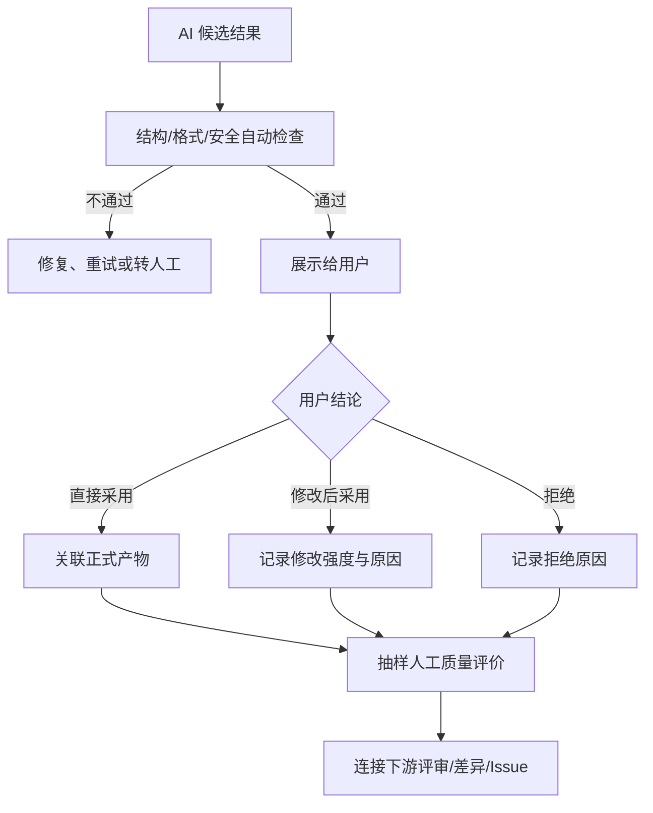

# AI质量评价指标

> 文档状态：当前有效  
> 基线版本：V1.0  
> 生效日期：2026-07-27  
> 适用范围：AI 候选输出的自动检查、人工评价、采用结果与长期质量验证

## 1. 评价目标

AI 质量评价用于判断结果是否能安全、低返工地成为正式产品产物，并定位应优化的模型、Prompt、Skill、Template 或上下文策略。评价对象是明确任务、明确输入和明确版本下的一次结果，不评价抽象的“模型好坏”。

质量证据分四层：

1. 运行可用：调用成功、结果可解析。
2. 输出合格：结构、完整性、正确性、相关性、可追溯性满足任务要求。
3. 用户可用：被直接采用或修改后采用，且修改强度可接受。
4. 下游有效：未在评审、实现确认或验证中引发可归因的重大返工。

高层证据不能被低层证据替代；例如格式通过不能证明内容正确，用户评分不能替代真实采用。

## 2. 评价对象与关联

每条评价记录至少关联：

- `evaluation_id`、`ai_task_id`、`ai_call_id` 或聚合结果 ID。
- 任务类型、业务对象、项目版本、产物版本。
- Skill、Prompt、Template、Model、Context Strategy 版本。
- 评价方式、评价人/规则、评价时间、`rubric_version`。
- 各维度得分、重大错误标签、评价说明和采用状态。

同一结果可以有自动检查、用户评价和抽样专家评价，多类评价分别保存，不互相覆盖。

## 3. 通用质量维度

| 维度 | 核心问题 | 主要证据 | MVP |
|---|---|---|---|
| 结构合规 | 是否符合 Template、格式和必填字段 | 规则校验 | 是 |
| 完整性 | 是否覆盖本任务所有适用要求项 | Checklist/要求项 | 是 |
| 正确性 | 事实、业务规则、计算和状态关系是否正确 | 来源核对、人工评审 | 抽样 + 重大错误必评 |
| 相关性 | 是否围绕当前任务和项目版本，避免无关内容 | 人工评价 | 抽样 |
| 一致性 | 内部表述及与当前正式设计是否冲突 | 规则/人工评审 | 抽样 |
| 可追溯性 | 关键结论能否定位到上下文来源或用户输入 | 来源引用检查 | 是 |
| 可执行性 | 是否足以驱动评审、实现、验证或下一步行动 | 用户/评审者评价 | 抽样 |
| 清晰性 | 结构、术语和表达是否易于理解 | 人工评价 | 抽样 |
| 安全与边界 | 是否泄露敏感信息、越权或把候选当正式事实 | 规则 + 人工 | 是 |

## 4. 评分量表

人工评价采用 0～4 分，并允许 `N/A`：

| 分值 | 定义 |
|---|---|
| 4 | 可直接用于正式产物，无实质修改 |
| 3 | 少量修改后可用，不改变核心逻辑 |
| 2 | 部分可用，需要明显补充或重构 |
| 1 | 仅少量内容可参考，主要结论不可用 |
| 0 | 错误、无关、越界或存在不可接受风险 |

默认不把各维度简单平均成一个“AI 总分”。不同任务维度权重不同，单一总分会掩盖重大错误。若后续需要综合分，必须为每个任务类型单独定义权重、硬门槛和 `rubric_version`。

### 4.1 重大错误门槛

以下任一项出现时，结果即使其他维度较高也不得直接采用：

- 与当前正式产品设计、用户明确输入或来源事实冲突。
- 遗漏门禁、异常、权限、安全或验收中的关键要求。
- 引用不存在、错误版本或无权访问的来源。
- 未经用户确认把候选内容标记为正式设计或正式知识。
- 泄露凭证、敏感上下文或跨项目数据。

## 5. 分任务评价清单

### 5.1 Requirement/需求分析

- 覆盖目标用户、场景、核心任务、问题、约束和期望结果。
- 区分原始输入、已确认事实、假设和待澄清项。
- 保留来源，不用整理结果覆盖原始需求。
- 不擅自扩大范围或确定未确认规则。

### 5.2 PRD

- 覆盖目标、用户、范围、功能、业务规则、异常、权限和验收。
- 核心对象、术语和项目版本保持一致。
- 明确不做什么，未决项和风险可见。
- 关键结论可追溯到 Requirement、项目上下文或已确认决策。

### 5.3 Flow

- 角色、节点、条件、分支、返回点和退出条件完整。
- 文本流程、Mermaid、`.drawio` 的业务逻辑一致。
- 主流程/子流程及来源节点、来源文档版本关系清晰。
- 不绕过文本 Review、Mermaid Review 和逻辑校验。

### 5.4 Design Review

- 反馈定位到明确产物版本和具体问题。
- 区分阻断、建议、澄清和范围外事项。
- 建议包含理由、影响和可执行修改方向。
- 不把偏好表述为事实或强制规则。

### 5.5 Implementation Plan/差异分析

- 功能、状态、异常、数据、接口/依赖和验收范围足以支撑实现确认。
- 设计事实与实际实现证据分别表达。
- 差异包含原设计、实际情况、类型、原因、影响和处理建议。
- 不凭空声称代码、环境或接口已经存在。

### 5.6 Test/Issue/优化建议

- 测试范围、前置条件、步骤、预期、实际和证据完整。
- Issue 类型、严重性、影响范围和版本去向有依据。
- 当前版本修正与派生新版本符合版本规则。
- 优化建议包含问题证据、假设、预期指标和护栏。

### 5.7 知识候选

- 包含来源、适用条件、结论、排除条件和证据强度。
- 能跨具体一次性问题复用，又不被过度抽象。
- 不与当前正式规则冲突。
- 未经人工审核不得成为正式 Experience 或 Checklist。

## 6. 核心质量指标

| ID | 公式 | 解释与用途 |
|---|---|---|
| AQ-01 结构检查通过率 | 结构通过结果 / 已检查结果 | 基础可解析门槛 |
| AQ-02 要求项完整度 | 满足项 / 适用要求项 | 定位遗漏；要求项需版本化 |
| AQ-03 可追溯通过率 | 来源完整结果 / 应追溯结果 | 防止无依据内容正式化 |
| AQ-04 有效采用率 | 直接采用 + 修改后采用 / 已评审任务 | 主要用户价值信号 |
| AQ-05 直接采用率 | 直接采用 / 已评审任务 | 反映低返工可用性 |
| AQ-06 大改率 | 大改后采用 / 修改后采用 | 反映距离正式结果的差距 |
| AQ-07 拒绝率 | 拒绝 / 已评审任务 | 识别不可用结果 |
| AQ-08 重大错误率 | 含重大错误结果 / 已评价结果 | 必须作为护栏 |
| AQ-09 维度得分 | 各维度得分分布、均值和低分率 | 定位具体优化方向 |
| AQ-10 下游返工归因率 | 因该产物导致的退回/差异/Issue / 可关联结果 | 长期真实效果 |

“重新生成次数 / 生成次数”只作为诊断指标，不单独定义为返工率；用户可能探索多个方案，重新生成不必然代表失败。MVP 的返工程度以采用状态、修改强度和原因标签组合判断。

## 7. 评价流程

## 8. MVP 评价要求

- 所有拟正式保存的 AI 结果执行结构、必填项、追溯和安全检查。
- 所有已展示结果记录采用状态；`not_reviewed` 不进入采用率分母。
- 修改后采用必须记录 `minor/major`，拒绝或大改必须选择原因。
- 每类核心 AI 任务在每个观察周期至少抽样 10 条或 10%（取较大者，上限可由运营能力决定）做人工维度评价；样本不足时全量评价并标注小样本。
- 重大错误全量复核并形成 Issue；不能只留低分。
- MVP 不使用 LLM-as-a-Judge 作为正式质量结论；后续引入时需先与人工评价校准一致性、偏差和成本。

## 9. 评价一致性与限制

- 人工评价必须隐藏不必要的模型/Prompt 名称，降低品牌偏差。
- 同一对比使用相同任务、输入、来源快照和量表版本。
- 定期抽取双人重评样本，记录分歧率；分歧高时先修订量表，不急于优化模型。
- 采用率受用户习惯、任务难度和强制流程影响，必须按任务类型和复杂度分组。
- 自动完整度只证明“有内容”，不证明“内容正确”。
- 文本长度和编辑距离不得单独作为质量结论。

## 10. 优化归因

发现质量问题时按以下顺序定位：输入是否完整 → 上下文来源是否正确 → Skill/Prompt/Template 约束是否合理 → 模型输出是否稳定 → Result Processor 是否误判 → 用户任务是否发生变化。任何优化都要绑定具体能力版本，并进入《版本优化指标》规定的前后对比。

