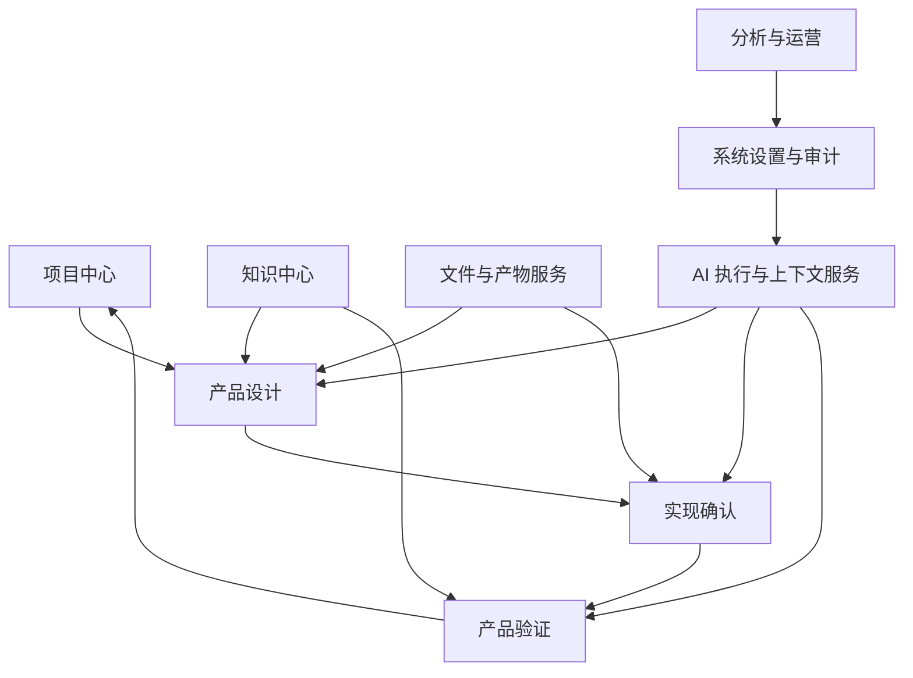

# 产品功能架构

> 文档状态：当前有效  
> 基线版本：V1.0  
> 生效日期：2026-07-27  
> 适用范围：功能模块、边界、依赖与版本分层

## 1. 架构结论

前台一级业务域统一为：**项目中心、产品设计、实现确认、产品验证、知识中心、系统设置**。文件能力采用跨模块能力，不在 MVP 中设置独立一级入口；AI 上下文与 Agent 调度是后台能力，不作为一级导航；数据分析在增强阶段作为“分析与运营”入口提供。

## 2. 功能域总图

## 3. 模块定义

### 3.1 项目中心

职责：管理项目生命周期、项目版本、当前工作上下文和项目资料入口。

核心功能：

- 创建、查看、归档和恢复项目。
- 自动创建 V1，查看版本谱系和选择查看上下文。
- 显示当前工作版本、生命周期状态、当前工作流节点和最近访问模块。
- 从零开始或携带资料从指定节点进入。
- 基于历史版本派生新版本。

边界：不承载 PRD 编辑、评审处理或测试记录；这些操作进入对应业务模块完成。

### 3.2 产品设计

职责：把原始需求转化为可评审、可实现的产品方案。

子模块：

- Requirement：原始输入、来源、澄清项和确认结果。
- PRD：生成/上传/编辑、版本管理、主 PRD 标记和变更说明。
- Flow：按来源范围和流程图类型生成、上传、编辑主流程或子流程，管理文本流程、Mermaid、`.drawio` 及 PNG/SVG 交付物；为可选产物。
- Design Review：评审范围、反馈、处理结果和再次评审。
- Implementation Plan：面向实现的功能、规则、状态、异常、交互和验收说明。

Flow 工作台初步能力：

- 从 PRD 或需求文档中选择生成范围和流程图类型，并记录所引用的来源版本。
- AI 提取角色、节点、条件和分支，先形成可编辑的文本流程。
- 文本流程通过 Review 后生成 Mermaid 预览；Mermaid 通过 Review 后再生成 `.drawio`。
- 对 `.drawio` 执行布局与格式优化，允许人工微调；通过逻辑校验后保存 Flow Version。
- 从主流程图选择节点或业务模块，结合来源文档和用户补充要求生成独立子流程图。
- `.drawio` 作为可编辑交付源，PNG 和 SVG 作为同一 Flow Version 的导出交付物。

以上为产品路径初步方案；具体流程图类型、Review 交互、自动布局和逻辑校验规则留待后续阶段验证。

边界：产品设计只描述“应实现什么”；实际实现证据与偏差在实现确认中管理。

### 3.3 实现确认

职责：把已评审设计与实际实现建立可追溯映射，并决定能否进入验证。

子模块：

- 实现资料：截图、说明、测试环境和外部交付物引用。
- 确认轮次：每次确认形成不可变记录，可有多轮，只有一轮处于当前有效状态。
- Difference Record：记录原设计、实际实现、差异类型、原因、影响和处理决定。
- 验证就绪检查：确认环境、接口、数据和范围是否具备验证条件。

边界：只确认测试条件和差异，不替代实际测试结论。

### 3.4 产品验证

职责：记录真实验证结果，形成问题处置和版本迭代输入。

子模块：

- Test Record：范围、环境、步骤、结果和证据。
- Issue：统一问题主对象，类型包括缺陷、用户反馈、数据异常和优化机会。
- Bug 扩展：仅承载缺陷特有字段，如复现、严重级别和修复信息。
- Optimization 扩展：承载建议、价值、影响范围和版本去向。
- 迭代判定：当前版本修正、暂缓、拒绝或派生新版本。

边界：Issue 可以来源于测试，也可以来源于反馈或运行数据；`test_record_id` 因此允许为空，但每个 Issue 必须属于一个项目版本。

### 3.5 知识中心

职责：管理可复用、受审核、可版本化的产品知识资产。

子模块：Experience Candidate、Experience、Scenario、Checklist、Skill、Prompt、Template。

边界：

- Experience 是分析参考，不是硬性规则。
- Checklist 是场景化提醒，不直接判断对错。
- Skill 定义执行方法，不塞入大量案例。
- 候选内容未经人工审核不能自动成为正式知识。

该模块整体属于增强功能；MVP 只保留后台预置的最小 Skill/Prompt/Template 与调用追溯。

### 3.6 文件与产物服务

职责：提供统一上传、文件版本、解析、业务对象关联和下载能力。

边界：文件是载体，Requirement、PRD、实现确认等业务对象才是业务事实。删除文件不得静默删除业务记录；历史正式产物不得被同名文件覆盖。

### 3.7 AI 执行与上下文服务

职责：完成任务路由、Skill Version 选择、上下文检索、Prompt 构建、模型调用、结果校验和追溯记录。

最小调用链：

`业务任务 → Task Router → Skill Version → Context Strategy → Knowledge Retriever → Prompt Builder → Model Gateway → Result Processor → 用户确认/保存`

边界：AI 服务不拥有项目状态，不越过业务服务直接把生成结果设为正式产物。

### 3.8 系统设置与审计

职责：用户偏好、模型连接、基础模板、模块开关、密钥引用和操作审计。

边界：模型目录与用户/平台连接配置分离；密钥只保存安全引用或加密值，不以普通 JSON 明文保存。

### 3.9 分析与运营

职责：基于真实事件、AI 调用、产物修改、知识复用和版本效果提供指标。

边界：分析看板与运营工作台属于增强功能；MVP 仅同步建设可计算核心指标所需的最小业务事实、AI 追溯、质量反馈和版本归因，不设置独立一级入口。正式指标口径以《产品数据闭环设计》《数据指标体系》《AI质量评价指标》和《版本优化指标》为准；字段级事件契约和物理数据血缘在状态机及技术设计阶段冻结，当前空白埋点文件不构成设计基线。

## 4. 对象归属

| 业务对象 | 直接归属 | 说明 |
|---|---|---|
| Project Version | Project | 一轮完整产品迭代 |
| Requirement | Project Version | 可有多条，保留来源与确认状态 |
| PRD | Project Version | 一个版本可有主 PRD 与补充 PRD |
| PRD Version | PRD | 产物内容版本 |
| Flow | PRD | 可选；可表示主流程或独立子流程，通过 PRD 间接归属项目版本 |
| Flow Version | Flow | 保存文本流程、Mermaid 和 `.drawio` 对应版本；子流程版本保留父 Flow 与来源节点/模块关系 |
| Flow Export | Flow Version | PNG/SVG 等派生交付物，不形成独立业务版本 |
| Design Review | Project Version | 评审范围可引用多个产物版本 |
| Implementation Plan | Project Version | 一个版本可有多个方案 |
| Confirmation Round | Implementation Plan | 1:N，不覆盖历史轮次 |
| Test Record | Confirmation Round | 通过确认轮次间接归属项目版本 |
| Issue | Project Version | `test_record_id` 可空 |
| Bug / Optimization | Issue | Issue 的类型扩展，不与 Issue 并列成为主对象 |
| Experience Candidate | Issue / AI Call | 候选，待审核 |
| Checklist Version | Checklist | 重要修改生成新版本 |
| Context Strategy | Skill Version | 保证 AI 调用可复现 |

## 5. 范围分层

| 功能域 | MVP | 增强 | 未来 |
|---|---|---|---|
| 项目中心 | 项目、版本、派生、阶段信息 | 协作、审批、版本比较 | 多租户与组合项目 |
| 产品设计 | Requirement、PRD、Review、Plan；Flow 可选 | 高级编辑、一致性检查 | 跨项目设计复用 |
| 实现确认 | 多轮确认、差异、就绪检查 | 自动差异提取、外部研发联动 | 代码/构建证据自动关联 |
| 产品验证 | Test、Issue、Bug/Optimization、版本去向 | 测试推荐、批量分析 | 专业测试平台双向同步 |
| 知识中心 | 后台预置能力与追溯 | 完整审核、RAG、管理 UI | 生态市场与跨组织共享 |
| 文件能力 | 上传、版本、关联、下载 | 解析、预览、批量处理 | 外部云盘与资产治理 |
| AI 能力 | 最小可追溯调用链 | 评测、路由、混合检索 | 自动优化与实验平台 |
| 分析运营 | 核心业务事实、AI 追溯、质量反馈、版本归因 | 完整埋点、指标计算与看板 | 预测与智能运营 |

## 6. 模块边界验收

- 每个核心对象只有一个直接归属模块。
- 文件、AI、配置和分析被定义为支撑能力，不与业务主链争夺状态所有权。
- “知识中心”是统一用户可见名称；“数据中心”“AI 能力中心”保留为历史称呼。
- 项目版本状态、工作流节点和最近访问模块分别维护，不复用同一字段。
