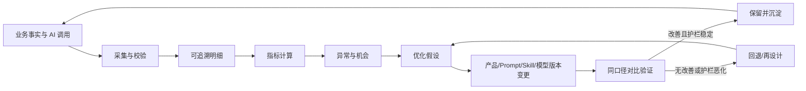

# 产品数据闭环设计

> 文档状态：当前有效  
> 基线版本：V1.0  
> 生效日期：2026-07-27  
> 适用范围：产品行为、AI 运行、输出质量、知识资产与版本优化的数据闭环

## 1. 设计结论

产品数据闭环不是独立数据产品，而是 AI 产品设计与验证平台的横向支撑能力。其目标是用真实业务事实回答三个问题：用户是否完成了端到端工作、AI 是否稳定地产生可用结果、产品或 AI 能力变更是否带来可复现的改善。

闭环遵循：

`业务行为/AI 调用 → 可追溯记录 → 指标计算 → 问题识别 → 优化假设 → 版本变更 → 同口径验证 → 保留或回退`

指标用于辅助产品决策，不替代用户确认、评审、实现确认或测试结论。不得以调用量、生成量等规模指标单独证明产品价值。

## 2. 决策对象与使用者

| 决策 | 主要使用者 | 需要的数据 | 典型动作 |
|---|---|---|---|
| MVP 主链是否可用 | 产品负责人 | 阶段到达、门禁结果、完成周期、异常 | 修复阻断点、调整流程 |
| AI 能力是否可用 | 产品负责人、平台管理者 | 成功率、时延、采用、修改、质量评价 | 调整模型、Prompt、Skill 或上下文 |
| 输出是否达到正式使用要求 | 产品负责人、评审者 | 完整性、正确性、可追溯性、人工结论 | 采用、修改、拒绝或重新生成 |
| 知识是否值得沉淀和复用 | 知识审核者 | 候选来源、审核、调用、采纳与结果 | 入库、停用、改版 |
| 版本优化是否有效 | 产品负责人 | 变更归因、前后同口径指标、护栏 | 保留、继续观察或回退 |

## 3. 数据闭环

### 3.1 五类观测对象

1. 平台使用：项目版本是否进入、通过和完成各核心阶段。
2. AI 运行：一次 AI 任务从路由到结果处理的稳定性、性能和成本。
3. AI 输出质量：候选结果是否完整、正确、可追溯并被真实采用。
4. 知识资产：候选是否经审核形成资产，资产是否被检索、引用并产生价值。
5. 版本优化：产品版本或 AI 能力版本变化前后，主指标和护栏是否同口径改善。

### 3.2 数据粒度

| 粒度 | 唯一标识 | 作用 |
|---|---|---|
| 业务事件 | `event_id` | 记录创建、提交、通过、退回、派生等事实 |
| AI 调用 | `ai_call_id` | 记录一次模型调用及完整追溯链 |
| AI 任务 | `ai_task_id` | 聚合一次用户意图下的重试、多模型或多步骤调用 |
| 产物版本 | `artifact_version_id` | 连接 AI 候选、人工修改与正式产物 |
| 质量评价 | `evaluation_id` | 保存自动检查或人工评价及评价口径版本 |
| 知识调用 | `knowledge_usage_id` | 记录检索、注入、引用和采用结果 |
| 优化实验/观察 | `optimization_id` | 记录变更、对照口径、观察窗与结论 |

同一用户动作可能产生多条技术日志，但只能形成一条去重后的业务事实；AI 重试属于同一 `ai_task_id` 下的多个 `ai_call_id`。

## 4. 采集原则

- 业务事实优先：以服务端确认后的创建、提交、通过和保存结果为准，不用按钮点击替代成功事实。
- 全链可关联：核心记录必须能够关联 `user_id`、`project_id`、`project_version_id`、业务对象和时间。
- AI 可复现：正式 AI 结果必须关联 Task、Skill Version、Prompt Version、Template Version、Model、Context Strategy 和上下文来源。
- 候选与正式分离：生成、采用、修改后采用、拒绝分别记录，生成次数不等于有效产出。
- 版本可归因：产品发布、项目版本和 AI 能力版本分别记录，禁止把三者混为一个 `version` 字段。
- 口径先于看板：先冻结事件语义、计算公式和数据质量规则，再建设展示。
- 最小必要：不采集与决策无关的正文、密钥和敏感上下文；优先保存 ID、版本、摘要、检查结果和用户结论。
- 失败也记录：超时、解析失败、校验失败、取消和拒绝是改进所需数据。

## 5. MVP 采集范围

MVP 必须采集“基础可计算数据”，但不要求建设完整埋点平台、知识运营后台或自动评测平台。

### 5.1 MVP 必采公共字段

所有核心业务事件至少包含：

- `event_id`、`event_name`、`occurred_at`、`schema_version`。
- `user_id`、`session_id`（可匿名化）、`project_id`、`project_version_id`。
- `module`、`object_type`、`object_id`、`object_version_id`（适用时）。
- `result_status`、`failure_code`（失败时）、`source_type`。
- `product_release`、`client_version`（适用时）、`trace_id`。

### 5.2 核心功能统计覆盖

| 核心功能 | 最小业务事实 | 可计算结果 |
|---|---|---|
| 项目/项目版本 | 创建项目、创建/派生版本、设置当前工作版本、归档 | 项目数、版本派生率、活跃项目版本数 |
| Requirement | 创建、来源确认、确认完成、遗留/风险接受 | 需求确认完成率、遗留率、阶段耗时 |
| PRD/产物版本 | 生成/上传、保存版本、设为有效、提交评审 | 正式产物形成率、版本数、阶段耗时 |
| Flow（可选） | 选择需要/跳过及原因、生成/上传、Review、保存版本 | 使用率、跳过原因、Review 通过率 |
| Design Review | 发起、反馈提交、反馈处置、通过/退回 | 评审通过率、阻断反馈数、返轮次数 |
| Implementation Plan | 创建、保存有效版本 | 方案形成率、形成周期 |
| Confirmation Round | 创建、差异确认、就绪检查、通过/不通过 | 确认通过率、阻断差异率、确认轮次 |
| Test Record | 创建、执行结果、完成 | 验证完成率、通过率、验证周期 |
| Issue/Bug/Optimization | 创建、分类、处置、关闭、派生版本 | Issue 密度、处置率、版本去向分布 |
| 文件 | 上传、解析结果、关联业务对象、生成文件版本 | 上传成功率、解析成功率、关联完整率 |
| AI 任务 | 发起、成功/失败、重试、结果校验、采用/修改/拒绝 | 稳定性、时延、采用率、返工率 |
| 审计/配置 | 关键配置版本生效、当前版本变更 | 变更归因与追溯完整率 |

### 5.3 MVP 必采 AI 字段

- 任务：`ai_task_id`、任务类型、所属模块、业务对象、发起时间、完成时间、最终状态。
- 调用：`ai_call_id`、调用序号、模型目录标识、运行配置版本、开始/结束时间、状态、错误类型、重试原因。
- 能力版本：Skill、Prompt、Template、Context Strategy 的版本标识；不适用项显式为空并记录原因。
- 上下文：来源对象 ID/版本、来源类型、是否实际注入、摘要或指纹；不得默认保存完整敏感正文。
- 用量：输入/输出 token、调用次数；可获得时记录供应商计费量和估算成本。
- 结果：格式校验、必填项检查、结果版本、用户采用状态、正式产物版本关联。

### 5.4 MVP 必采质量反馈

每个拟保存为正式产物的 AI 结果必须记录：

- 自动检查：结构/格式是否通过、必填项覆盖数与总数、引用来源是否可追溯。
- 用户结论：`adopted`、`adopted_after_edit`、`rejected`、`not_reviewed`。
- 修改强度：`none`、`minor`、`major`；MVP 可由用户选择，增强阶段再计算结构化差异。
- 拒绝或大改原因：不完整、不正确、不相关、不可执行、格式问题、上下文错误、其他。
- 适用时保存 1～5 分可用性评分；评分不是采用事实的替代。

### 5.5 MVP 暂不强制

- 页面停留时长、鼠标轨迹和全量点击流。
- 自动语义相似度、LLM-as-a-Judge 总分和跨模型 Benchmark。
- 完整知识中心的检索/审核看板；若知识功能未开放，仅保留调用链中的预置知识来源。
- 自动 A/B 分流、因果推断和跨项目行业 Benchmark。
- 保存未采用 AI 输出的完整正文；可保存摘要、指纹、失败原因和必要审计信息。

## 6. 数据处理与指标生产

1. 业务服务在动作成功或状态变化后写入业务事件。
2. AI 服务写入任务、调用、上下文和结果处理记录。
3. 事件接收层校验必填字段、枚举和引用关系，并按 `event_id` 幂等去重。
4. 明细层保留不可变原始事实；修正通过补偿记录完成，不静默覆盖。
5. 指标层按《数据指标体系》计算，指标结果携带 `metric_version`、时间窗和过滤条件。
6. 周期性数据质量检查发现缺失、重复、迟到和关联失败。
7. 指标异常转化为 Issue 或优化候选，绑定证据与责任人。
8. 优化发布后按《版本优化指标》进行同口径比较并记录结论。

## 7. 数据质量与治理

### 7.1 上线门禁

- 核心事件字段完整率达到 99% 才可用于正式指标。
- AI 正式结果追溯完整率必须为 100%；缺少能力版本或上下文来源时不得宣称可复现。
- 重复业务事件率低于 0.5%，否则暂停使用受影响指标进行版本判断。
- 指标必须有名称、公式、粒度、时间窗、过滤条件、责任人和口径版本。

以上是数据可用门槛，不是业务成功目标。

### 7.2 隐私与保留

- 分析层默认使用内部 ID，不展示姓名、邮箱、密钥或原始凭证。
- 上下文正文和用户上传内容按业务权限访问，不复制到通用分析明细。
- 未采用输出只保留最小审计信息；正式产物按业务版本规则保留。
- 数据保留期限、删除请求和导出权限在安全与合规设计阶段冻结；冻结前不得无限期复制敏感内容。

## 8. 运行节奏与责任

| 节奏 | 检查内容 | 输出 |
|---|---|---|
| 每日 | AI 失败、P95 时延、核心事件缺失 | 运行告警与故障 Issue |
| 每周 | 薄闭环完成、阶段转化、采用/大改、主要失败原因 | 产品与 AI 优化候选 |
| 每次发布 | 变更归因、观察窗、主指标与护栏 | 版本结论 |
| 每月 | 指标口径、数据质量、长期趋势 | 指标字典修订建议 |

产品负责人拥有业务指标口径；AI 能力负责人拥有运行与质量诊断；后续数据负责人拥有采集、计算和质量。MVP 中可由同一人兼任，但责任记录不能省略。

## 9. 阶段验收

- 核心功能均能通过成功后的业务事实统计，失败和跳过原因可查。
- 正式 AI 结果能连接运行记录、质量评价、采用结论与正式产物。
- 版本变更能连接变更内容、影响范围、前后指标与护栏。
- MVP 必采和增强采集边界已明确。
- 未获得基线数据前不设置虚假业务目标；上线后先形成 2～4 周稳定基线。

