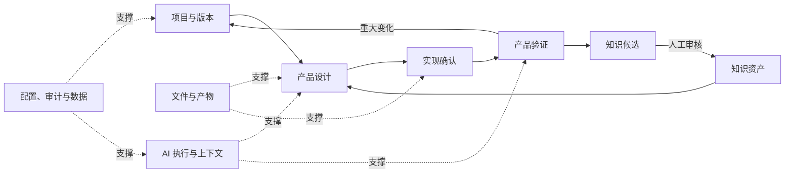

# 产品设计总览

> 文档状态：当前有效  
> 基线版本：V1.0  
> 生效日期：2026-07-27  
> 产品名称：AI 产品设计与验证平台  
> 适用范围：产品定位、用户、场景、范围与跨模块原则

## 1. 产品定位

AI 产品设计与验证平台是一套面向产品经理的 AI 工作平台。平台以“项目版本”为业务主线，把需求澄清、PRD、设计评审、实现确认、产品验证和下一轮迭代组织为可追溯闭环，并通过受控的项目上下文、AI 调用记录与知识复用持续提升产出质量。

平台解决的不是“生成一份文档”，而是以下长期问题：

- 产品资料分散，当前有效口径难以判断。
- 需求、设计、实际实现和验证结果之间缺少关联。
- AI 输出缺少项目上下文、版本依据和调用追溯。
- 问题与优化没有稳定回流到下一轮产品设计。
- 历史经验重复发生，但缺少受控沉淀与复用机制。

## 2. 产品边界

平台负责产品工作流与证据链，不替代代码仓库、研发流水线、专业测试平台或通用团队协作工具。

平台内负责：

- 管理项目、项目版本、阶段节点与产品产物。
- 生成、上传、编辑、评审和版本化产品资料。
- 记录设计方案与实际实现之间的差异。
- 记录验证结果、问题和优化去向。
- 按任务动态组合 AI 上下文并保留调用追溯。
- 将高价值问题转化为待审核的经验和检查项。

平台外完成：

- 代码实现、构建、部署与源代码版本控制。
- 专业自动化测试执行。
- 组织级即时沟通和通用项目排期。

## 3. 核心用户与角色

### 3.1 核心用户：产品负责人

产品负责人是 MVP 的主用户和流程责任人，通常是产品经理、独立产品开发者或承担产品职责的项目负责人。其核心任务是建立项目版本、确认需求、维护正式产品设计、发起评审、确认实现差异、判定问题去向，并决定是否进入新版本。

### 3.2 流程参与者

评审者、实现确认人和测试人员是流程参与身份，不在 MVP 中建设复杂的独立工作台：

- 评审者：提交结构化反馈，不直接改变正式设计。
- 实现确认人：上传实现依据、确认差异及是否具备验证条件。
- 测试人员：提交测试记录和 Issue。

MVP 允许同一用户承担多个身份。细粒度 RBAC、团队空间和审批链属于增强能力；在其落地前，产品负责人拥有项目内最终确认权。

### 3.3 平台管理者

平台管理者维护模型连接、基础模板和系统开关。知识审核者可由平台管理者或产品负责人兼任。MVP 仅提供必要配置，不建设完整运营后台。

## 4. 核心使用场景

1. **从零创建产品方案**：创建项目与 V1，澄清原始需求，形成 PRD，完成评审并输出实现方案。
2. **携带已有资料接续工作**：上传已有 PRD、流程图或实现资料，由用户选择起始节点；系统标记缺失节点，但不强制重做。
3. **设计评审闭环**：对 PRD、Flow 或实现方案提交评审，逐条处理反馈，形成新的产物版本后再次评审。
4. **设计与实现对齐**：关联实际实现资料，记录差异、影响和原因，确认是否具备验证条件。
5. **验证并推动迭代**：记录测试结果和 Issue，区分缺陷、反馈、数据异常和优化建议，决定在当前版本修正或派生新版本。
6. **复用历史经验**：在评审、差异分析和问题分析中按需检索 Experience 与 Checklist；候选内容经人工审核后才能成为正式知识。

## 5. 产品整体架构

产品由一条前台业务主链和三类支撑能力构成：

## 6. 核心产品原则

- **项目版本是迭代容器**：项目版本代表一轮需求—设计—实现—验证周期，不等于 PRD 版本或文件版本。
- **正式产物可追溯**：AI 结果、用户修改、评审反馈和确认记录均需关联所属项目版本及来源。
- **用户拥有最终确认权**：AI 可以建议、生成和检查，不能自动把候选内容升级为正式设计或正式知识。
- **允许非线性进入**：可从指定节点开始、跳过可选节点或批量运行，但系统必须展示缺失项和风险。
- **历史不可覆盖**：重大修改产生新产物版本或新确认轮次；回滚通过派生新项目版本完成。
- **上下文按需加载**：按当前任务检索必要资料，不把全部历史无差别发送给模型。
- **MVP 优先闭环**：先跑通一条端到端可验证链路，再扩展知识、分析和平台化能力。

## 7. MVP 边界

### 7.1 MVP 必须包含

- 基础身份、项目、项目版本和项目上下文。
- Requirement、PRD 及其版本、Design Review 与反馈处理。
- Implementation Plan、实现确认轮次、差异记录和进入验证确认。
- Test Record、Issue、当前版本修正与派生新版本。
- 基础文件上传、对象关联和历史版本查看。
- 最小 AI 调用链：任务类型、Skill Version、Prompt Version、Model、上下文来源、结果与采用状态可追溯。
- 最小配置和操作审计。
- 最小数据闭环：核心业务事实、AI 运行记录、采用/修改/拒绝、质量检查和版本归因可采集、可关联、可计算。

Flow 在 MVP 中为可选产物：支持上传或生成，但缺失不阻断评审。MVP 发布门槛是端到端薄闭环可运行，而不是只完成 PRD 生成。

### 7.2 增强功能

- 多人角色权限、任务分派、通知与审批。
- 高级 Flow 编辑、跨产物一致性检查和批量评审。
- Experience Candidate、Experience、Scenario、Checklist 审核与调用。
- Skill、Prompt、Template 的可视化管理和评测。
- 混合检索、向量知识库、模型效果对比和细粒度项目配置。
- 完整事件埋点、自动质量评测、指标计算服务与运营看板；不影响 MVP 最小必采数据同步落地。

### 7.3 未来规划

- 组织/租户空间、外部协作和企业级权限治理。
- Skill/Template 生态与受控安装市场。
- 与代码仓库、测试平台、项目管理工具的双向集成。
- 自动发现流程瓶颈并生成优化候选。
- 跨项目 Benchmark、实验平台和模型/Prompt 自动评测。

## 8. 成功标准

MVP 成功不以“生成文档次数”判断，而以以下结果判断：

- 一个项目版本能够从需求进入实现确认和产品验证。
- 每个正式产物能说明所属版本、来源、状态和当前有效版本。
- 评审反馈、实现差异和 Issue 都有明确处理去向。
- 重大优化能派生新项目版本，且原历史仍可查。
- 任一 AI 正式结果能追溯使用的 Skill、Prompt、模型和上下文来源。
- 每项核心功能能被统计，AI 结果有评价方式，版本变更可进行同口径前后比较。

## 9. 阶段验收

| 验收项 | 结果 | 基线位置 |
|---|---|---|
| 产品定位明确 | 通过 | 本文第 1～2 节 |
| 用户角色明确 | 通过 | 本文第 3 节 |
| 模块边界明确 | 通过 | 《产品功能架构》第 3～4 节 |
| 核心流程明确 | 通过 | 《核心业务流程》第 1～9 节 |
| MVP 边界初步明确 | 通过 | 本文第 7 节、《产品功能架构》第 5 节 |
| 草稿与正式设计已区分 | 通过 | 《版本管理规则》第 7 节 |
| 初始化阶段产品冲突已处理 | 通过 | 《产品设计决策记录》PD-001～PD-017；技术细节按后续阶段门禁处理 |
| 产品数据闭环与指标口径明确 | 通过 | 《产品数据闭环设计》《数据指标体系》《AI质量评价指标》《版本优化指标》 |

## 10. 文档效力

本文件与同目录其余八份 V1.0 文档共同构成当前有效产品设计基线。原始 Word 文档保留为设计来源与历史依据，不再直接作为当前产品口径；具体分类见《版本管理规则》和《产品设计决策记录》。
