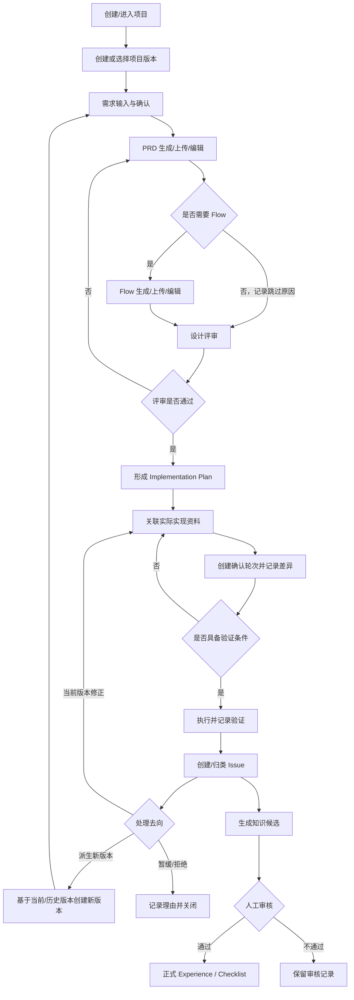
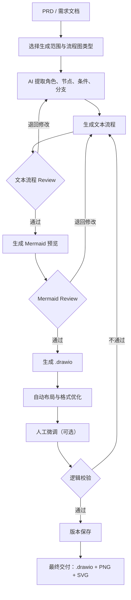
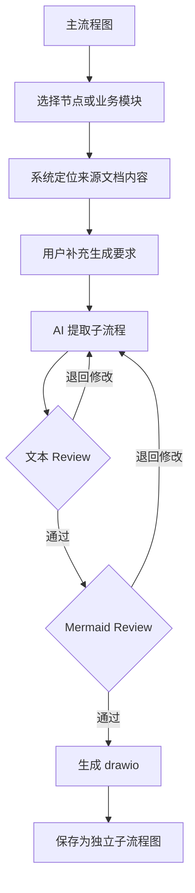
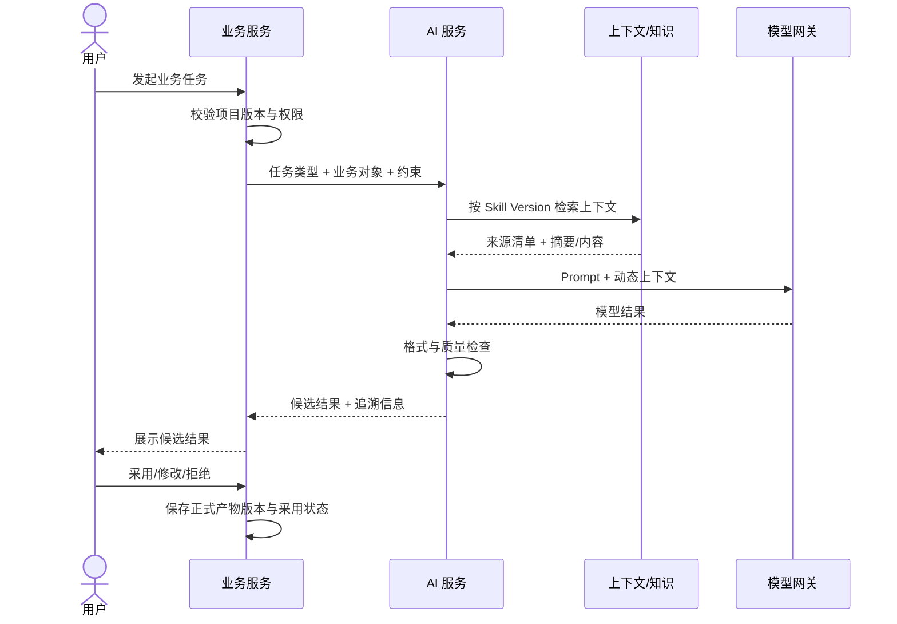

# 核心业务流程

> 文档状态：当前有效  
> 基线版本：V1.0  
> 生效日期：2026-07-27  
> 适用范围：端到端主流程、分支、异常与阶段门禁

## 1. 端到端主流程

## 2. 流程一：项目启动与版本进入

### 2.1 新项目

1. 产品负责人创建项目，填写名称、目标、背景和基本配置。
2. 系统自动创建项目版本 V1，并将其设为当前工作版本。
3. 用户选择“从零开始”或“已有资料开始”。
4. 从零开始进入需求输入；已有资料进入资料识别与起始节点确认。

### 2.2 已有资料项目

1. 用户上传 PRD、Flow、实现说明或验证资料。
2. 系统识别资料类型并提出建议起始节点，但不能自动确认。
3. 用户确认起始节点。
4. 系统建立节点完整性清单：`已具备 / 待补充 / 已跳过 / 不适用`。
5. 缺失非门禁产物不阻断继续；缺失门禁项时，必须在进入下一阶段前补齐或由产品负责人记录风险接受。

## 3. 流程二：需求到实现方案

### 输入

- 原始需求、用户反馈、运营建议、项目要求或上一版本 Optimization。
- 项目上下文和关联历史决策。

### 步骤

1. 创建 Requirement，保留来源文本，不用整理稿覆盖原始输入。
2. 形成待确认问题，产品负责人逐项确认、暂缓或标记不适用。
3. 生成或上传 PRD，并形成首个 PRD Version。
4. 检查目标、用户、范围、业务规则、异常、权限和验收要求。
5. 用户决定是否需要 Flow；跳过时记录原因。
6. 发起 Design Review，冻结本轮评审引用的产物版本。
7. 反馈逐条标记为接受、拒绝、暂缓或需澄清；接受反馈产生新的产物版本。
8. 评审通过后形成 Implementation Plan。

### 输出门禁

- Requirement 已确认或存在明确的遗留清单。
- PRD 有且仅有一个当前有效版本。
- 评审引用的具体产物版本可追溯。
- 所有阻断反馈已处理。
- Implementation Plan 说明功能、规则、状态、异常、交互和验收范围。

### 3.1 流程图生成路径（暂定）

Flow 为可选产物。用户决定生成 Flow 时，初步路径为：

关键门禁：

- 文本流程 Review 确认角色、节点、条件、分支、范围及业务语义，不通过时不得进入 Mermaid 生成。
- Mermaid Review 确认拓扑结构和流程逻辑，不通过时不得生成 `.drawio`。
- 逻辑校验通过后才能把该 Flow Version 标记为当前有效版本并生成最终交付物。
- AI 生成、自动布局和格式优化均为候选处理，用户保留最终确认权。

### 3.2 子流程图生成路径（暂定）

子流程从已存在的主流程图派生，初步路径为：

子流程保存为独立 Flow，并保留与父 Flow、来源节点或业务模块、来源文档版本的关联。子流程的文本、Mermaid、`.drawio` 和导出物仍遵循主流程图的 Review、逻辑校验及版本规则。

待后续阶段验证：流程图类型枚举、生成范围选择方式、Review 的编辑与确认语义、Mermaid 到 `.drawio` 的转换保真度、自动布局可行性、逻辑校验规则及导出规格。

## 4. 流程三：实现确认

### 输入

- 已评审通过的 Implementation Plan。
- 实际实现说明、截图、环境信息或外部交付物引用。

### 步骤

1. 上传或关联本次实现证据。
2. 创建新的 Confirmation Round；历史轮次不可覆盖。
3. AI 或用户对比设计与实现，生成 Difference Record 候选。
4. 产品负责人确认每项差异的类型、原因、影响和处理决定。
5. 完成验证就绪检查：页面/功能、接口、数据、环境和验证范围。
6. 当前轮次满足条件后标记为“已确认”，并取代上一轮成为当前有效轮次。

### 分支

- 无差异：仍保留确认轮次和证据，差异清单为空。
- 存在可接受差异：记录接受原因和是否回写后续设计版本。
- 存在阻断差异：确认不通过，返回实现或产品设计处理。

## 5. 流程四：产品验证与 Issue 处理

### 步骤

1. 基于当前有效 Confirmation Round 创建 Test Record。
2. 记录验证范围、环境、步骤、实际结果和证据。
3. 发现问题时创建统一 Issue，选择类型：`defect`、`feedback`、`data_anomaly`、`optimization`。
4. 缺陷型 Issue 补充 Bug 字段；优化型 Issue 补充 Optimization 字段。
5. 评估严重程度、影响范围、处理优先级和版本去向。
6. 选择处理动作：当前版本修正、派生新版本、暂缓或拒绝。
7. 当前版本修正后重新走实现确认；重大变化派生新版本并回到需求确认。

### 版本判定

当前版本修正：文案修改、展示问题、普通缺陷、小范围异常、未改变已确认业务规则的实现修正。

派生新版本：新功能、业务规则变化、产品方向变化、大范围优化、重大实现调整或验收口径变化。

## 6. 流程五：AI 调用与正式产物保存

规则：AI 输出默认是候选；只有用户采用或修改并保存后，才成为正式业务产物。失败、超时和被拒绝结果保留最小审计信息，不更新正式产物。

## 7. 流程六：知识沉淀

1. Issue、评审反馈或高价值差异触发 Experience Candidate。
2. 候选必须包含来源、适用范围、抽象结论和排除条件。
3. 规则过滤一次性、不可复用、低证据内容。
4. 人工审核后成为 Experience；未通过候选保留审核结论。
5. Experience 可进一步形成 Checklist 候选，并绑定 Scenario。
6. Checklist 重要修改生成新版本；历史调用仍指向当时版本。

## 8. 三类状态不得混用

| 概念 | 用途 | 示例 |
|---|---|---|
| 项目版本生命周期 | 表示一轮迭代整体状态 | 草稿、设计中、实现中、验证中、已完成、已归档 |
| 工作流节点 | 表示当前业务步骤 | 需求确认、PRD、评审、实现确认、测试 |
| 最近访问模块 | 仅用于下次进入时导航 | 产品设计、实现确认、产品验证 |

项目版本生命周期由关键门禁推动；工作流允许局部分支和回退；最近访问模块不具有业务状态效力。

## 9. 核心异常处理

- AI 超时/失败：保留任务状态，允许重试或转人工，不改变业务状态。
- 上传文件无法解析：保留原文件并标记解析失败，允许人工指定类型。
- 并发编辑冲突：拒绝静默覆盖，提示基于最新产物版本重新合并。
- 历史版本被选中：默认只读；用户必须显式执行“基于此版本派生”。
- 阶段资料缺失：展示缺失清单；门禁项必须补齐或记录风险接受人和理由。
- 已确认设计发生变化：生成新产物版本，并使相关评审/确认状态重新待处理。

## 10. 流程验收

- 主流程能从项目创建走到验证结果与下一版本。
- 所有循环都有返回点和退出条件。
- 所有跳过行为保留原因，所有重大变化不覆盖历史。
- AI 候选、正式产物、评审反馈、差异和 Issue 的责任边界明确。
