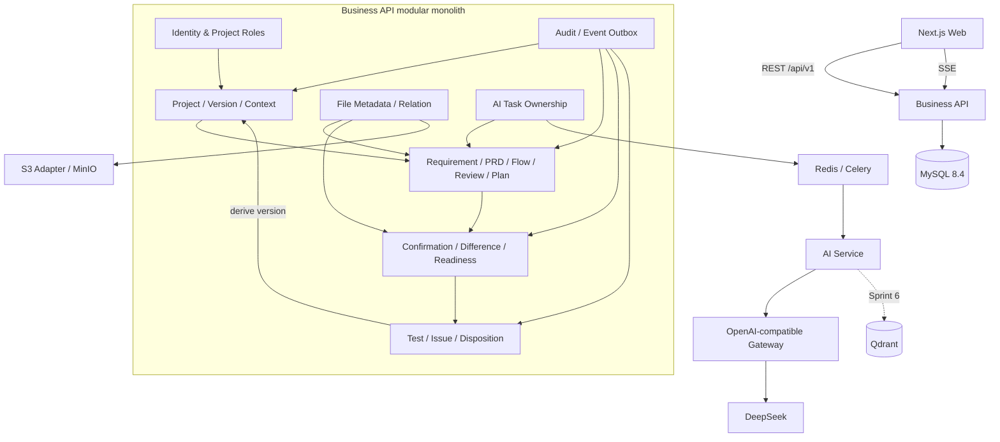
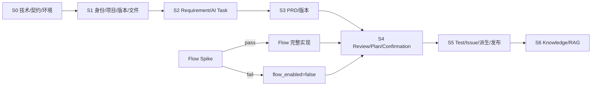

# 模块依赖关系

> 文档状态：当前有效（2026-07-29 已确认）
> 规划版本：V1.0
> 建立日期：2026-07-29
> 范围：运行时依赖、开发依赖、关键路径、功能旗标和降级边界

## 1. 依赖原则

1. 业务事实以 Project Version 为根，模块不能绕过直接归属对象写入其他模块状态。
2. AI、文件、事件、审计和配置是支撑能力，不拥有业务主链状态。
3. 前端只调用 Business API；AI 服务通过内部契约与业务服务协作。
4. 依赖以版本化 OpenAPI、JSON Schema、事件 Schema 和对象 ID 表达，不共享数据库表写权限。
5. 历史版本、确认轮次和验证事实不可原位覆盖。
6. 条件能力必须使用功能旗标并有完整关闭状态。

## 2. 系统拓扑

## 3. 业务模块依赖

| 模块 | 上游依赖 | 下游消费者 | 允许写入 | 禁止行为 |
|---|---|---|---|---|
| Identity/Role | User、Session | 全部业务模块 | 用户、会话、固定项目角色 | 在 JWT 中永久缓存可变权限 |
| Project Center | Identity | 全部项目内模块 | Project、Project Version、Context、谱系 | 用查看历史替代设置工作版本 |
| File Service | Identity、Project | Requirement、PRD、Flow、Confirmation、Test | File、File Version、Relation、Parse Result | 删除文件时静默删除业务记录 |
| AI Task | Identity、Project、目标对象 | Requirement、PRD、Plan、可选 Flow | Task/Call/Context/Result 候选记录 | 直接写正式产物或业务状态 |
| Requirement | Project Version、File、AI Task | PRD、Review | Requirement 草稿/正式版本 | 覆盖已确认历史 |
| PRD | Requirement、AI Task | Flow、Review、Plan | PRD/PRD Version | 把 AI ready 当成正式版本 |
| Flow | PRD、File、AI Task、Feature Flag | Review | Flow/Version/Export | Gate 未通过时开放半成品入口 |
| Design Review | Project Version、产物版本 | Plan、Confirmation | Review、Feedback、处置 | 评审通过自动让产物生效 |
| Implementation Plan | Review、PRD、AI Task | Confirmation | Plan/Version/引用 | 绕过阻断评审进入确认 |
| Confirmation | Plan、File、Identity | Test Record | Round、Difference、Readiness、有效轮次 | 修改历史轮次或失败时撤销旧有效轮次 |
| Validation | 有效 Confirmation Round、Project Version | Issue、版本派生 | Test Record、证据 | 将草稿结果当成验证事实 |
| Issue | Project Version、可选 Test Record | 当前版本修正、派生版本、Sprint 6 知识候选 | Issue、Bug/Optimization 扩展、去向 | Bug/Optimization 脱离 Issue 成为并列主对象 |
| Knowledge | Issue/AI Call、Feature Flag | AI Context/RAG | Candidate、Experience、Checklist、版本 | 候选自动入库或 Qdrant 成为事实源 |

## 4. 接口责任边界

| 契约 | 生产者 | 消费者 | 版本/一致性规则 |
|---|---|---|---|
| OpenAPI `/api/v1` | Business API | Web、契约测试 | 兼容变更同 v1；破坏性变更需新版本或迁移期 |
| Internal AI Task Contract | Business API | AI API/Worker | 只传 task ID、目标快照 ID 和 trace；大正文按权限读取 |
| AI Result Contract | AI Service | Business API | 候选版本化；正式化前校验目标仍有效 |
| Event Schema | Business/AI 服务 | 数据质量查询 | `schema_version` 必填；追加字段向后兼容 |
| File Adapter | Business API | MinIO/托管 S3 | 业务只依赖 S3 语义；对象键不可作为业务 ID |
| Provider Adapter | AI Gateway | DeepSeek/后续 Provider | 统一请求、流式块、用量、错误和重试分类 |
| Vector Adapter | AI Service | Qdrant | Sprint 6 启用；索引可从权威来源重建 |
| Design Token Build | `design-tokens.json` | Web UI | 构建时校验；语义 Token 不由页面私建 |

## 5. 关键路径

关键路径任务：

- Foundation：`BE-002/003`、`AI-001/002`、`DATA-001/002`、`OPS-001/002`。
- Core Context：`BE-101～105`。
- AI Candidate：`BE-203/204`、`AI-201～203`、`DATA-201`。
- Formal Artifact：`BE-301/302`、`AI-301`。
- Review/Confirmation：`BE-401～403`、`AI-401`。
- Validation/Release：`BE-501～503`、`DATA-501`、`QA-501/502`、`OPS-501/502`。

## 6. 功能旗标

| Flag | 默认 | 启用前置 | 关闭表现 | 数据要求 |
|---|---|---|---|---|
| `flow_enabled` | false | `AI-003=pass` 且 FE-304/BE-303/AI-302/QA-301 完成 | 页面显示跳过/未开放，不创建 Flow 对象 | 记录跳过/关闭原因和版本 |
| `knowledge_center_enabled` | false | Sprint 6 全部 Gate 通过 | KC 页面显示未开放，MVP 主链不受影响 | 预置知识调用仍保留来源追溯 |
| `secondary_provider_enabled` | false | AI-602 契约与回归通过 | 仅使用 DeepSeek Provider Profile | Provider/模型版本继续记录 |

规则：旗标关闭必须在前端、API、后台任务和导航四处一致；不得只隐藏按钮而保留未授权 API。

## 7. 数据依赖

### 7.1 权威数据与派生数据

| 类型 | 权威存储 | 可重建派生 |
|---|---|---|
| 业务对象、状态、版本、权限 | MySQL | 前端缓存、搜索摘要 |
| AI Task/Call/Context/Result | MySQL | Redis 进度、运行指标 |
| 文件正文 | MinIO/S3 | 解析文本、预览、缩略图 |
| 文件元数据/关联 | MySQL | 下载 URL |
| 原始事件/审计 | MySQL 不可变明细 | 指标查询、离线报表 |
| 知识正文/版本 | MySQL/对象存储 | Qdrant 向量索引 |

### 7.2 事务边界

- 业务写入、版本关系、审计和 Outbox 在同一 MySQL 事务完成。
- 外部文件/模型调用不持有数据库长事务。
- Outbox 发布失败可重试，不重复生成业务事实。
- AI 结果完成与业务正式化是两个事务、两个用户可感知状态。
- 对象存储成功但元数据失败时进入可清理孤儿对象队列，不返回业务成功。

## 8. 故障与降级依赖

| 故障源 | 受影响模块 | 仍可用 | 必须阻止 |
|---|---|---|---|
| DeepSeek | AI 生成 | 人工创建/上传/编辑、历史查看 | 新 AI 正式结果 |
| AI Service/Worker | AI Task | 全部业务 CRUD、已有候选审核 | 新 AI 任务执行 |
| Redis | AI 队列/SSE 缓存 | 非 AI 主链、历史、文件元数据 | 新 AI 任务受理 |
| MinIO/S3 | 文件上传/下载 | 无新文件依赖的业务操作、既有元数据 | 新上传和假成功 |
| MySQL | 全部权威业务 | 健康/维护页、静态说明 | 所有业务写入 |
| Flow 转换 | Flow | Requirement、PRD、Review、Plan 主链 | 半完成 Flow 保存为正式版本 |
| Qdrant | Sprint 6 RAG | MVP、结构化/关键词检索 | 宣称向量检索成功 |
| SSE | 长任务实时反馈 | 任务快照查询/轮询 | 虚假进度和重复任务 |

## 9. Sprint Gate 依赖

| 后续能力 | 必须完成 |
|---|---|
| Requirement 正式化 | 身份、Project Version、文件/审计、OpenAPI、事件基线 |
| PRD AI 生成 | Requirement 正式版本、AI Task、Context/Result 追溯、候选正式化 |
| Design Review | PRD 正式版本；Flow 若启用则引用明确 Flow Version |
| Implementation Confirmation | 通过/可接受的 Review、正式 Plan、实现资料能力 |
| Test Record | 当前有效 Confirmation Round 与验证就绪 |
| Issue 派生版本 | 已提交 Issue 去向、Project Version 谱系和幂等命令 |
| MVP 发布 | T01～T07、NFR、数据质量、备份恢复、回滚演练 |
| Knowledge/RAG | MVP 稳定、候选审核模型、Qdrant 安全/重建/降级 |

## 10. 禁止形成的循环依赖

- AI 服务不得依赖前端状态决定业务事实；前端也不得直接解释 Provider 原始状态。
- Project Version 不依赖 PRD/Review 完成才能存在；业务模块通过门禁引用 Project Version。
- Issue 可选关联 Test Record，但 Test Record 不得依赖 Issue 才能提交。
- Knowledge 可来源于 Issue/AI Call，但 MVP 主链不得依赖知识中心启用。
- 事件写入服务于统计和追溯，指标计算失败不得回滚已成功业务动作；关键审计/Outbox 例外，必须与命令同事务。
