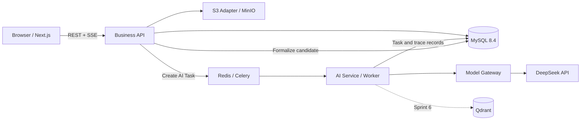

# 项目开发规划与 MVP 路线

> 文档状态：当前有效（2026-07-29 已确认）
> 规划版本：V1.0
> 建立日期：2026-07-29
> 适用范围：Development Planning、MVP 开发、测试与首次私有部署
> 权威边界：本文件执行已确认产品、交互、页面状态机和 UI 基线，不反向修改其业务结论

## 1. 规划结论

本项目采用“十二周 MVP + 两周增强”的精益开发路线：Sprint 0～5 跑通 Project Version → Requirement → PRD → Design Review → Implementation Plan → Confirmation Round → Test Record → Issue → 派生新版本的端到端薄闭环；Sprint 6 再开放知识中心、RAG、多 Provider 和 AI 能力增强。

首发采用单服务器 Docker Compose 私有部署。架构保持云端可迁移，但不在 MVP 中提前建设 Kubernetes、微服务集群、多租户、完整分析平台或复杂 RBAC。

## 2. 输入与权威顺序

开发必须按以下顺序解释需求：

1. `产品设计体系整理/` 当前有效产品基线。
2. `交互设计与页面状态机/交互设计/` 已验收交互基线。
3. `交互设计与页面状态机/页面状态机/页面状态机.md`。
4. `Wireframe与UI设计/` 当前有效 Wireframe、设计系统和高保真原型。
5. `开发规划/` 当前有效开发规划。
6. `PROJECT_MEMORY.md`、`PROJECT_STATUS.md` 和历史 DOCX，仅作摘要或追溯证据。

出现冲突时不得由开发人员静默裁决；应记录冲突、影响对象和最小调整建议，回到主责文档确认。

## 3. 团队、周期与发布边界

### 3.1 规划能力

- Sprint 长度：两周。
- 团队：1 名前端、1 名后端、1 名 AI/数据工程师；测试由团队共同承担。
- MVP：Sprint 0～5，共十二周。
- 增强版本：Sprint 6，两周，不阻塞 MVP。
- 发布目标：先私有部署，后续迁移到云端并支持外部用户访问。

### 3.2 MVP 必须包含

- 邮箱密码身份、固定项目角色与操作审计。
- Project、Project Version、Project Context、历史查看和安全派生。
- Requirement、PRD/PRD Version、Design Review/Feedback。
- Implementation Plan、Confirmation Round、Difference Record、就绪检查。
- Test Record、Issue、Bug/Optimization 扩展和版本去向。
- 文件上传、对象关联、文件版本和安全下载。
- 最小 AI 调用链、DeepSeek Provider Profile、上下文来源与采用结果追溯。
- 核心业务事件、AI 记录、质量反馈和版本归因。
- T01～T07 端到端路径、异常恢复、权限与并发保护。

### 3.3 条件启用能力

Flow 通过 `flow_enabled` 控制。Sprint 0 必须完成文本流程 → Mermaid → `.drawio` → PNG/SVG 的可行性验证：

- 通过：Sprint 3 实现完整文本 Review、Mermaid Review、逻辑校验、版本保存和交付物链路。
- 未通过：MVP 保持功能关闭，只显示“未开放”或跳过记录；不得提供半成品入口，也不得阻断 PRD → Review 主链。

### 3.4 MVP 不包含

- 组织、租户、动态权限策略、多人任务分派和审批链。
- 完整知识中心、Experience/Checklist 审核后台和向量检索。
- 自动 LLM-as-a-Judge、实验平台、完整指标计算服务和运营看板。
- 原生移动端、桌面客户端、暗色模式全量页面。
- Kubernetes、服务网格、跨地域高可用和多活架构。
- 代码仓库、CI/CD、项目管理或专业测试平台双向集成。

## 4. 技术基线

### 4.1 选型表

| 层 | 冻结选择 | 使用边界 |
|---|---|---|
| 前端 | Next.js 16 App Router、TypeScript、pnpm | 桌面 Web SaaS；框架版本锁定到 Sprint 0 当日稳定补丁版本 |
| UI | Tailwind CSS、Radix UI、自有 Design Token | 不使用第三方默认视觉覆盖当前 Sage/Apricot 语义 |
| 状态与请求 | TanStack Query；局部 UI 状态使用 React 内置状态 | 服务端事实不复制成长生命周期前端主状态 |
| 表单 | React Hook Form + Zod | 表单校验与 API Schema 对齐 |
| 富文本 | Tiptap 3 开源能力 | PRD/Plan 保存结构化 JSON，并生成可检索文本/Markdown 派生表示 |
| 业务 API | FastAPI 模块化单体、Pydantic、SQLAlchemy 2、Alembic | 业务状态、正式产物、权限和审计的唯一写入方 |
| AI 服务 | 独立 FastAPI、Celery Worker、Redis、LangGraph | 负责运行与候选结果，不直接把候选设为正式业务事实 |
| 模型网关 | OpenAI-compatible Adapter + DeepSeek Provider Profile | 模型名称从模型目录/连接配置读取，不写死废弃模型名 |
| 主数据库 | MySQL 8.4 LTS、InnoDB、utf8mb4 | 业务事实、版本、AI 追溯、事件和审计 |
| 缓存/队列 | Redis | 队列、短期进度、限流和可重建缓存；不作为事实源 |
| 对象存储 | S3 兼容接口；私有部署使用 MinIO | 文件正文不进入关系表；云端替换托管 S3 无需改业务接口 |
| 向量库 | Qdrant，Sprint 6 启用 | Sprint 0～5 不部署、不成为 MVP 依赖 |
| 部署 | Docker Compose + 反向代理/TLS | 单服务器私有部署；镜像和配置保持云迁移能力 |

技术依据：

- Next.js 官方当前安装基线：<https://nextjs.org/docs/app/getting-started/installation>
- Tiptap 编辑器：<https://tiptap.dev/docs/editor/getting-started/overview>
- Celery Redis：<https://docs.celeryq.dev/en/stable/getting-started/backends-and-brokers/>
- LangGraph：<https://docs.langchain.com/oss/python/langgraph/overview>
- DeepSeek API：<https://api-docs.deepseek.com/guides/agent_integrations/openclaw>
- MySQL 8.4 LTS：<https://dev.mysql.com/doc/refman/8.4/en/mysql-releases.html>
- MinIO S3 兼容接口：<https://min.io/docs/minio/container/index.html>
- Qdrant：<https://qdrant.tech/documentation/quick-start/>

### 4.2 建议仓库结构

```text
apps/
└─ web/                 Next.js 前端
services/
├─ api/                 FastAPI 业务模块化单体
└─ ai/                  AI API、Celery Worker、LangGraph
packages/
├─ contracts/           OpenAPI 生成的前端类型与事件 Schema
└─ design-tokens/       UI Token 转换与校验
infra/
├─ compose/             本地、staging、production Compose
├─ migrations/          环境初始化和数据迁移入口
└─ scripts/             备份、恢复、健康检查和发布脚本
tests/
├─ e2e/                 Playwright T01～T07
├─ contract/            OpenAPI、事件、Provider 契约
└─ performance/         API、SSE 和上传性能场景
```

Python 与 Node 依赖分别使用锁文件；容器镜像禁止使用浮动 `latest` 标签。共享只通过 OpenAPI、JSON Schema、事件 Schema 和版本化契约，不共享运行时代码。

## 5. 服务边界与数据流



边界规则：

- Browser 不直接调用模型供应商、Redis、MySQL、MinIO 或 Qdrant。
- AI 服务不拥有 Project Version、产物生效、评审结论或确认轮次状态。
- Redis 消息只放任务 ID 和最小路由信息，不传输大文件或完整上下文正文。
- 对象存储只保存文件内容；文件版本、校验和、业务关联和权限位于 MySQL。
- 正式产物由业务 API 在用户确认后事务性保存，并关联 AI 结果版本与追溯记录。

## 6. 公共接口契约

### 6.1 REST 与标识

- 统一前缀：`/api/v1`。
- OpenAPI 是字段级接口事实源，前端类型由其生成。
- 成功响应：`{code, message, data, trace_id}`。
- 错误响应：`{code, message, details, trace_id}`；`message` 面向用户，`details` 不暴露堆栈或密钥。
- 数据库 `BIGINT UNSIGNED` ID 对外统一为字符串。
- 时间使用 UTC RFC 3339；展示层再转用户时区。
- 列表默认游标分页：`items`、`next_cursor`、`has_more`；需要总数的页面使用独立统计接口。

### 6.2 写入、幂等与并发

- 创建、提交评审、确认、派生版本、Issue 去向等命令必须携带 `Idempotency-Key`。
- 可编辑资源携带 `version`；客户端写入提交 `expected_version`。
- 并发冲突返回 HTTP 409 和 `VERSION_CONFLICT`，附最新版本标识，不自动覆盖。
- 幂等响应按用户、端点和 Key 隔离；同 Key 不同请求体返回冲突。
- 已评审产物、历史版本、有效确认轮次和已提交验证事实不原位覆盖。

### 6.3 身份与权限

- 邮箱密码注册/登录；密码使用 Argon2id。
- Access JWT 为短期令牌；Refresh Token 七天有效、可撤销并保存哈希，使用 Secure/HttpOnly Cookie。
- 固定项目角色：`owner`、`reviewer`、`implementer`、`tester`；系统角色 `admin`。
- 同一用户可兼任多个项目角色；最终确认类动作必须记录实际操作者。
- 不在 JWT 中放长期可变的完整权限清单；关键写操作实时查询项目授权。

### 6.4 AI 任务

状态枚举统一为：

`queued → preparing → generating → checking → ready`

分支状态：`blocked`、`failed`、`cancelled`、`expired`。

- 前端通过 SSE 订阅任务摘要；断线后使用任务 ID 重连或查询快照。
- 离开页面不取消任务；取消必须显式提交。
- 重试创建新调用记录，保留原失败事实。
- `ready` 只表示候选可审核，不表示正式产物已保存。
- DeepSeek 连接保存 Provider、Base URL、模型目录引用和密钥安全引用；不把密钥写入普通 JSON。

### 6.5 事件契约

核心事件至少包含：`event_id`、`event_name`、`occurred_at`、`schema_version`、`user_id`、`session_id`、`project_id`、`project_version_id`、`module`、`object_type`、`object_id`、`object_version_id`、`result_status`、`failure_code`、`source_type`、`product_release`、`client_version`、`trace_id`。

- 事件在业务动作成功或状态变化后写入；失败事件不得伪装为成功事实。
- `event_id` 唯一并用于幂等去重。
- 原始明细不可变；修正使用补偿记录。
- AI 正式结果必须可定位 Skill、Prompt、Template、Context Strategy、Model 和上下文来源版本。

## 7. 开发阶段与里程碑

| 阶段 | Sprint | 里程碑 |
|---|---|---|
| Foundation | 0 | 技术、ER、OpenAPI、事件、CI/CD、部署和两项可行性验证通过 |
| Core Context | 1 | 用户可登录并完成项目、V1、版本上下文和基础文件操作 |
| Requirement + AI | 2 | Requirement 与 AI 候选审核、追溯和长任务恢复可用 |
| PRD + Optional Flow | 3 | PRD 正式版本闭环；Flow 按 Gate 完整启用或关闭 |
| Review + Confirmation | 4 | Review、Plan、差异和确认轮次闭环可用 |
| Validation + Release | 5 | Test、Issue、版本去向、T01～T07 和私有部署通过 |
| Knowledge + AI Enhance | 6 | 知识中心、Qdrant RAG 与多 Provider 增强发布 |

详细 Sprint 任务见《Sprint规划》，任务 ID 和责任见《开发任务清单》，依赖见《模块依赖关系》，发布门禁见《验收标准》。

## 8. 上线规划

### 8.1 环境

- Local：开发者 Compose，使用独立数据卷和模拟/测试 Provider。
- CI：无持久业务数据，运行单元、契约、迁移与构建测试。
- Staging：与生产同拓扑，使用隔离数据库、桶、Redis DB 和 DeepSeek 测试连接。
- Production：单服务器 Compose，反向代理/TLS，仅开放 Web/API 入口；数据库、Redis、MinIO 和 Qdrant 不直接暴露公网。

### 8.2 发布顺序

1. 冻结发布候选和数据库迁移。
2. 备份 MySQL、对象存储元数据和配置；验证备份可读。
3. 在 staging 执行迁移、T01～T07、性能与恢复演练。
4. 生产进入维护窗口，运行迁移预检。
5. 部署 API/Worker，再部署 Web；运行健康检查和冒烟测试。
6. 观察错误率、队列积压、事件缺失和 AI 失败。
7. 满足门禁后结束维护窗口；否则按回滚手册恢复旧镜像和数据。

### 8.3 云端演进

云端迭代保持 API 和业务模型不变：MySQL 替换托管 MySQL，MinIO 替换托管 S3，Redis 替换托管 Redis，Qdrant 使用托管集群；容器编排可从 Compose 演进到托管容器平台。组织、租户、计费和公网合规需作为独立产品/技术阶段，不在本次 MVP 中预设空壳字段。

## 9. 风险与降级

| 风险 | 预防 | 降级 |
|---|---|---|
| DeepSeek/外部模型不可用 | 超时、退避、熔断、Provider 契约测试 | 保留人工输入/上传/编辑；失败不生成正式结果 |
| Redis 不可用 | 健康检查、持久化配置、队列告警 | 停止新 AI 任务，核心业务 CRUD 和历史查看继续可用 |
| AI Worker 积压 | 并发配额、任务优先级、超时与可取消 | 显示排队与预计阶段，不显示虚假百分比 |
| MinIO 不可用 | S3 适配器、校验和、备份 | 禁止新上传，保留元数据和既有业务记录 |
| Flow 转换不可靠 | Sprint 0 固定样本验证 | 关闭 `flow_enabled`，主链继续运行 |
| Qdrant 不可用 | Sprint 6 前置索引重建脚本 | 降级结构化/关键词检索，不影响 MVP |
| 数据迁移失败 | Alembic 预检、staging 演练、备份 | 停止发布并恢复旧镜像/备份 |
| 并发覆盖历史 | 乐观锁、不可变版本和事务 | 返回冲突并提供比较/保存副本，不自动覆盖 |
| 范围膨胀 | Sprint Gate、功能旗标、MVP 清单 | 延后增强功能，不拆除薄闭环必要节点 |
| 单机故障 | 每日备份、恢复演练、运行手册 | RPO 24 小时、RTO 4 小时目标恢复 |

## 10. 文档效力与阶段门禁

本文件与同目录四份文档已于 2026-07-29 经用户确认，现构成 Development Planning 当前有效基线。

- Development 实施必须引用本规划及其上游正式产品、交互、状态机和 UI 基线。
- 代码、DDL、OpenAPI、事件 Schema 和部署实现仅在用户明确启动 Development / Sprint 0 后开始。
- 实施发现冲突时，不得静默修改正式规划；应记录来源、影响和候选调整并重新确认。
- Sprint 0 形成的字段级 ER、OpenAPI、事件契约和 ADR 在通过对应 Gate 后成为实施层技术基线。
