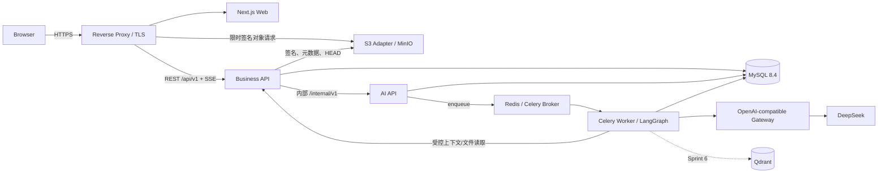

# 技术架构设计

> 文档状态：当前有效
> 基线版本：V1.0
> 生效日期：2026-07-29
> 建立日期：2026-07-29
> 适用范围：MVP Sprint 0～5；Sprint 6 扩展点单独标注
> 上游基线：正式产品设计、已验收交互/页面状态机/UI、Development Planning、数据设计与 AI 能力设计

## 1. 设计结论

MVP 采用单仓库、三运行单元、单服务器 Docker Compose 候选拓扑：

- `apps/web`：Next.js 16 App Router 桌面 Web。
- `services/api`：FastAPI 业务模块化单体，是权限、业务状态、正式产物、文件元数据、审计和业务 Outbox 的唯一写入入口。
- `services/ai`：独立 FastAPI AI API、Celery Worker 和 LangGraph 编排，只产生可追溯候选，不直接正式化业务产物。

MySQL 8.4 是业务事实与 AI 追溯事实源；MinIO/S3 保存文件正文；Redis 仅用于队列、短期进度、SSE 通知、限流和可重建缓存。Qdrant 与第二 Provider 只在 Sprint 6 启用。

技术设计必须保持基础设施可替换。CloudBase 只作为 MVP 核心闭环完成后的集成测试部署 PoC 候选，不进入本架构的生产技术基线。

## 2. 权威输入与变更规则

实现冲突按以下顺序处理：

1. `产品设计体系整理/` 正式产品设计。
2. 已验收交互设计、页面状态机和 V1 UI/高保真原型。
3. `开发规划/`、`数据埋点与数据库设计/`、`AI能力体系设计/` 当前有效基线。
4. 本目录经确认后的技术设计。
5. Sprint 0 形成的 OpenAPI、JSON Schema、Alembic 与 ADR。

开发人员不得用实现便利静默修改上游规则。发现冲突时记录来源、影响对象、阻断任务和最小调整候选，回到主责文档确认。

## 3. 运行拓扑



边界：

- Browser 的业务请求只进入 Business API；不得直接访问 AI API、数据库、Redis 或模型供应商。
- Browser 可以使用 Business API 签发的短期、单对象签名 URL 传输文件字节，但不能获得对象存储凭据、桶列表或任意对象键。
- AI API 只在内部网络开放；Business API 是 AI Task 对外门面。
- Business API 与 AI 服务可使用同一 MySQL 实例，但必须使用不同数据库账号和表级写权限。
- 服务之间共享 OpenAPI/JSON Schema 和标识，不共享业务运行时代码。

## 4. 建议仓库结构

```text
apps/
└─ web/
   ├─ app/                 App Router、布局、页面入口
   ├─ features/            按业务域组织的页面能力
   ├─ components/          设计系统与跨域组件
   ├─ lib/api/             OpenAPI 生成 Client 与统一拦截
   └─ tests/
services/
├─ api/
│  ├─ app/modules/         identity/project/file/artifact/review/confirmation/validation
│  ├─ app/platform/        config/db/security/errors/idempotency/audit/outbox
│  ├─ app/internal_api/    AI 内部上下文与健康契约
│  └─ tests/
└─ ai/
   ├─ app/api/             内部任务 API
   ├─ app/router/          Task Router 与 Capability Registry
   ├─ app/orchestration/   LangGraph/Context/Prompt/Result Processor
   ├─ app/providers/       OpenAI-compatible Adapter
   ├─ app/workers/         Celery Task
   └─ tests/
packages/
├─ contracts/              生成物；不得手写漂移
└─ design-tokens/           Token 转换与校验
infra/
├─ compose/
├─ monitoring/
├─ migrations/
└─ scripts/
tests/
├─ contract/
├─ e2e/
└─ performance/
```

## 5. 前端架构

### 5.1 渲染与数据边界

- App Router 负责路由、布局、错误边界、静态说明和登录前页面。
- 已登录业务数据使用生成式 API Client + TanStack Query 读取；不得在页面层手写重复请求类型。
- 服务端事实只保存在 Query Cache 中；页面不得把完整 Project、Version、PRD、Task 等复制到长期全局状态。
- 局部展开、弹窗、筛选和编辑器临时状态使用 React 内置状态。
- 正式写入全部经 Business API；不使用 Next.js Server Action 复制业务命令。
- 认证业务请求走同源 `/api/v1`。生产环境不向浏览器暴露内部服务地址。

### 5.2 功能域组织

| 前端域 | 页面/能力 | 主要依赖 |
|---|---|---|
| `identity` | 注册、登录、会话恢复、退出 | Auth API |
| `project-center` | 项目、版本、上下文、文件 | Project/File API |
| `product-design` | Requirement、PRD、条件性 Flow、Review、Plan | Artifact/Review/AI Task API |
| `confirmation` | 轮次、差异、证据、Readiness | Confirmation/File API |
| `validation` | Test、Issue、去向、派生版本 | Validation/Project API |
| `task-center` | AI/解析/导出任务、SSE、恢复 | AI Task API |
| `settings` | 个人偏好、管理员 Provider/Flag | Settings API |

跨域组件只接收稳定 View Model 和回调，不直接调用其他功能域私有 Hook。

### 5.3 表单、编辑与并发

- React Hook Form + Zod；Zod Schema 从 OpenAPI 约束派生或显式映射并做契约测试。
- Tiptap 保存结构化 JSON；可检索文本和 Markdown 是服务端派生表示。
- 草稿自动保存使用防抖命令，并携带 `expected_version`；同一时刻只允许一个在途保存，后续修改排队。
- 离开时若仍有未确认写入，提供“保存草稿、放弃、留在页面”；网络失败保留内存内容并允许复制。
- 不把完整敏感文档默认持久化到 LocalStorage；筛选、非敏感 UI 偏好可持久化。
- 409 冲突不得自动重放覆盖；展示最新版本、差异和“保存副本”路径。

### 5.4 请求与错误

- Query Key 必须包含项目、查看版本、对象 ID 和必要过滤条件。
- Mutation 成功后按对象精确失效，不全局清空 Cache。
- 错误边界分为页面加载、局部区块、Mutation 和全局维护四级。
- 用户提示使用服务端 `message`；诊断入口展示 `trace_id`，不展示内部堆栈或原始供应商错误。
- SSE 断线按退避重连；超过上限后轮询任务快照，不把断线当作任务失败。

## 6. 业务后端架构

### 6.1 模块化单体分层

每个业务模块包含：

1. Router：HTTP、Schema、身份和协议适配。
2. Application Service：用例、权限、幂等、事务编排。
3. Domain Policy：状态、守卫、不可变和版本规则。
4. Repository/Adapter：SQLAlchemy、S3、内部服务和 Outbox。

Router 不直接操作 ORM；Repository 不决定业务状态；模块之间通过 Application Service 或只读查询接口协作。

### 6.2 模块写入责任

| 模块 | 允许写入 | 禁止写入 |
|---|---|---|
| Identity | user、session/refresh、project_member | 业务产物 |
| Project | project、project_version、context、谱系 | PRD/Review 等域对象正文 |
| File | stored_file、file_version、relation、parse 元数据 | 删除业务对象 |
| Artifact | Requirement/PRD/Flow/Plan 及版本 | Review/Confirmation 结论 |
| Review | review、scope、feedback、disposition | 原位改写产物版本 |
| Confirmation | round、difference、material、readiness | Test/Issue |
| Validation | test、evidence、issue、disposition | 覆盖已提交验证事实 |
| AI Task Facade | 对外权限、幂等、内部调用、正式化 | 模型编排或直接标记候选 ready |
| Audit/Outbox | operation audit、business outbox | 代替业务实体 |

### 6.3 事务与一致性

- 关键业务命令在一个 MySQL 事务中写入业务事实、审计和 Business Outbox。
- 外部模型、对象存储和内部 HTTP 不得持有 MySQL 长事务。
- 跨服务操作使用 `command_id`、`trace_id` 和幂等内部契约；失败通过重试或补偿，不使用分布式事务。
- 正式化候选时重新校验权限、目标快照、候选状态、追溯完整性和 `expected_version`。
- 历史版本、已确认轮次、已提交 Test 与不可变事件不得原位覆盖。

### 6.4 数据访问与并发模型

- SQLAlchemy 2 使用同步 Session/Unit of Work；业务 API 的数据库型路由使用 FastAPI 同步执行模型。
- SSE 和内部网络调用使用独立异步适配层，不在事件循环中运行同步数据库 I/O。
- 列表必须使用明确 Select、投影和批量加载，禁止隐式 N+1。
- 热点唯一性依靠数据库约束；Application Guard 只提供可读错误，不能替代约束。
- `version` 每次成功修改递增；命令提交 `expected_version`，冲突返回 409。

## 7. AI 服务架构

### 7.1 责任分解

| 组件 | 责任 |
|---|---|
| AI API | 校验内部服务身份、接收 Task Envelope、幂等创建、查询、取消、健康 |
| Celery Broker | 传递任务 ID、路由、trace 等最小消息 |
| Worker | 加载权威 Task、执行编排、响应取消、更新状态 |
| Task Router | 规则/语义/用户选择路由，冻结 Capability Bundle |
| Context Manager | 权限内来源选择、预算、压缩、指纹、排除原因 |
| Prompt Builder | 组合已发布 Skill/Prompt/Template/Context |
| Provider Gateway | DeepSeek 请求、流式块、用量、错误和重试分类 |
| Result Processor | 解析、Schema、必填、追溯、安全和质量门禁 |
| Trace Recorder | Task/Call/Context/Result/Evaluation/AI Outbox |

### 7.2 Business API 与 AI API 契约

- Browser 只调用 Business API 的 `/api/v1/ai/tasks*`。
- Business API 完成用户权限、功能旗标、配额、目标存在性和幂等检查，再调用内部 AI API。
- 内部 Task Envelope 只携带 `task_public_id`、用户/项目/版本标识、任务类型、目标快照引用、Capability 选择、`command_id`、`trace_id`；不携带大正文。
- Worker 使用内部服务身份向 Business API 拉取任务作用域内的不可变上下文快照或短期文件读取 URL。
- AI API 返回候选引用；Business API 读取候选摘要并在正式化命令中再次验证，不让 AI 服务写正式业务表。

### 7.3 队列、重试与取消

- 队列按 `interactive`、`file_parse`、`export`、`maintenance` 分路由；MVP 可共享 Worker 进程但必须保留路由和并发上限。
- Provider 瞬时错误在同一 Task 新增 Call；输入、目标快照或 Capability 改变时新建 Task。
- Celery 消息启用 late acknowledgement；任务必须幂等读取权威状态后执行。
- `cancel_requested` 只表示请求已接收；Worker 确认安全停止后才进入 `cancelled`。
- Redis 不可用时拒绝新任务；已存在候选和全部非 AI CRUD 保持可用。

## 8. 数据存储架构

- MySQL 8.4 LTS、InnoDB、utf8mb4；ID 使用 `BIGINT UNSIGNED`，对外序列化为字符串。
- 时间统一 UTC `DATETIME(6)`，API 使用 RFC 3339。
- 业务、AI、事件、审计表沿用已确认 77 表数据字典；本阶段不新增平行通用文档表。
- Business API、AI Service、Event Consumer、Metric Job 使用独立账号；默认拒绝非主责表写权限。
- 原始事件、审计、版本和 AI 追溯保留不可变；修正使用新版本或补偿记录。
- Qdrant 只是 Sprint 6 派生索引，可从 MySQL/对象存储权威版本重建。

## 9. 文件存储架构

### 9.1 上传协议

1. Client 请求初始化，提交文件名、大小、声明 MIME、SHA-256、目标业务对象和版本关系。
2. Business API 校验权限、50MB 上限、允许类型、对象状态和配额，创建 `pending` 元数据并签发短期 PUT URL。
3. Client 直接上传字节；URL 只允许指定对象键、方法、大小和有限有效期。
4. Client 提交完成确认；API 使用 HEAD 校验对象存在、大小、ETag/校验信息并在必要时流式复核 SHA-256。
5. 校验通过后创建不可变 `file_version` 并关联业务对象；失败保持失败事实，不返回成功记录。

### 9.2 下载与解析

- 下载前实时校验项目与对象权限，签发短期 GET URL；对象键不返回到业务 UI。
- 响应强制安全 `Content-Disposition`，对可执行/未知类型使用下载而非内联预览。
- 解析任务以 `file_version_id` 为输入；解析失败保留原文件并允许人工指定类型。
- 文件删除默认归档元数据并撤销新签名 URL；不得级联删除历史业务引用。
- 定时清理超过 TTL 的 pending/orphan 对象，清理行为需审计。

## 10. 缓存设计

| 用途 | 权威来源 | Redis Key 前缀 | TTL/失效 |
|---|---|---|---|
| AI 进度快照 | MySQL ai_task/call | `ai:progress:` | 24h；终态后可重建 |
| SSE Pub/Sub | MySQL 状态 | `ai:event:` | 瞬时；断线查快照 |
| API 限流 | 请求事实 | `rate:` | 按窗口 1～60 分钟 |
| 权限只读摘要 | MySQL project_member | `authz:` | 最长 60s；角色变化主动失效 |
| Provider 目录只读缓存 | MySQL active config | `cfg:provider:` | 5 分钟；发布/停用主动失效 |
| 短期解析/导出进度 | MySQL task/record | `job:progress:` | 24h |

规则：

- Idempotency 记录保存在 MySQL，不依赖 Redis。
- Refresh Token、正式产物、业务状态、AI Result 和审计不得只存在 Redis。
- 关键写操作不信任权限缓存，必须实时查询或校验权限版本。
- Redis Key 必须带环境前缀；应用不得依赖 Redis 逻辑 DB 才能隔离，便于迁移托管 Redis。
- Celery 不把返回正文保存到 Redis Result Backend；权威 Task/Result 写 MySQL。

## 11. 错误处理

| 类别 | HTTP | 代表错误码 | 客户端行为 |
|---|---:|---|---|
| 参数/Schema | 400/422 | `VALIDATION_ERROR` | 定位字段并保留输入 |
| 未认证 | 401 | `AUTH_REQUIRED`、`TOKEN_EXPIRED` | 尝试一次刷新或返回登录 |
| 无权/防枚举 | 403/404 | `FORBIDDEN`、`RESOURCE_NOT_FOUND` | 进入安全来源页 |
| 状态门禁 | 409 | `INVALID_STATE`、`BLOCKING_GATE` | 展示缺失项/可恢复动作 |
| 并发 | 409 | `VERSION_CONFLICT` | 获取最新版本、比较、保存副本 |
| 幂等冲突 | 409 | `IDEMPOTENCY_CONFLICT` | 不自动重试不同请求体 |
| 限流 | 429 | `RATE_LIMITED`、`AI_QUOTA_EXCEEDED` | 遵循 Retry-After |
| 外部依赖 | 502/503/504 | `PROVIDER_UNAVAILABLE`、`QUEUE_UNAVAILABLE` | 转人工、稍后重试 |
| 内部未知错误 | 500 | `INTERNAL_ERROR` | 显示 trace，不泄露细节 |

服务端使用统一领域异常到 HTTP/Provider/Task 错误映射。未知异常只在日志保存去敏诊断；供应商原始错误不得直接返回浏览器。

## 12. 测试策略

| 层 | 工具 | 必测内容 |
|---|---|---|
| 前端单元/组件 | Vitest、React Testing Library | 状态、表单、错误、权限、只读、冲突 |
| 前端契约 | 生成 Client、Mock Service Worker | Schema、错误信封、SSE 事件 |
| 后端单元 | pytest | Policy、权限、状态机、错误映射 |
| 数据/迁移 | pytest + 临时 MySQL/Compose | 空库、升级、重复执行、失败重试、约束 |
| AI | pytest、Provider Stub、固定回归集 | 路由、Context、重试、取消、追溯、质量门禁 |
| 契约 | OpenAPI/JSON Schema lint + Consumer Test | Web/API、API/AI、事件、Provider |
| 集成 | pytest/HTTPX + Compose | MySQL、Redis、MinIO、内部服务 |
| E2E | Playwright + axe | T01～T07、Chrome/Edge、键盘、无障碍 |
| 性能 | k6 | 20 并发、API P95、SSE、50MB 上传 |
| 安全 | Gitleaks/等价 Secret 扫描、Trivy、依赖审计 | Secret、镜像、依赖、配置、文件越权 |

CI 只调用 Provider Stub；真实 DeepSeek 只用于受控 staging 连通性和固定样本 Gate。

## 13. 三人团队分工与并行规则

### 13.1 主责

| 角色 | 主责目录/契约 | 额外 DRI |
|---|---|---|
| 前端 | `apps/web`、design tokens、生成 Client、前端/E2E | Web 镜像与页面验收证据 |
| 后端 | `services/api`、OpenAPI、Alembic、权限、业务事务、S3 Adapter | Compose、反向代理、TLS、发布/回滚 |
| AI/数据 | `services/ai`、AI/事件 Schema、数据质量、指标、监控 | Provider、Worker、仪表盘与告警 |

测试由三人共同承担：作者写单元/模块测试；消费者写契约/集成测试；关键路径由跨端共同验收。

### 13.2 契约先行

跨端任务按以下顺序：

1. 生产者提交契约候选和示例。
2. 消费者审核路径、字段、错误、权限和版本兼容。
3. 契约单独合并并生成类型/Mock。
4. 前端、后端、AI/数据基于同一版本并行实现。
5. 合并前运行 Consumer/Provider 契约和受影响集成测试。

禁止临时私有接口进入主干，禁止手写前端类型绕过 OpenAPI，禁止在内部消息传输大正文。

### 13.3 并行冲突规则

- Alembic 迁移链由后端串行维护；AI/数据工程师审核 AI、事件与指标表，不并行创建分叉 head。
- OpenAPI 根文件、公共错误码、事件公共信封和 Compose 主文件设置单一当期 owner。
- 前端使用契约 Mock，不等待空接口；AI 服务使用 Context/Provider Stub，不等待真实业务数据。
- 任何跨服务字段变更先改契约，禁止先改数据库或 UI 再补文档。
- 每个 Sprint 预留约 20% 容量，至少设置一次契约冻结点、一次跨端联调窗口和一次失败/降级演练。
- 合并顺序：Schema/契约 → 生产者实现 → 生成 Client/消费者实现 → 集成/E2E。

## 14. 端到端追踪矩阵

| 业务动作 | API | 权限 | 权威存储 | 日志/指标 | 核心测试 |
|---|---|---|---|---|---|
| 创建项目/V1 | Project create | 登录用户→owner | MySQL project/version/member | audit、outbox、API latency | 幂等、事务、T01 |
| 正式化 AI 候选 | Adoption/formalize | owner | 领域版本 + adoption | trace completeness | stale、409、追溯 100% |
| 文件上传关联 | File init/complete/relation | 项目编辑权 | S3 + file_version/relation | upload failure/capacity | 中断、越权、校验和 |
| Review 通过 | Review decision | owner | review/feedback/disposition | audit、blocking count | 阻断项、并发 |
| 确认轮次生效 | Confirmation confirm | owner | round/difference/readiness | audit、readiness failure | 旧轮次保护 |
| 提交 Test | Test submit | tester/owner | test/evidence | validation event | 不可变、权限 |
| Issue 派生版本 | Issue disposition/derive | owner | issue/disposition/version lineage | outbox、derive failure | 幂等、谱系、T06/T07 |
| AI Task | Task create/SSE/cancel | 有权项目成员 | MySQL Task/Call/Result | queue age、provider error | 重连、取消、Redis 故障 |

## 15. 基线验收条件

- 用户要求的前端、业务后端、AI、数据、文件、缓存、权限、API、部署、日志监控、错误和测试均可定位。
- 运行边界与已确认模块依赖、数据写入责任和 Agent 架构一致。
- 三名开发人员不存在未分配的 FE/BE/AI/DATA/OPS/QA 关键责任。
- CloudBase、Qdrant、第二 Provider 和生产服务器选型未被误写成 MVP 生产依赖。
- 本文与同目录其余五份文档已于 2026-07-29 通过用户确认，共同构成当前有效 V1.0 技术设计基线，是 Development / Sprint 0 的直接实施输入。
