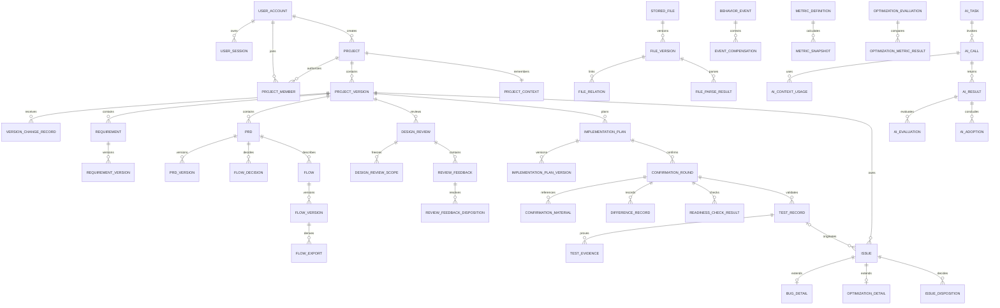
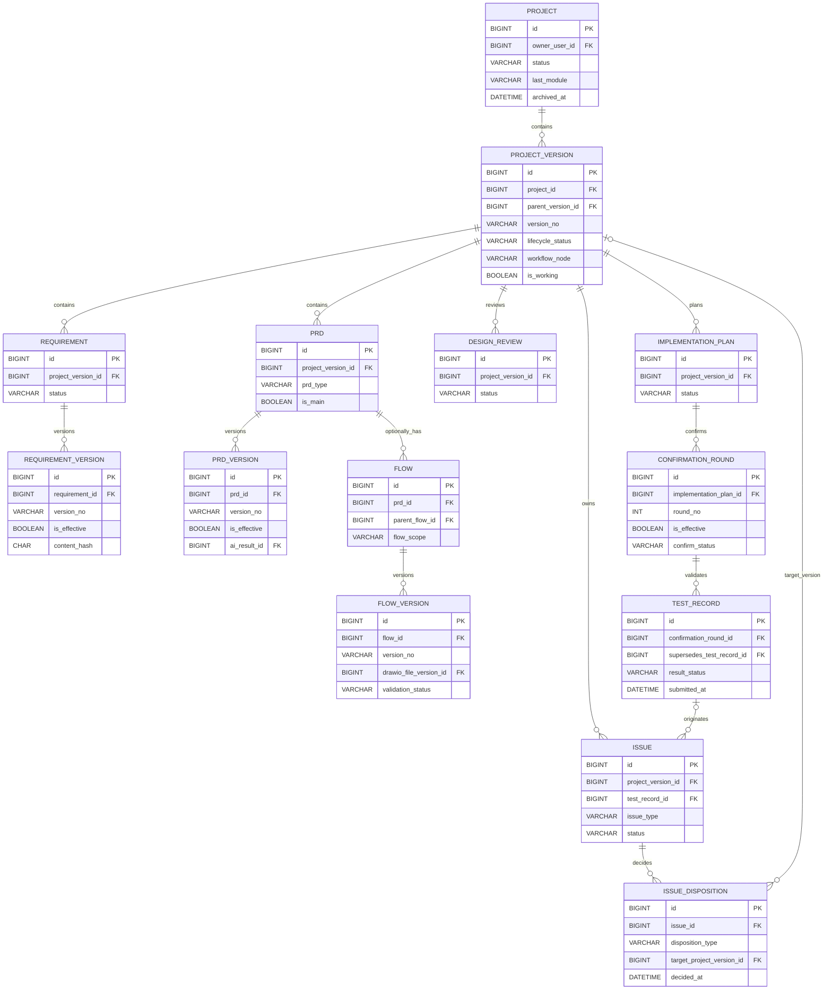
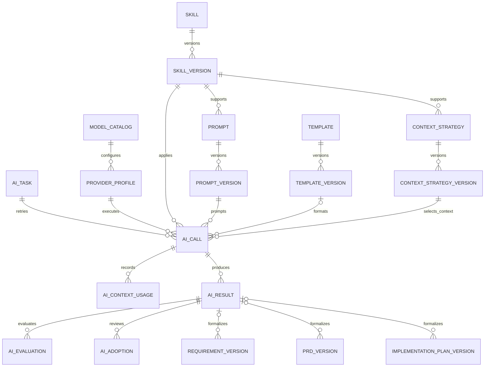
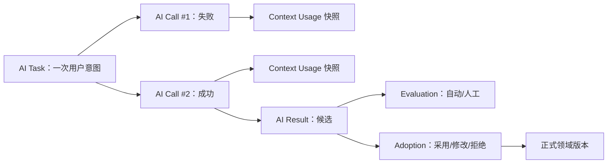
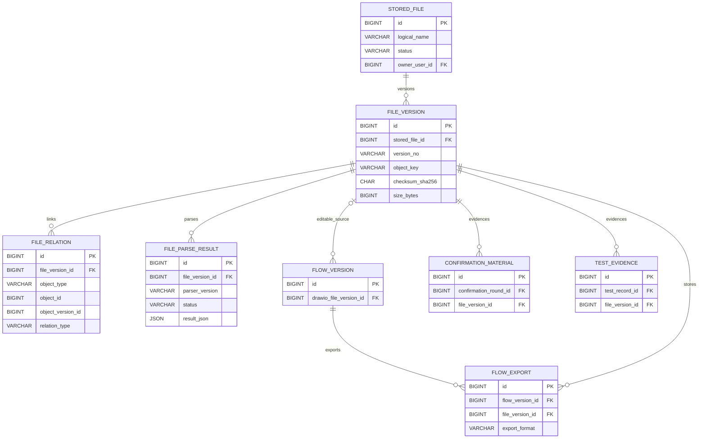
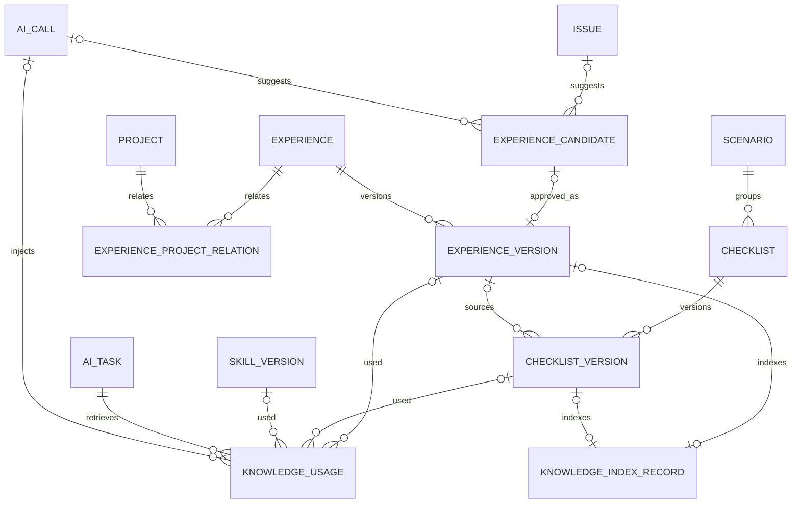

# ER 图

> 文档状态：当前有效
> 设计版本：V1.0
> 建立日期：2026-07-29
> 确认日期：2026-07-29
> 说明：Mermaid 图用于冻结关系和基数；字段、约束与索引以《数据字典》《数据库详细设计》为准

## 1. 总体 ER

## 2. 业务主链 ER

业务基数规则：

- Project 1:N Project Version；同一 Project 只有一个 `is_working=1`。
- PRD 直接属于 Project Version；Flow 直接属于 PRD。
- Implementation Plan 1:N Confirmation Round；同一 Plan 只有一个有效轮次。
- Test Record 直接属于 Confirmation Round。
- Issue 必须属于 Project Version，`test_record_id` 可空。

## 3. AI 追溯 ER

## 4. 文件与版本 ER

文件关系必须指向 `file_version_id`，不能只指向逻辑 File，否则历史记录无法确定当时使用的内容。

## 5. 知识预留 ER（Sprint 6）

`knowledge_index_record` 是 MySQL 到 Qdrant 的派生映射；索引必须能从有效知识版本完整重建。

## 6. 事件与指标 ER

```mermaid
erDiagram
    BUSINESS_EVENT_OUTBOX {
        BIGINT id PK
        VARCHAR event_id UK
        VARCHAR event_name
        VARCHAR publish_status
        JSON payload_json
    }
    AI_EVENT_OUTBOX {
        BIGINT id PK
        VARCHAR event_id UK
        VARCHAR event_name
        VARCHAR publish_status
        JSON payload_json
    }
    BEHAVIOR_EVENT {
        BIGINT id PK
        VARCHAR event_id UK
        VARCHAR event_name
        DATETIME occurred_at
        BIGINT project_version_id
        BIGINT ai_task_id
        VARCHAR trace_id
        JSON payload_json
    }
    EVENT_COMPENSATION {
        BIGINT id PK
        VARCHAR original_event_id FK
        VARCHAR compensation_type
        JSON replacement_payload
    }
    EVENT_INGEST_REJECTION {
        BIGINT id PK
        VARCHAR event_id
        VARCHAR rejection_code
        JSON field_errors
    }
    OPERATION_AUDIT_LOG {
        BIGINT id PK
        BIGINT actor_user_id FK
        VARCHAR operation_name
        VARCHAR object_type
        BIGINT object_id
        VARCHAR trace_id
    }
    IDEMPOTENCY_RECORD {
        BIGINT id PK
        BIGINT user_id FK
        VARCHAR endpoint_key
        VARCHAR idempotency_key
        CHAR request_hash
    }
    RETENTION_POLICY {
        BIGINT id PK
        VARCHAR policy_code
        VARCHAR table_name
        INT retention_days
        VARCHAR approval_status
    }
    DATA_PURGE_RUN {
        BIGINT id PK
        BIGINT retention_policy_id FK
        DATETIME cutoff_at
        BIGINT affected_count
        VARCHAR status
    }
    METRIC_DEFINITION {
        BIGINT id PK
        VARCHAR metric_id
        VARCHAR metric_version
        VARCHAR grain
        TEXT formula_text
    }
    METRIC_SNAPSHOT {
        BIGINT id PK
        BIGINT metric_definition_id FK
        DATETIME window_start
        DATETIME window_end
        DECIMAL numerator
        DECIMAL denominator
        DECIMAL metric_value
        VARCHAR quality_status
    }
    DATA_QUALITY_RUN {
        BIGINT id PK
        VARCHAR rule_set_version
        DATETIME window_start
        DATETIME window_end
        VARCHAR status
    }
    DATA_QUALITY_ISSUE {
        BIGINT id PK
        BIGINT data_quality_run_id FK
        VARCHAR rule_id
        VARCHAR severity
        VARCHAR affected_metric_id
    }
    OPTIMIZATION_EVALUATION {
        BIGINT id PK
        VARCHAR optimization_id UK
        VARCHAR conclusion
        DATETIME baseline_start
        DATETIME observation_end
    }
    OPTIMIZATION_METRIC_RESULT {
        BIGINT id PK
        BIGINT optimization_evaluation_id FK
        VARCHAR metric_id
        VARCHAR metric_role
        DECIMAL before_value
        DECIMAL after_value
    }
    EXPERIMENT_DEFINITION {
        BIGINT id PK
        VARCHAR experiment_key UK
        VARCHAR primary_metric_id
        VARCHAR status
    }
    EXPERIMENT_ASSIGNMENT {
        BIGINT id PK
        BIGINT experiment_definition_id FK
        VARCHAR subject_type
        BIGINT subject_id
        VARCHAR variant
    }

    BUSINESS_EVENT_OUTBOX ||--o| BEHAVIOR_EVENT : publishes
    AI_EVENT_OUTBOX ||--o| BEHAVIOR_EVENT : publishes
    BEHAVIOR_EVENT ||--o{ EVENT_COMPENSATION : corrected_by
    USER_ACCOUNT ||--o{ OPERATION_AUDIT_LOG : acts
    USER_ACCOUNT ||--o{ IDEMPOTENCY_RECORD : scopes
    RETENTION_POLICY ||--o{ DATA_PURGE_RUN : governs
    METRIC_DEFINITION ||--o{ METRIC_SNAPSHOT : produces
    DATA_QUALITY_RUN ||--o{ DATA_QUALITY_ISSUE : finds
    METRIC_SNAPSHOT o|--o{ DATA_QUALITY_ISSUE : affects
    OPTIMIZATION_EVALUATION ||--o{ OPTIMIZATION_METRIC_RESULT : compares
    METRIC_DEFINITION ||--o{ OPTIMIZATION_METRIC_RESULT : supplies
    EXPERIMENT_DEFINITION ||--o{ EXPERIMENT_ASSIGNMENT : assigns
```

事件消费者只追加 `behavior_event` 或拒收记录；指标任务只追加快照和质量结果，不修改原始事件。

## 7. 关系验收清单

- [ ] Project、Project Version、工作版本和版本派生基数与正式版本规则一致。
- [ ] Requirement、PRD、Flow、Plan、File、Template、Checklist 均使用领域专属版本表。
- [ ] Review Scope 固定到明确产物版本。
- [ ] Confirmation Round 为 1:N 且只有一个当前有效轮次。
- [ ] Test Record 只直接关联 Confirmation Round。
- [ ] Issue 必属 Project Version，Test Record 可空，Bug/Optimization 不成为并列主对象。
- [ ] AI Task、Call、Context、Result、Evaluation、Adoption 可完整追溯。
- [ ] Event、Audit、Outbox、Compensation 与 Metric Snapshot 相互分离。
- [ ] Knowledge 与 Qdrant 保持“权威事实/派生索引”边界。
